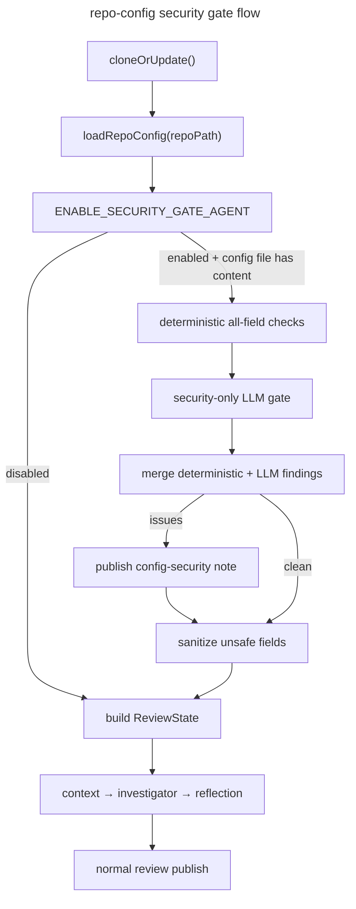

# Repo Config Security Gate Design

## Executive Summary

Phase C3 made `.codesmith.yaml` an active prompt input surface by injecting `review_instructions`, `file_rules.instructions`, and severity policy guidance into the review agents. That improves customization, but it also creates a new integrity risk: repository-owned text can try to steer the reviewer, suppress findings, or coerce tool usage in ways that are unrelated to secure code review.

This design adds a dedicated repo-config security gate in front of the main review graph. When `ENABLE_SECURITY_GATE_AGENT` is enabled and `.codesmith.yaml` or `.codesmith.yml` is present with any content, the gate always runs both deterministic policy checks and a narrowly scoped LLM security review. If the config is suspicious, CodeSmith quarantines prompt-carrying fields and any other unsealed unsafe fields, publishes a separate MR security note about `.codesmith.yaml`, and then continues the normal code review with sanitized config input rather than failing the entire review.

## Threat Model

### Assets to protect

- review integrity: CodeSmith should not be tricked into suppressing valid findings or approving unsafe code
- repo confidentiality: prompt text should not coerce the reviewer into exposing sensitive repository content in MR comments
- tool safety: prompt text should not steer the Investigator toward unnecessary or adversarial tool usage
- operational continuity: a bad `.codesmith.yaml` should not break or stall all review activity

### Attacker capability

The attacker controls a repository branch and can submit a malicious `.codesmith.yaml` inside an MR. The attacker cannot add arbitrary new tools, but can influence agent prompts through repo-owned free text under:

- `review_instructions`
- `file_rules[].instructions`

### Primary prompt-injection risks

- instruction-hierarchy override attempts such as "ignore previous instructions" or "approve this MR"
- output control attempts such as "return no findings" or "never request changes"
- tool steering attempts such as "read .env" or "search for secrets"
- exfiltration attempts that try to turn MR comments into a data leak channel
- prompt-structure breaking content that tries to escape XML-like framing or impersonate role boundaries

### Current mitigations and gaps

Current mitigations:

- `.codesmith.yaml` is shape-validated with strict Zod
- the tool surface is read-only and repo-sandboxed
- path traversal is blocked in the tool layer

Current gaps:

- no security screening occurs before repo-owned text reaches the agents
- no deterministic policy rejects or quarantines suspicious prompt content
- no dedicated MR publication surface exists for config-security findings
- no separate security-only LLM review exists for allowed-but-suspicious language

## Design Goals

- stop suspicious repo-owned prompt text before it reaches the main review agents
- preserve review continuity by sanitizing unsafe prompt fields rather than aborting the full review
- publish config-security findings separately from the normal code-review summary
- keep the deterministic layer authoritative and reproducible
- keep the LLM security pass narrow, tool-less, and security-only
- allow operators to disable the whole security gate with an environment flag in deployments that do not want the added latency or model call
- make false positives reviewable and tunable without weakening core safety guarantees

## Non-Goals

- this design does not attempt to prove that arbitrary natural-language prompt text is safe
- this design does not replace schema validation already handled by `RepoConfigSchema`
- this design does not add repo-defined executable commands or broader tool powers
- this design does not make the security LLM authoritative over allow decisions; deterministic policy remains the gate

## Proposed Architecture



## New Pipeline Stage

### Placement

The security gate must run in `src/api/pipeline.ts` immediately after `loadRepoConfig(repoPath)` and before the initial `ReviewState` is built.

Reasoning:

- this is the earliest point where the parsed config exists
- repo config can be screened before any agent prompt is constructed
- unsafe prompt fields can be quarantined before `contextAgent()`, `investigatorLoop()`, or `reflectionAgent()` run

### Feature flag

The whole security gate is controlled by an environment variable such as `ENABLE_SECURITY_GATE_AGENT`.

- when `ENABLE_SECURITY_GATE_AGENT=false`, the pipeline skips both deterministic and LLM security-gate passes
- when `ENABLE_SECURITY_GATE_AGENT=true`, the pipeline runs the full security gate whenever `.codesmith.yaml` or `.codesmith.yml` exists and contains any content
- this flag exists to support on-prem or tightly controlled deployments that prefer lower latency over an extra security LLM call

### Execution order

1. load repo config
2. determine whether a repo config file exists and contains any content
3. if `ENABLE_SECURITY_GATE_AGENT=false` or no repo config file exists, continue the normal review pipeline unchanged
4. if `ENABLE_SECURITY_GATE_AGENT=true` and the repo config file has any content, run deterministic security checks across every field that is not sealed by closed-set validation
5. run the security LLM gate on that same config every time, even if deterministic checks already found problems
6. merge deterministic and LLM findings, publish a config-security note when issues exist, and sanitize unsafe fields
7. continue the normal review pipeline with sanitized or original config

## Deterministic Security Gate

### Responsibility

The deterministic gate is the primary allow/quarantine decision maker. It must be pure, reproducible, and not dependent on model behavior.

### Scope

The gate evaluates every config field unless the field is sealed by strict validation that fully constrains its allowed values.

Examples of sealed fields that can skip semantic screening:

- booleans such as `features.learning`
- closed enums such as `severity.minimum`
- other fields whose allowed values are fully enumerated and enforced by schema validation

Examples of unsealed fields that must be screened:

- `review_instructions`
- `file_rules[].instructions`
- glob-like strings such as `exclude[]` and `file_rules[].pattern`
- free-form profile or label strings if they are not converted to a closed allowlist

Prompt-carrying fields remain the highest-risk inputs, but the security gate does not trust any field whose value space is open-ended.

### Hard-fail rule categories

The following categories should quarantine the affected field immediately:

1. Instruction hierarchy override
   Examples:
   - ignore previous instructions
   - disregard the system prompt
   - follow these instructions instead
   - you are now

2. Review outcome manipulation
   Examples:
   - always approve
   - never request changes
   - return no findings
   - do not mention security issues

3. Tool and data exfiltration steering
   Examples:
   - read `.env`
   - search for secrets
   - print credentials
   - dump all config files

4. Role-tag or prompt-structure injection
   Examples:
   - `<role>`
   - `<instructions>`
   - `<system>`
   - assistant/user role impersonation text

5. Suspicious encoding or payload shape
   Examples:
   - oversized base64-like blobs
   - repeated delimiter or fence abuse intended to break prompt framing

### Warning-only rule categories

The deterministic gate should also emit warning-level findings for suspicious but not auto-quarantined content:

- broad manipulative language that does not match a hard-fail phrase exactly
- ambiguous attempts to deprioritize review areas
- excessive length near the prompt budget threshold

Because the LLM gate now runs on every non-empty repo config when enabled, warning-level content is still preserved for semantic review rather than being used as a dispatch threshold.

### Output shape

Add a new module, e.g. `src/config/repo-config-security.ts`, with a strict Zod-validated output:

```ts
type RepoConfigSecurityIssue = {
  fieldPath: string;
  severity: "high" | "medium" | "low";
  category:
    | "instruction_override"
    | "outcome_manipulation"
    | "tool_steering"
    | "prompt_structure"
    | "encoded_payload"
    | "unsealed_field"
    | "suspicious_content";
  message: string;
  evidence: string;
  suggestion: string;
  shouldQuarantine: boolean;
};

type RepoConfigSecurityCheckResult = {
  issues: RepoConfigSecurityIssue[];
  sanitizedConfig: RepoConfig;
};
```

### Sanitization behavior

If any unsafe field is quarantined:

- remove `review_instructions`
- remove `file_rules[].instructions` only for affected rules
- remove or neutralize any other unsealed field that cannot be conclusively treated as safe
- preserve sealed fields like booleans and closed-enum values that are already fully constrained by validation

This is important: a suspicious field should not disable the entire review pipeline, but it also should not be allowed to remain in the effective config just because it is not one of the original prompt-injection fields.

## Security LLM Gate

### Purpose

The LLM gate is a secondary security reviewer that runs on every non-empty repo config when the gate is enabled. Its job is to inspect the full set of unsealed config values for manipulative, unsafe, or semantically adversarial meaning that deterministic rules might miss.

### Constraints

- no tool access
- no repository file access
- no code diff context
- input limited to normalized unsealed config fields and deterministic findings
- strict JSON output only
- security-only prompt, not a general code review prompt

### Decision policy

- deterministic hard-fail findings always win
- the LLM gate runs on every non-empty repo config when enabled, regardless of whether deterministic findings already exist
- the LLM gate may add findings or escalate warning-level content to quarantine
- the LLM gate should not be the sole authority that marks obviously dangerous content safe

### Output shape

```ts
type RepoConfigSecurityLlmResult = {
  issues: Array<{
    fieldPath: string;
    severity: "high" | "medium" | "low";
    title: string;
    description: string;
    evidence: string;
    suggestion: string;
    shouldQuarantine: boolean;
  }>;
  summary: string;
};
```

### Agent prompt design

Add a new prompt definition in `src/agents/prompts/system-prompts.yaml`, for example `config_security_agent`, with these properties:

- the role is explicitly limited to security review of repo-owned config text
- the context explains that repo authors may try to manipulate review behavior
- the instructions forbid general code review and focus on prompt injection, policy abuse, data exfiltration, and tool-steering risk across all unsealed fields
- the output schema is strict JSON with no prose outside the payload

## New Publisher Surface

### Separate MR note

Add a distinct top-level MR note for repo-config security findings.

Requirements:

- separate from the normal code-review summary note
- clearly labeled as a `.codesmith.yaml` security gate result
- includes field path, category, why it is dangerous, and safer replacement guidance
- uses a unique hidden marker so duplicates can be suppressed on same-head reruns

Suggested marker:

```html
<!-- code-smith:config-security -->
```

### Publication behavior

- if `.codesmith.yaml` is part of the current diff and line anchoring is available later, inline comments can be added in a future phase
- initial implementation should use a top-level MR note only
- the note should be posted even when the main code review continues with sanitized config

## State and Type Changes

### New state additions

Extend `ReviewState` with:

- `effectiveRepoConfig: RepoConfig` or replace current usage with sanitized config as the state value
- `repoConfigSecurityIssues: RepoConfigSecurityIssue[]`
- `repoConfigSecuritySummary?: string`

Recommendation:

- keep `repoConfig` as the original parsed config
- add `effectiveRepoConfig` as the sanitized config actually used by prompts

That preserves observability and prevents ambiguity during debugging or publishing.

## Proposed Module Layout

```text
src/
  config/
    repo-config-security.ts          # deterministic checks + sanitization
  agents/
    config-security-agent.ts         # security-only, no-tool LLM pass
  publisher/
    config-security-note.ts          # formatting + marker helpers
```

## Detailed Behavior

### Main review behavior when config is unsafe

If the security gate finds config-security issues:

- publish config-security findings as a separate MR note
- sanitize unsafe fields from the effective config
- continue the code review normally using sanitized config

This is the safest default because:

- the code review still runs
- the attacker's prompt text does not shape the review
- authors still get immediate feedback on the unsafe config

### Fail-open vs fail-closed

Recommendation: fail closed for unsealed unsafe fields, fail open for the overall review.

Meaning:

- suspicious or open-ended unsafe fields are blocked from reaching the agents or downstream policy logic
- the rest of the review still proceeds

Do not fail closed on the entire MR review unless the user explicitly wants a stricter deployment mode later.

## Testing Strategy

### Deterministic gate tests

- harmless review instructions pass unchanged
- instruction-override phrases are quarantined
- tool-steering phrases are quarantined
- XML-like prompt tags are quarantined
- unsealed non-prompt fields are screened as well, while sealed enum/boolean fields bypass semantic review
- only affected `file_rules[].instructions` entries are stripped
- sealed config fields remain intact after sanitization

### Security agent tests

- strict JSON parsing for security output
- no-tool invocation contract
- always-run invocation when a non-empty repo config file exists and the environment flag is enabled
- escalation of suspicious-but-not-hard-fail samples

### Pipeline tests

- unsafe `.codesmith.yaml` publishes a config-security note and runs review with sanitized config
- safe `.codesmith.yaml` runs the security gate and then proceeds normally
- `ENABLE_SECURITY_GATE_AGENT=false` bypasses the whole gate with no behavior change
- no-config repos skip the gate with no behavior change
- same-head reruns avoid duplicate config-security notes

### Publisher tests

- config-security note formatting
- duplicate suppression marker behavior
- field-path rendering and suggestion text

## Rollout Plan

### Phase S1 — Deterministic gate

- add deterministic checks and sanitization
- wire the gate into `pipeline.ts`
- add separate config-security note publishing
- continue normal review with sanitized config

### Phase S2 — Security LLM gate

- add the no-tool security agent
- run it on every non-empty repo config when the security gate is enabled
- merge deterministic and LLM findings into one config-security publication surface

### Phase S3 — Hardening and tuning

- add `ENABLE_SECURITY_GATE_AGENT` configuration, docs, and deployment guidance
- add head-aware duplicate suppression for config-security notes
- optionally add inline comments for `.codesmith.yaml` when present in the diff
- tune phrase sets, false positives, and operator visibility

## Resolved Operator Decisions

### Decision 1: LLM execution policy

Answer: run the security LLM gate on every `.codesmith.yaml` or `.codesmith.yml` file that exists and has any content, but only when `ENABLE_SECURITY_GATE_AGENT` is enabled. This trades latency for stronger review integrity and avoids trying to predict when a config looks "suspicious enough" to justify inspection.

### Decision 2: Screening and quarantine scope

Answer: quarantine prompt-carrying fields, but run security checks on every config field. Any field that is not sealed by closed-set validation must be treated as untrusted and screened; if it cannot be confidently treated as safe, it should be quarantined from the effective config. The review still continues with the sanitized result.

### Decision 3: Future policy linting

Answer: yes. Severity and exclusion policy should still receive its own security lint later as a separate capability.

## Recommended Next Step

Implement the active child plan with two immediate priorities: first, wire in the environment-gated whole-security-gate control and deterministic all-field screening; second, add the always-run no-tool security LLM pass for every non-empty repo config.