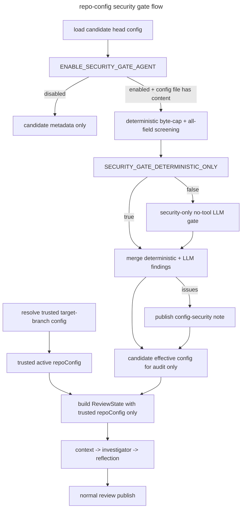

# Repo Config Security Gate Design

## Executive Summary

Phase C3 made `.codesmith.yaml` an active prompt and policy input surface by injecting `review_instructions`, `file_rules.instructions`, and severity policy guidance into the review agents. That improved customization, but it also created a trust-boundary problem: an MR can try to change the very review policy that evaluates it.

This design splits repo config into two trust domains:

- a trusted baseline config resolved from the target branch
- an untrusted candidate config loaded from the MR head branch

The current MR review always runs under the trusted baseline config. The candidate config is screened independently with deterministic all-field checks, optional no-tool LLM review, bounded input size, and redacted publication. Unsafe candidate fields are quarantined from any future effective config, but they do not govern the introducing MR.

## Core Design Decisions

| Concern | Decision | Rationale |
|---|---|---|
| Current-MR trust source | Use the target-branch config as the only repo-owned config that may govern the current MR | Prevents self-exemption through `exclude`, `skip`, severity inflation, or invalid-config fallback games |
| Candidate config role | Treat head-branch config as audit-only during the MR that introduces it | Preserves useful feedback without allowing attacker-controlled policy to self-apply |
| Deterministic authority | Deterministic policy remains authoritative | Reproducibility and security posture cannot depend on model judgment |
| LLM role | Run a no-tool, security-only semantic pass over non-empty candidate config unless deterministic-only mode is enabled | Captures manipulative text that exact-match heuristics may miss |
| Size controls | Enforce a byte cap before YAML parse and schema-level caps on strings and arrays | Prevents parse-time, memory, and token-budget amplification |
| Publication | Use a separate top-level config-security note with escaped or redacted excerpts | Keeps config-security findings distinct without echoing attacker payloads verbatim |
| Operator escape hatch | `ENABLE_SECURITY_GATE_AGENT` disables candidate screening and publication; `SECURITY_GATE_DETERMINISTIC_ONLY` disables only the LLM pass | Lets operators trim cost and latency without reopening the self-governing-config hole |

## Trusted Config Model

Repo config is modeled as two artifacts with different trust levels.

| Artifact | Source | Trust level | Allowed to govern the current MR review? |
|---|---|---|---|
| Trusted baseline config | `.codesmith.yaml` or `.codesmith.yml` resolved from the target branch through a server-trusted ref path | trusted after normal schema validation | yes |
| Candidate head config | `.codesmith.yaml` or `.codesmith.yml` loaded from the MR head branch clone | untrusted | no |

Operational rules:

- if the target branch has no repo config, the trusted baseline is `DEFAULT_REPO_CONFIG`
- if the target branch config is malformed or invalid, the trusted baseline falls back to defaults and logs an operator-visible warning
- if the head branch adds or changes repo config, the candidate file is audited and may publish security findings, but the current review still runs under the trusted baseline
- only after the candidate config lands on a trusted branch does it become eligible to govern future reviews

## Threat Model

### Assets to protect

- review integrity: CodeSmith should not be tricked into suppressing valid findings or approving unsafe code
- repo confidentiality: config text should not coerce the reviewer into exposing sensitive repository content in MR comments
- tool safety: config text should not steer the Investigator toward unnecessary or adversarial tool usage
- operational continuity: a bad `.codesmith.yaml` should not stall or crash review processing

### Attacker capability

The attacker controls a repository branch and can submit a malicious `.codesmith.yaml` inside an MR.

The attacker can attack two surfaces:

- prompt-bearing free text such as `review_instructions` and `file_rules[].instructions`
- policy-shaping config such as `exclude`, `file_rules[].pattern`, and future execution selectors like `linters.profile`

### Primary risks

- instruction-hierarchy override attempts such as "ignore previous instructions" or "approve this MR"
- output-control attempts such as "return no findings" or "never request changes"
- tool-steering attempts such as "read .env" or "search for secrets"
- exfiltration attempts that try to turn MR comments into a data leak channel
- prompt-structure breaking content that tries to escape XML-like framing or impersonate role boundaries
- scope-suppression attempts that broaden `exclude` or `file_rules.skip` to reduce review coverage
- severity-inflation attempts that make real findings disappear under higher thresholds
- oversized payloads meant to amplify parse cost, memory pressure, or LLM spend

## Design Goals

- stop suspicious repo-owned candidate config before it reaches any future policy or prompt surface
- preserve review continuity by continuing the current MR under trusted baseline config
- publish config-security findings separately from the normal code-review summary
- keep the deterministic layer authoritative and reproducible
- keep the LLM security pass narrow, tool-less, and security-only
- prevent raw attacker payloads from being re-emitted in notes or logs

## Non-Goals

- proving arbitrary natural-language prompt text safe in the general case
- replacing schema validation already handled by `RepoConfigSchema`
- adding repo-defined executable commands or broader tool powers
- making the LLM gate authoritative over deterministic allow or quarantine decisions

## Proposed Architecture



## Pipeline Placement

The security-gate path belongs in `src/api/pipeline.ts` after repo acquisition but before any agent prompt is built.

The concrete order is:

1. resolve the trusted target-branch baseline config
2. load the candidate head-branch config and measure byte size before YAML parse
3. if screening is enabled and the candidate file has content, run deterministic screening
4. if deterministic-only mode is off and the candidate file is within normalized budgets, run the no-tool security LLM gate
5. publish config-security findings when present
6. build `ReviewState` using only the trusted baseline config for live review behavior

Important constraint:

- `ENABLE_SECURITY_GATE_AGENT=false` may disable candidate screening and config-security publication, but it must not allow the candidate head config to govern the current MR

## Deterministic Gate

### Responsibilities

The deterministic layer is responsible for:

- bounding candidate-config input size before YAML parse
- classifying config fields as sealed, prompt-bearing, scope-shaping, selector, or bounded numeric
- screening every unsealed field with reproducible heuristics
- producing stable field-path inventory entries so later LLM findings can only refer to real fields
- sanitizing the candidate config deterministically

### Field classes

| Field class | Examples | Screening behavior |
|---|---|---|
| Sealed policy fields | booleans, closed enums such as `severity.minimum` and `severity.block_on` | schema validation only |
| Prompt-bearing free text | `review_instructions`, `file_rules[].instructions` | prompt-abuse detectors plus optional LLM semantic review |
| Scope-shaping open strings | `exclude[]`, `file_rules[].pattern` | suppression, breadth, marker, and suspicious-shape detectors |
| Selector open strings | `linters.profile` | quarantine until a future deployment-owned allowlist seals the field |
| Bounded numeric hints | `output.max_findings` | schema cap only |

### Rule categories

Deterministic screening should detect at least:

1. instruction override
2. outcome manipulation
3. tool steering and exfiltration
4. prompt-structure injection
5. suspicious payload shape or encoded blobs
6. config-scope suppression abuse
7. selector abuse for unallowlisted execution selectors
8. markdown or hidden-marker abuse that would break publication

### Input size controls

The gate enforces two layers of size control:

- `SECURITY_GATE_MAX_CONFIG_BYTES` before YAML parse
- schema-level caps on strings and arrays after parse

If the candidate config exceeds the byte cap:

- do not send it to the LLM gate
- emit deterministic findings describing oversize input
- avoid persisting raw content beyond gate-local scope

### Output contract

The deterministic module in `src/config/repo-config-security.ts` should return:

- validated security issues
- stable field inventory metadata
- a sanitized candidate config
- publication-ready evidence that is already escaped or redacted

## Sanitization Rules

Sanitization is deterministic and stable-path based.

Rules:

- remove `review_instructions` when quarantined
- remove only the affected `file_rules[].instructions` entries when those fields are quarantined
- remove the entire `file_rules[]` entry when its `pattern` is quarantined
- remove only the affected `exclude[]` entries when they are quarantined
- remove `linters.profile` until a future deployment-owned allowlist seals that selector
- preserve unaffected array entries and all sealed values

To avoid index-shift bugs, sanitization is derived from stable field paths over the original parsed tree rather than from in-place mutation as issues are discovered.

## Security LLM Gate

### Purpose

The LLM gate is a secondary semantic reviewer for non-empty candidate config. Its job is to catch manipulative text that deterministic detectors may consider suspicious but not obviously quarantinable.

### Constraints

- no tool access
- no repository file access
- no diff context
- input limited to normalized unsealed fields and deterministic finding context
- bounded timeout and token budget
- strict JSON output only
- field paths restricted to the deterministic field inventory

### Decision policy

- deterministic hard-fail findings always win
- the LLM may add new quarantines but may not clear deterministic quarantines
- unknown field paths are rejected
- if the LLM path fails, the pipeline degrades to deterministic-only behavior
- if `SECURITY_GATE_DETERMINISTIC_ONLY=true`, SG3 is skipped entirely

## Publisher Surface

Config-security findings are published as a separate top-level MR note.

Requirements:

- separate from the normal review summary note
- clearly labeled as `.codesmith.yaml` security feedback
- includes field path, detector category, impact, and safer replacement guidance
- uses a unique hidden marker for duplicate suppression on same-head reruns
- never echoes raw attacker payloads verbatim

Publication rules:

- escape HTML comments, hidden markers, and markdown fences in evidence excerpts
- cap each excerpt and the total note size
- keep inline `.codesmith.yaml` comments out of scope for v1

## State Model

Downstream state must remain unambiguous.

- `repoConfig` means the trusted effective config used by the actual review
- candidate config details stay audit-only
- raw candidate config text does not persist in `ReviewState`

Recommended audit-only fields include:

- candidate-config presence
- candidate-config byte count
- candidate-config hash
- deterministic and merged security findings
- optional security summary text

## Module Layout

```text
src/
  config/
    repo-config-security.ts          # deterministic checks, field inventory, sanitization
    repo-config-loader.ts            # shared byte-cap and parse helpers
  agents/
    config-security-agent.ts         # security-only, no-tool LLM pass
  publisher/
    config-security-note.ts          # formatting + marker helpers
  gitlab-client/
    client.ts                        # target-branch config retrieval
```

## Failure Semantics

Recommended policy:

- fail closed for unsafe candidate fields
- fail open for the overall review
- keep the current MR review running under trusted baseline config

This is the safest default because:

- the review still runs
- the attacker's candidate config does not shape the introducing MR
- authors still get immediate feedback about unsafe config

## Testing Strategy

### Deterministic gate tests

- harmless review instructions pass unchanged
- instruction-override phrases are quarantined
- tool-steering phrases are quarantined
- XML-like prompt tags are quarantined
- non-prompt unsealed fields are screened as well
- multi-entry array sanitization stays stable
- oversize input is rejected before YAML parse and before LLM use
- `linters.profile` is quarantined until allowlisted by a future phase

### Security agent tests

- strict JSON parsing for security output
- no-tool invocation contract
- bounded timeout and budget behavior
- unknown field-path rejection
- graceful deterministic-only fallback

### Pipeline tests

- unsafe candidate config publishes a config-security note and the review continues under trusted baseline config
- safe candidate config produces no config-security note and preserves existing review behavior
- `ENABLE_SECURITY_GATE_AGENT=false` disables candidate screening and publication but not trusted-baseline governance
- `SECURITY_GATE_DETERMINISTIC_ONLY=true` skips only the LLM gate
- no-config repos skip the candidate screening path cleanly

## Rollout Sequence

### Phase SG1 — Deterministic foundation

- add schema caps, byte-cap handling, field inventory, deterministic detectors, and deterministic sanitization
- wire the loader and tests for the bounded deterministic foundation

### Phase SG2 — Trusted-baseline pipeline integration and publication

- resolve trusted baseline config from the target branch
- keep downstream `repoConfig` trusted-only
- publish separate config-security notes

### Phase SG3 — Security LLM gate

- add the no-tool security agent
- run it on every non-empty candidate config unless deterministic-only mode is enabled
- merge deterministic and LLM findings safely

### Phase SG4 — Validation and audit

- add end-to-end malicious samples
- run `bun run check` and `bun run ci`
- complete the plan review gate and final documentation sweep

## Implementation Status

CP1-SG is now implemented across SG1 through SG4.

- the current MR always runs under the trusted target-branch baseline config
- candidate repo config is screened deterministically, optionally reviewed by the no-tool LLM gate, and published through a separate config-security note when needed
- the final implementation record lives in `docs/plans/implemented/repo-config-security-gate-plan.md`
- the most recent final audit report lives in `docs/plans/review-reports/cp1-sg-final-review-2026-03-29-m4t8.md`