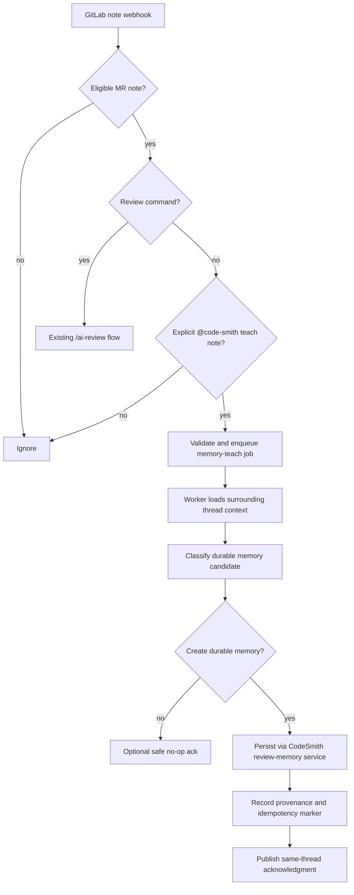

# Review Memory Foundation Design

## Goal

Define the first implementation slice for organizational learning: expand GitLab note handling so CodeSmith can learn from explicit `@code-smith` reviewer replies, acknowledge the learning outcome in the same thread, and persist durable review memory through a CodeSmith-owned boundary backed by Mem0 OSS on PostgreSQL plus `pgvector`.

## Design Goals

1. Preserve existing `/ai-review` note behavior.
2. Make `@code-smith` teaching explicit rather than inferred from every conversation.
3. Keep route handlers fast by validating and enqueueing only.
4. Keep semantic-memory vendor details behind CodeSmith-owned interfaces.
5. Preserve provenance so memories can later be audited, edited, or deleted.

## Trigger Model

### Supported Note Triggers

| Trigger | Example | Outcome |
|---|---|---|
| Review command | `/ai-review` | existing review flow |
| Memory teach | `@code-smith we do not want start implementations in this repo` | enqueue memory-teach job |
| Other note | plain discussion without explicit bot teach intent | ignore |

### Trigger Precedence

1. If a note qualifies as `/ai-review`, route it to the existing review trigger.
2. Otherwise, if the note explicitly addresses `@code-smith`, evaluate it for the memory-teach flow.
3. Otherwise ignore the note for automation purposes.

This precedence avoids accidental behavioral changes for existing manual review workflows.

## Eligibility Rules

A note is eligible for the memory-teach flow only if all conditions hold:

- `object_kind` is `note`
- the note belongs to a merge request
- the note author is not the CodeSmith bot identity
- the note body explicitly includes the configured CodeSmith mention
- the note is not a system note
- the event is not already marked as processed by an existing acknowledgment or checkpoint marker

Additional heuristics may later refine eligibility, but the first slice should stay explicit and conservative.

## High-Level Flow



## Webhook And Queue Boundary

### Router Responsibilities

The route layer should:

- validate the inbound payload with Zod
- identify note-trigger type with deterministic precedence
- reject unsupported note contexts early
- enqueue a memory-teach job with the minimum data needed to rehydrate the event in the worker
- return quickly without talking to Mem0 or PostgreSQL directly

### Queue Payload Contract

The dedicated memory-teach payload should include at least:

- GitLab project ID
- merge request IID
- note ID
- discussion ID if present
- author identity fields
- bot mention detected
- raw note body
- event timestamp
- delivery or dedupe key
- checkpoint correlation data

The payload should avoid embedding large thread blobs. The worker should re-fetch authoritative context.

## Worker Flow

### Step 1: Rehydrate Context

Load:

- the triggering note
- surrounding discussion notes where available
- the originating CodeSmith note being replied to, if identifiable
- basic MR metadata needed for scope and provenance

### Step 2: Decide Whether Durable Memory Applies

The first slice should use explicit conservative rules. Durable memory is appropriate when the note clearly communicates stable guidance such as:

- review style preferences
- repo-specific constraints
- team norms for suggestions or patches
- instructions about what CodeSmith should avoid doing in future reviews

Examples that should usually be ignored or stay no-op:

- transient conversational thanks
- one-off thread-specific clarifications that do not generalize
- ambiguous notes without a stable instruction

### Step 3: Persist Through CodeSmith-Owned Service

The worker should call a CodeSmith service boundary, not Mem0 directly from orchestration code.

Proposed internal interface shape:

```ts
interface ReviewMemoryService {
  createMemory(input: CreateReviewMemoryInput): Promise<CreateReviewMemoryResult>;
  hasProcessedEvent(input: MemoryEventKey): Promise<boolean>;
  markAcknowledged(input: MemoryAckRecord): Promise<void>;
}
```

The implementation can fan out to:

- Mem0 for semantic memory creation and retrieval-facing metadata
- PostgreSQL for CodeSmith provenance, idempotency, scope metadata, and audit records

### Step 4: Publish Same-Thread Acknowledgment

If a durable memory was stored, publish a short same-thread reply.

Baseline copy:

> Got it. I added that to my review memory for future feedback in this repo.

The exact text can change, but the behavior contract matters more:

- post in the same thread or discussion when possible
- include a hidden marker for idempotency
- only acknowledge success after persistence succeeds
- if the event is a safe no-op, either post nothing or use a separate no-op contract consistently

## Idempotency Model

The system must tolerate duplicate webhook deliveries and worker retries.

Use at least two guards:

1. A durable processed-event record keyed by project, merge request, and note event identity.
2. A hidden acknowledgment marker embedded in the bot reply body or otherwise recoverable from provenance.

This protects against:

- duplicate memory writes
- duplicate acknowledgment comments
- inconsistent partial completion on retry

## Provenance Registry

Even if Mem0 stores semantic memory records, CodeSmith should maintain its own provenance registry for auditability and future admin operations.

Minimum fields:

- internal memory record ID
- external memory provider ID
- project/repo scope
- optional MR and discussion linkage
- source note ID
- source author ID
- normalized memory text or summary
- created timestamp
- ack note ID if posted
- dedupe key / event key
- status: created, skipped, failed, acknowledged

This is the durable anchor for later edit/delete/admin flows.

## Service Boundary

The boundary for this slice should be:

- route layer: Zod validation and enqueue only
- worker orchestration: fetch context, call classifier, call review-memory service, publish ack
- review-memory service: own provider integration and PostgreSQL registry writes
- publisher/GitLab client: own outbound note publication

Do not let route handlers or prompt builders depend on Mem0 request shapes.

## Configuration Surface

Add explicit configuration for:

- CodeSmith bot username or mention token
- feature flag to enable note-based memory teaching
- feature flag to enable acknowledgment replies
- Mem0 connection/auth configuration
- PostgreSQL configuration for provenance registry

All config must be validated through Zod in `src/config.ts`.

## Failure Handling

### If webhook validation fails

- reject early
- do not enqueue

### If thread hydration fails

- retry within bounded queue policy
- do not acknowledge until persistence path succeeds

### If classification returns no durable memory

- mark as skipped with provenance
- optionally suppress acknowledgment to avoid noise

### If memory persistence succeeds but ack publish fails

- keep the durable memory record
- retry ack publication separately if possible using checkpoint/provenance data

## Test Matrix

At minimum, cover:

- `/ai-review` notes still take precedence over memory-teach routing
- non-mention notes are ignored
- bot-authored notes are ignored
- duplicate deliveries do not create duplicate memories
- duplicate deliveries do not create duplicate acknowledgments
- same-thread acknowledgment is posted after successful persistence only
- skipped memory outcomes remain idempotent and auditable
- degraded Mem0 or PostgreSQL dependencies surface retryable failures correctly

## Open Questions For Later Slices

- exact repo/team/user scope model for stored memories
- admin edit/delete workflow and approval model
- ranking and retrieval-window logic for prompt injection
- whether safe no-op acknowledgments are desirable or too noisy
- how to ingest reactions and applied suggestions as reinforcement signals