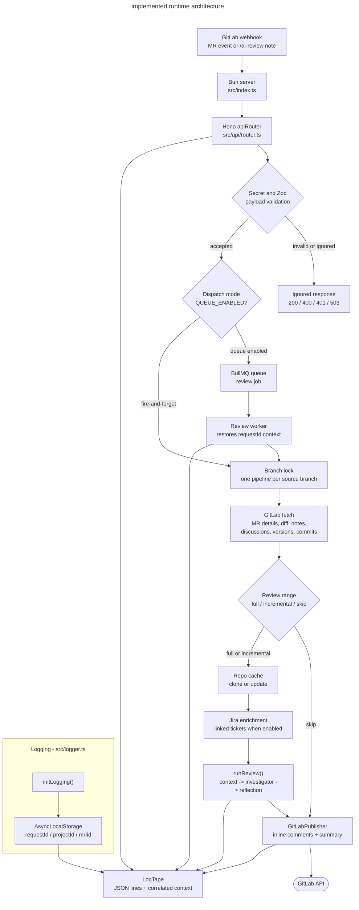

# Architecture

GitGandalf is a Bun-native webhook service built in phases. The current repository includes the complete webhook-to-review-to-publish path: webhook ingestion, typed GitLab access, repo cache management, modular tool execution, the multi-agent review subsystem, GitLab publishing, deployment packaging, and structured logging with request correlation.

For the concise agent-optimized version, see [`docs/agents/context/ARCHITECTURE.md`](../../agents/context/ARCHITECTURE.md).

## Current Implemented Architecture



## Directory Structure

```text
git-gandalf/
├── .env.example                    # Template for secrets & config
├── .gitignore
├── docker-compose.yml
├── Dockerfile
├── package.json                    # Dependencies & scripts
├── tsconfig.json                   # TypeScript configuration
├── README.md
├── src/
│   ├── index.ts                    # Bun/Hono entrypoint + logging bootstrap
│   ├── worker.ts                   # BullMQ worker process entrypoint
│   ├── logger.ts                   # LogTape configuration and context helpers
│   ├── config.ts                   # Env vars via Zod-validated process.env
│   ├── api/
│   │   ├── router.ts               # Webhook routing, validation, filtering, dispatch
│   │   ├── schemas.ts              # Zod schemas for GitLab webhook payloads
│   │   ├── trigger.ts              # Automatic vs manual review trigger context
│   │   └── pipeline.ts             # Full pipeline: fetch MR state, range selection, repo, Jira, publish
│   ├── gitlab-client/
│   │   ├── client.ts               # @gitbeaker/rest wrapper (MR state, versions, commits, compare, publish)
│   │   └── types.ts                # TypeScript types for GitLab data
│   ├── context/
│   │   ├── diff-parser.ts          # Diff hunk parsing for the review state
│   │   ├── repo-manager.ts         # Clone/cache repos via Bun.spawn + git CLI
│   │   └── tools/                  # Agent tools — one file per tool
│   │       ├── index.ts            # TOOL_DEFINITIONS + executeTool()
│   │       ├── shared.ts           # SearchResult type + repo path guard helpers
│   │       ├── read-file.ts        # read_file tool
│   │       ├── search-codebase.ts  # search_codebase tool
│   │       └── get-directory-structure.ts  # get_directory_structure tool
│   ├── integrations/
│   │   └── jira/
│   │       └── client.ts           # Read-only Jira REST client and ticket normalization
│   ├── agents/
│   │   ├── orchestrator.ts         # Review pipeline state machine + deterministic dedupe
│   │   ├── review-range.ts         # full / incremental / skip selector
│   │   ├── state.ts                # ReviewState and Finding definitions
│   │   ├── protocol.ts             # Internal agent message/tool contract
│   │   ├── llm-client.ts           # Provider fallback entrypoint for chatCompletion()
│   │   ├── provider-fallback.ts    # Ordered fallback orchestration
│   │   ├── providers/
│   │   │   ├── bedrock.ts          # AWS Bedrock Runtime adapter
│   │   │   ├── openai.ts           # OpenAI adapter
│   │   │   └── google.ts           # Google Gemini adapter
│   │   ├── context-agent.ts        # Agent 1: Context & Intent Mapper
│   │   ├── investigator-agent.ts   # Agent 2: Socratic Investigator (tool loop)
│   │   └── reflection-agent.ts     # Agent 3: Reflection & Consolidation
│   ├── queue/
│   │   ├── connection.ts           # Valkey/BullMQ connection parsing
│   │   ├── review-queue.ts         # Queue factory + job builder
│   │   ├── review-worker-core.ts   # Timeout-bound worker core
│   │   ├── review-worker.ts        # Worker factory + dead-letter handling
│   │   ├── dead-letter.ts          # Dead-letter queue helpers
│   │   └── job-schemas.ts          # Zod validation for queued job payloads
│   └── publisher/
│       ├── checkpoint.ts           # Machine-readable review-run checkpoint markers
│       ├── gitlab-publisher.ts     # Format findings -> GitLab inline comments + summary
│       ├── suggestion-normalizer.ts # Normalize suggestion ranges before publication
│       └── summary-note.ts         # Summary marker helpers and head-SHA metadata
└── tests/
    ├── fixtures/
    │   ├── sample_mr_event.json    # Sample MR event payload
    │   ├── sample_note_event.json  # Sample /ai-review note payload
    │   └── checkpoint-*.md         # Checkpoint marker parser fixtures
    ├── webhook.test.ts             # Router filtering and webhook behavior
    ├── tools.test.ts               # Tool sandboxing and output behavior
    ├── agents.test.ts              # Prompt builders, parsers, and orchestrator control flow
    ├── agents-entrypoints.test.ts  # Direct agent entrypoint tests with mocked LLM responses
    ├── publisher.test.ts           # Summary/comment formatting and dedupe behavior
    ├── pipeline.test.ts            # Branch serialization and pipeline concurrency
    ├── pipeline-policy.test.ts     # Automatic/manual same-head skip policy
    ├── review-range.test.ts        # full / incremental / skip selection
    ├── gitlab-client.test.ts       # MR commit/version pagination helpers
    ├── repo-manager.test.ts        # Cache, freshness, and SSRF guard behavior
    ├── queue.test.ts               # Queue config and enqueue behavior
    ├── review-worker-core.test.ts  # Worker timeout behavior
    ├── llm-providers.test.ts       # Provider fallback behavior
    ├── google-provider.test.ts     # Gemini adapter coverage
    ├── logger.test.ts              # Log configuration behavior
    └── jira.test.ts                # Jira ticket enrichment behavior
```

## Phase Ownership

| Area | Current Status | Owning Phase | Notes |
|---|---|---|---|
| `src/index.ts`, `src/api/`, `src/config.ts` | Implemented | Phase 1 | Webhook ingress, health endpoint, permissive-required payload validation, and config loading are live. |
| `src/logger.ts` | Implemented | Logging plan | Structured JSON logging via LogTape; `LOG_LEVEL` wired; request correlation via `withContext()`. |
| `src/gitlab-client/` | Implemented | Phase 1 | Typed GitLab wrapper exists, including read and write methods needed by later phases. |
| `src/context/repo-manager.ts` | Implemented | Phase 2 + Phase 4.6 | Shallow clone/update cache manager with TTL cleanup and host validation. Phase 4.6 added `buildGitEnv()` (exported pure function) which injects `GIT_SSL_CAINFO` into every git subprocess when `GITLAB_CA_FILE` is set. |
| `src/config.ts` — `GITLAB_CA_FILE` | Implemented | Phase 4.6 | Optional Zod string. When set, drives `GIT_SSL_CAINFO` injection in git subprocesses and `NODE_EXTRA_CA_CERTS` at startup for `@gitbeaker/rest` API calls. Enables self-hosted GitLab instances that use an internal or enterprise CA. |
| `src/context/tools/` | Implemented | Phase 2 and 2.5 | Tool surface exists, is modularized one-tool-per-file, and uses the app-owned tool-definition contract. |
| `src/agents/` | Implemented | Phase 3 | Shared state, internal protocol, Bedrock Runtime adapter, context agent, investigator agent, reflection agent, and orchestrator are implemented and invoked by the API pipeline. |
| `src/publisher/` | Implemented | Phase 4 | GitLab publisher posts inline comments and a summary comment, with duplicate detection and diff-position anchoring. |
| `src/integrations/jira/` | Implemented | Phase 4.5 | Read-only Jira REST client. Extracts ticket keys from MR title/description, fetches each ticket, normalizes ADF descriptions, supports acceptance-criteria custom fields, and degrades gracefully on any failure. |
| `Dockerfile`, `docker-compose.yml`, top-level `README.md` | Implemented | Phase 4 | Deployment packaging and end-user project documentation are present in the repository. |
| `tests/webhook.test.ts` | Implemented | Phase 1 | Covers auth, filtering, invalid payloads, and realistic GitLab payload tolerance. |
| `tests/tools.test.ts`, `tests/repo-manager.test.ts` | Implemented | Phase 2 and 2.5 | Covers tool sandboxing, search and tree behavior, repo cache cleanup, and SSRF guard behavior. |
| `tests/agents.test.ts`, `tests/agents-entrypoints.test.ts` | Implemented | Phase 3 | Covers prompt builders/parsers, orchestrator control flow, direct agent entrypoints with mocked LLM responses, and tool-failure recovery behavior. |
| `tests/publisher.test.ts` | Implemented | Phase 4 | Covers comment formatting, duplicate detection, diff anchoring, error continuation, and summary-note posting. |
| `tests/jira.test.ts` | Implemented | Phase 4.5 | Covers `extractTicketKeys` (pure), `fetchJiraTicket` (mocked fetch), and `fetchLinkedTickets` integration behavior including disabled guard, allow-list filtering, cap, dedup, and ADF description parsing. |

## Implemented Components

### Hono server

- `src/index.ts` creates the app, calls `initLogging()`, enables structured HTTP request logging via `@logtape/hono` middleware (JSON Lines, health check excluded), mounts `/api/v1`, and exports Bun server config.
- `GET /api/v1/health` returns `{ status: "ok", timestamp }`.

### Structured logging

`src/logger.ts` is the single logging configuration module.

- **Library**: LogTape (`@logtape/logtape` + `@logtape/hono`) — zero dependencies, Bun-native Web APIs, first-party Hono middleware.
- **Output**: JSON Lines to stdout via `getConsoleSink({ formatter: jsonLinesFormatter })`. When `LOG_LEVEL=debug` outside tests, the same records are also appended to `logs/gg-dev.log` in the project root.
- **Level control**: `config.LOG_LEVEL` maps to LogTape's `lowestLevel` on the root `["gandalf"]` category. All child categories (`["gandalf", "router"]`, `["gandalf", "orchestrator"]`, etc.) inherit it automatically.
- **Request correlation**: `requestId` is generated in the router via `Bun.randomUUIDv7()`. Both the router and pipeline call `withContext()` to set `requestId`, `projectId`, and `mrIid` as implicit context via `AsyncLocalStorage`. Every log line emitted anywhere in the pipeline carries these fields without explicit passing.
- **Future sinks**: Adding `@logtape/otel` or `@logtape/sentry` only requires adding a new sink to `initLogging()` — no call-site changes.

### Webhook router

`src/api/router.ts` does four real jobs today:

1. verifies the GitLab shared secret
2. validates webhook payloads with Zod schemas that require the fields GitGandalf uses while tolerating additional GitLab webhook keys
3. filters down to merge-request review triggers
4. hands the event to `runPipeline(event, trigger)` without blocking the HTTP response

It also applies two MR-lifecycle guards before dispatch:

- metadata-only `update` deliveries are ignored when GitLab reports the same `oldrev` and current `last_commit.id`
- automatic draft/WIP MR webhooks can be ignored when `REVIEW_DRAFT_MRS=false`; manual `/ai-review` note commands still run

The filter rules are intentionally narrow:

- merge request actions: `open`, `update`, `reopen`
- note trigger: `/ai-review` comment on a merge request

### Zod schema boundary

`src/api/schemas.ts` defines permissive object schemas for:

- project identity
- user identity
- merge request attributes
- note attributes
- a discriminated union over `object_kind`

This means required fields are validated, while extra GitLab keys are tolerated. That matches real GitLab webhook payloads better than the earlier strict-only version.

### GitLab client wrapper

`src/gitlab-client/client.ts` wraps `@gitbeaker/rest` behind a smaller domain API:

- `getMRDetails()`
- `getMRDiff()`
- `getMRDiscussions()`
- `createMRNote()`
- `createInlineDiscussion()`

The wrapper also handles gitbeaker's awkward snake_case response shapes and camelCase create-option shapes in one place. MR diffs are fetched via `MergeRequests.allDiffs()`.

### Repo cache manager

`src/context/repo-manager.ts` is the repo access layer used by the current review pipeline.

- repo cache path: `<REPO_CACHE_DIR>/<projectId>-<url-encoded-branch>`
- first-time path: `git clone --depth 1 --branch <branch>`
- refresh path: `git fetch origin refs/heads/<branch>:refs/remotes/origin/<branch> --depth 1` + `git reset --hard origin/<branch>`
- post-refresh validation: after clone/update, the manager runs `git rev-parse HEAD` and compares it to the expected MR head SHA from GitLab. A mismatch aborts the review instead of reviewing stale code.
- active-repo touch: after clone/update, `utimes(repoPath, now, now)` refreshes the directory mtime so active repos are not evicted early by TTL cleanup on filesystems that do not update the directory mtime during git operations.
- cleanup: TTL-based eviction using directory `mtime`
- retention policy: clones are intentionally kept warm after review completion and reclaimed by TTL cleanup later, rather than deleted immediately after every run
- TLS / custom CA (Phase 4.6): `buildGitEnv(config.GITLAB_CA_FILE)` is called inside `run()` before every `Bun.spawn()` call. When `GITLAB_CA_FILE` is set, `GIT_SSL_CAINFO` is added to the subprocess env so git trusts the custom CA bundle for HTTPS operations. The same file is set as `NODE_EXTRA_CA_CERTS` at startup in `src/index.ts` for the `@gitbeaker/rest` API client. `buildGitEnv()` is a pure exported function so it can be unit-tested without spawning real git processes.

Security detail: the clone URL hostname must match `GITLAB_URL`. The manager refuses to inject the GitLab token into a different host, which blocks token exfiltration through a malicious webhook payload.

### Modular tool system

Phase 2.5 split the original monolithic `src/context/tools.ts` into per-tool modules under `src/context/tools/`.

- `read-file.ts`
- `search-codebase.ts`
- `get-directory-structure.ts`
- `shared.ts`
- `index.ts`

This keeps each tool independently testable and makes the public API surface explicit in one place.

The public contract is now fully internal to GitGandalf:

- each tool module exports `toolDefinition`, `inputSchema`, and its implementation
- `src/context/tools/index.ts` assembles `TOOL_DEFINITIONS` using the internal `AgentToolDefinition` type
- provider SDK tool types do not leak into the repo-facing tool layer

### Agent review subsystem

Phase 3 adds the review logic itself under `src/agents/`.

- `state.ts` defines `Finding` and `ReviewState`
- `protocol.ts` defines the app-owned agent message and tool contract
- `llm-client.ts` adapts AWS Bedrock Runtime Converse to that internal contract
- `context-agent.ts` derives MR intent, changed areas, and initial risk hypotheses
- `investigator-agent.ts` runs the tool loop against the cloned repository context
- `reflection-agent.ts` filters noise and assigns the review verdict
- `orchestrator.ts` coordinates the three stages and allows one reinvestigation loop

This review subsystem is implemented, tested, and wired into the full API pipeline.

Important runtime detail: if Agent 2 calls a tool incorrectly or asks for a missing file, the tool error is converted into an error `tool_result` block and sent back to the model. The review continues instead of aborting the entire pipeline.

Another current behavior worth knowing: only findings that can be anchored to the MR diff are published inline. Findings outside the diff are skipped for inline publication and summarized instead.

### Jira ticket context enrichment

`src/integrations/jira/client.ts` is the read-only Jira integration added in Phase 4.5. It runs in the pipeline between repo clone and agent invocation.

**What it does:**

- Scans the MR title and description for Jira ticket keys with the pattern `[A-Z][A-Z0-9]+-\d+` (e.g. `SRT-28326`, `ENG-123`, `PLATFORM-7`). This pattern correctly handles the common `SRT-28326: some MR title` format because the `\b` word boundary matches before the colon.
- Deduplicates keys found across title and description.
- Filters by `JIRA_PROJECT_KEYS` when configured (e.g. `SRT,ENG`).
- Caps fetches at `JIRA_MAX_TICKETS` (default 5).
- Fetches each ticket from the Jira REST API (`/rest/api/3/issue/<key>`) using Basic Auth with `JIRA_EMAIL:JIRA_API_TOKEN`.
- Normalizes each ticket into a `JiraTicket` value with `key`, `summary`, `status`, `issueType`, `priority`, `assignee`, `description`, and `acceptanceCriteria`.
- Handles Atlassian Document Format (ADF) descriptions by extracting plain text from paragraph nodes.
- Supports a custom acceptance-criteria field via `JIRA_ACCEPTANCE_CRITERIA_FIELD_ID`.
- Returns `null` on any per-ticket failure and logs a `warn` through `["gandalf", "jira"]`. The pipeline always receives an array — never a thrown error.

**How Agent 1 uses it:**

`contextAgent()` receives `ReviewState.linkedTickets`. When the array is non-empty, it prepends a `## Linked Jira Tickets` section to the user prompt, rendering each ticket's key, summary, status, type, and optional priority, assignee, description, and acceptance criteria. This gives Agent 1 the business context behind the MR before it produces risk hypotheses.

**Enabling the integration:**

Set `JIRA_ENABLED=true` in `.env`. The integration is disabled by default so existing deployments are unaffected. See [Getting Started](../../guides/GETTING_STARTED.md) for the full setup procedure including API token creation.

**Important:** paste `JIRA_API_TOKEN` as a single unbroken line in `.env`. A token that wraps across two lines is read as two separate values by dotenv, and Jira will return `401`.

## What Is Still Planned

The current runtime already includes queueing, worker execution, Kubernetes manifests,
and multi-provider fallback. The remaining planned work is narrower:

- Gandalf Awakening: trigger aliases, immediate acknowledgement notes, and tone-aware summary behavior
- Phase 5.5 optional adapter evaluation remains deferred by the master plan
- Phase 6 Jira write actions remain deferred pending explicit scope and security review

## Why the Design Looks This Way

- Bun is used directly for runtime, subprocesses, and file access to keep the stack small and fast.
- Zod is used at all external boundaries so invalid inputs fail before they enter core logic.
- The repo owns its own agent protocol so provider SDKs stay replaceable.
- The tool system is split by file so future tools are modular and reusable.
- The agent subsystem remains independently testable even though it is now wired into the full API pipeline.

## ELI5

GitGandalf receives a GitLab webhook, validates the important parts, fetches the MR and repo contents, lets three agents investigate the change, and posts the result back to GitLab. The code keeps Bedrock-specific details boxed into one adapter, and every log line carries the same request context so humans and agents can trace a review end to end.
