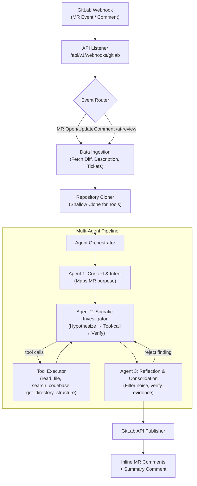
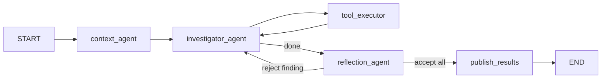

# Agentic Code Review Service for GitLab — Implementation Plan

---

# TypeScript vs Python — Ecosystem Research & Verdict

## Executive Summary

This section evaluates the **Python** and **TypeScript** ecosystems for building GitGandalf (GG) — a multi-agent, LLM-powered GitLab code review service. Both paths are viable, but they differ in **ecosystem maturity for AI/agent tooling**, **runtime performance characteristics**, **developer ergonomics**, and **deployment story**. Below is a thorough, concern-by-concern comparison, followed by our verdict.

---

## Concern-by-Concern Comparison

### 1. Web Framework

| | Python | TypeScript |
|---|---|---|
| **Choice** | FastAPI + Uvicorn | **Bun + Hono** |
| **Maturity** | Battle-tested, massive ecosystem, first-class async, Pydantic integration | Hono is production-ready (used at Cloudflare). Bun is rapidly maturing (1.x stable) |
| **Performance** | Excellent for I/O-bound (async), limited by Python GIL for CPU work | Bun + Hono benchmarks at **111K+ req/s**, avg response ~0.45ms. Significantly faster raw throughput |
| **Validation** | Pydantic (best-in-class schema validation) | Zod (excellent, first-class TS integration, similar DX to Pydantic) |
| **Webhook Handling** | Native async with `BackgroundTasks` | Bun's native async + `waitUntil()` pattern or simple `Promise` fire-and-forget |
| **Verdict** | ✅ Rock-solid, but performance is overkill for webhook volume | ✅ Faster, lighter, modern DX. Bun's built-in test runner, bundler, and package manager reduce toolchain complexity |

> [!NOTE]
> For a webhook-driven service processing ~100s of MR events/day, raw HTTP throughput is **not** the bottleneck — LLM latency dominates. Both frameworks are more than adequate. The real differentiator is **developer experience and toolchain simplicity**.

---

### 2. LLM Provider — AWS Bedrock

| | Python | TypeScript |
|---|---|---|
| **Choice** | `boto3` + Bedrock Runtime | `@aws-sdk/client-bedrock-runtime` or `@anthropic-ai/bedrock-sdk` |
| **SDK Quality** | `boto3` is the canonical AWS SDK. Mature, well-documented, sync + async (`aioboto3`) | `@aws-sdk/client-bedrock-runtime` is the official JS SDK v3 — modular, tree-shakeable, fully typed. Anthropic also ships `@anthropic-ai/bedrock-sdk` for a cleaner DX |
| **Sonnet 4 Access** | Full support via `InvokeModel` / `Converse` API | Full support via identical Bedrock APIs. The `@anthropic-ai/bedrock-sdk` gives you the same Anthropic Messages API shape but routed through Bedrock auth |
| **Streaming** | `InvokeModelWithResponseStream` — works well | Same API, fully supported. Bun's streaming primitives are excellent |
| **Verdict** | ✅ Slightly more examples/docs available | ✅ Excellent parity. The Anthropic Bedrock SDK for TS is arguably cleaner than raw `boto3` |

> [!TIP]
> **Recommendation**: Use `@anthropic-ai/bedrock-sdk` for TypeScript — it gives you the familiar Anthropic Messages API (with tool_use support) while routing through Bedrock IAM auth. This avoids the verbosity of raw `@aws-sdk` Bedrock calls. For Python, use `anthropic` SDK with the `AnthropicBedrock` client for the same benefit.

---

### 3. Agent Orchestration

| | Python | TypeScript |
|---|---|---|
| **Choice** | **LangGraph** (Python) | **LangGraph.js** (`@langchain/langgraph`) or **Custom Graph** |
| **Maturity** | LangGraph Python is the primary, most mature version. Rich ecosystem, LangSmith integration, extensive docs | LangGraph.js exists and supports multi-agent workflows, but **the ecosystem is heavily Python-first**. Docs, examples, and community are ~80% Python |
| **Feature Parity** | Full: StateGraph, conditional edges, ToolNode, checkpointing, human-in-the-loop | Good but lagging: StateGraph and conditional edges work. Some advanced features (checkpointing backends, LangSmith integration) may lag behind Python |
| **Custom Alternative** | Overkill — LangGraph is designed for exactly this | A lightweight custom state machine is very viable in TS (see below) |
| **Verdict** | ✅ **Clear winner** for LangGraph usage. If you want LangGraph, use Python | ⚠️ LangGraph.js works but you're a second-class citizen. **Better to build a lean custom orchestrator** in TS |

> [!IMPORTANT]
> **Critical insight**: The 3-agent pipeline in GG is a **linear graph with 2 loops** (Agent2↔Tools, Agent3→Agent2 re-investigation). This is not complex enough to warrant a full framework like LangGraph. A custom orchestrator in TypeScript (~200-300 lines) with explicit state passing, a tool-call loop, and a re-investigation counter would be **simpler, more debuggable, and zero-dependency**. In Python, LangGraph adds value because of `ToolNode` automation and LangSmith observability — but these benefits are specific to the Python-first LangChain ecosystem.

**Custom TS Orchestrator Sketch:**

```typescript
// Simplified — the full graph is just function composition with a loop
type ReviewState = { mrDetails: MRDetails; diffFiles: DiffFile[]; repoPath: string; ... };

async function runReview(state: ReviewState): Promise<ReviewState> {
  state = await contextAgent(state);          // Agent 1: no tools
  state = await investigatorLoop(state);       // Agent 2: tool loop (max 15 iterations)
  state = await reflectionAgent(state);        // Agent 3: filter/verify
  if (state.needsReinvestigation && state.reinvestigationCount < 1) {
    state.reinvestigationCount++;
    state = await investigatorLoop(state);
    state = await reflectionAgent(state);
  }
  return state;
}
```

---

### 4. LLM Abstraction

| | Python | TypeScript |
|---|---|---|
| **Choice** | **LiteLLM** | **Deferred to Phase 6+** (per user request) |
| **Python Path** | LiteLLM: unified interface, swap models via env vars, 100+ provider support | N/A |
| **TS Path** | N/A | For Phase 1-4: use `@anthropic-ai/bedrock-sdk` directly. In Phase 6+, consider **Vercel AI SDK** (`ai` package) — the most mature multi-provider abstraction in TS (OpenAI, Anthropic, Google, Bedrock, etc.) |
| **Verdict** | ✅ LiteLLM is excellent and battle-tested | ✅ Direct SDK is fine for single-provider start. Vercel AI SDK is the natural upgrade path |

---

### 5. GitLab API Client

| | Python | TypeScript |
|---|---|---|
| **Choice** | `python-gitlab` | **`@gitbeaker/rest`** |
| **Maturity** | Official, mature, good for REST v4 | Actively maintained (v43.8.0, Oct 2025), full TypeScript types, comprehensive GitLab API coverage up to v16.5 |
| **API Surface** | MR details, diffs, discussions, notes — all well-supported | Same coverage. Works on Bun, Node.js, Deno, and browsers |
| **Typing** | Python type hints via stubs (not native) | **Native TypeScript** — fully typed responses, autocomplete for all API methods |
| **Verdict** | ✅ Solid | ✅ **Arguably better DX** — native types give superior autocomplete and compile-time safety |

---

### 6. Git Operations — The Deep Dive

This is the most nuanced concern. Three approaches evaluated for TypeScript:

#### Option A: `Bun.spawn()` + native Git CLI

| Aspect | Assessment |
|---|---|
| **Performance** | ⭐⭐⭐⭐⭐ — Native Git is the fastest. Bun's `posix_spawn(3)` is significantly faster than Node.js `child_process` |
| **Reliability** | ⭐⭐⭐⭐⭐ — You're using the same Git that developers use. 100% feature parity |
| **Search** | Use `Bun.spawn()` with `ripgrep` for `search_codebase` tool — blazing fast |
| **File reading** | Use `Bun.file().text()` — zero-copy, extremely fast |
| **Complexity** | ⭐⭐⭐⭐ — Simple wrapper functions, no marshalling overhead |
| **Dependency** | Requires `git` and `ripgrep` installed in the Docker image (trivially solved) |
| **Directory listing** | `Bun.spawn()` with `find` or `Bun.file()` with recursive readdir |

#### Option B: `isomorphic-git`

| Aspect | Assessment |
|---|---|
| **Performance** | ⭐⭐⭐ — Pure JS Git implementation is **significantly slower** for cloning large repos (2-3x slower than native Git). Struggles with large pack files |
| **Reliability** | ⭐⭐⭐ — Good for basic operations but **not feature-complete**. Some advanced Git features are missing or behave differently |
| **Search** | ❌ No built-in search. You'd still need `ripgrep` via `Bun.spawn()` or implement JS-based search (much slower) |
| **File reading** | Works, but adds overhead — reads through Git's object model instead of direct filesystem access |
| **Complexity** | ⭐⭐⭐ — More complex API, need to handle HTTP transport, auth, etc. |
| **Dependency** | No native Git needed (the whole point) |
| **Best for** | Browser environments, serverless where you can't install `git`. **Not our use case** |

#### Option C: `simple-git` (wrapper around native Git CLI)

| Aspect | Assessment |
|---|---|
| **Performance** | ⭐⭐⭐⭐⭐ — Same as native Git (it's a wrapper) |
| **Reliability** | ⭐⭐⭐⭐⭐ — Mature, well-tested wrapper |
| **API** | Nice Promise-based API, TypeScript types included |
| **Dependency** | Requires native `git` (same as Option A) |
| **Verdict** | Good, but adds a dependency for what `Bun.spawn()` can do directly |

#### 🏆 Git Operations Verdict

**Recommendation: `Bun.spawn()` + native Git CLI (Option A)**

Reasons:
1. **We're running in Docker** — installing `git` and `ripgrep` is trivial (`apk add git ripgrep` in Alpine)
2. **Zero abstraction overhead** — `Bun.spawn()` uses `posix_spawn(3)`, the fastest way to invoke subprocesses
3. **`Bun.file().text()`** for file reading is zero-copy and extremely fast — no need to go through `isomorphic-git`'s JS Git object model
4. **`isomorphic-git` solves the wrong problem** — it's designed for environments where you *can't* install Git (browsers, edge). We're in a Docker container where Git is a 1-line install
5. **`simple-git`** adds a dependency for something that's ~50 lines of utility functions with `Bun.spawn()`
6. The Python plan uses `gitpython` which is also a native Git wrapper — `Bun.spawn()` is the equivalent pragmatic choice

**For the Python path**: `gitpython` is fine but has known issues with subprocess management and memory leaks on long-running processes. Consider `subprocess.run(['git', ...])` directly (same philosophy as `Bun.spawn()`), or stick with `gitpython` for the nicer API.

---

### 7. Task Queue (Phase 5+)

| | Python | TypeScript |
|---|---|---|
| **Choice** | **Celery + Redis/Valkey** | **BullMQ + Valkey** |
| **License** | Celery: **BSD 3-Clause** ✅ — fully permissive, safe for commercial use | BullMQ: **MIT** ✅ — fully permissive |
| **Valkey Support** | Celery works with Redis-compatible backends. Valkey is a drop-in Redis replacement (Redis fork). ✅ Works | BullMQ **explicitly supports Valkey** in their docs. ✅ First-class support |
| **Maturity** | Battle-tested at enormous scale (Instagram, Mozilla) | Mature, widely used in Node/TS ecosystem. Good dashboard (Bull Board) |
| **Alternative** | — | **Glide-MQ** (Rust core, NAPI bindings, built by Valkey maintainers) — newer but very promising for Valkey-native workloads |
| **Verdict** | ✅ Celery + Valkey is safe (BSD license confirmed) | ✅ BullMQ + Valkey is the natural choice. Both use Valkey Streams |

> [!NOTE]
> **Celery + Valkey**: Yes, Celery is BSD 3-Clause licensed — safe for any use. It works with Valkey since Valkey is wire-compatible with Redis. You just point the broker URL at Valkey instead of Redis.
>
> **BullMQ + Valkey**: BullMQ explicitly lists Valkey as a supported backend. Use `iovalkey` (100% TypeScript Redis/Valkey client) for the connection.

---

### 8. Deployment

| | Python | TypeScript |
|---|---|---|
| **Phase 1-4** | Docker Compose ✅ | Docker Compose ✅ |
| **Phase 5+** | k8s (KinD → EKS/GKE) | k8s (KinD → EKS/GKE) |
| **Docker Image** | Python 3.12 slim + ripgrep | **Bun's official Docker image** (`oven/bun:alpine`) + git + ripgrep |
| **Image Size** | ~150-200MB (Python slim + deps) | ~80-120MB (Bun alpine + deps). Bun is a single binary |
| **Startup Time** | ~1-2s (Uvicorn) | ~100-300ms (Bun native HTTP) |
| **k8s Parity** | Standard Python deployment patterns | Same patterns. Bun works identically in containers. KinD → EKS/GKE migration is runtime-agnostic |
| **Verdict** | ✅ Standard, well-documented | ✅ **Smaller images, faster cold starts** — advantages for k8s scaling |

---

## Overall Ecosystem Scorecard

| Concern | Python | TypeScript | Edge |
|---|---|---|---|
| Web Framework | FastAPI ⭐⭐⭐⭐⭐ | Bun + Hono ⭐⭐⭐⭐⭐ | **Tie** |
| LLM Provider (Bedrock) | boto3/anthropic ⭐⭐⭐⭐⭐ | @anthropic-ai/bedrock-sdk ⭐⭐⭐⭐⭐ | **Tie** |
| Agent Orchestration | LangGraph ⭐⭐⭐⭐⭐ | LangGraph.js ⭐⭐⭐ / Custom ⭐⭐⭐⭐ | **Python** (if you want a framework) |
| LLM Abstraction | LiteLLM ⭐⭐⭐⭐⭐ | Direct SDK → Vercel AI SDK later ⭐⭐⭐⭐ | **Python** (for now) |
| GitLab Client | python-gitlab ⭐⭐⭐⭐ | @gitbeaker/rest ⭐⭐⭐⭐⭐ | **TypeScript** |
| Git Operations | gitpython ⭐⭐⭐⭐ | Bun.spawn ⭐⭐⭐⭐⭐ | **TypeScript** |
| Task Queue | Celery + Valkey ⭐⭐⭐⭐⭐ | BullMQ + Valkey ⭐⭐⭐⭐⭐ | **Tie** |
| Deployment | Docker ⭐⭐⭐⭐ | Docker (smaller/faster) ⭐⭐⭐⭐⭐ | **TypeScript** |
| Type Safety | MyPy (opt-in, partial) ⭐⭐⭐ | Native TypeScript ⭐⭐⭐⭐⭐ | **TypeScript** |
| AI/Agent Ecosystem | Dominant ⭐⭐⭐⭐⭐ | Growing but second-class ⭐⭐⭐ | **Python** |

---

## 🏆 Final Verdict & Recommendation

### The Case for Python
- **AI ecosystem dominance**: LangGraph, LangChain, LiteLLM, and the broader AI tooling ecosystem are Python-first. You get the latest features, best docs, and largest community.
- **LangGraph**: If you want a framework-managed agent graph with built-in checkpointing, LangSmith observability, and `ToolNode` automation, Python is the only first-class path.
- **Lower risk**: More examples, more tutorials, more production deployments to reference.

### The Case for TypeScript
- **End-to-end type safety**: TypeScript's type system is significantly stronger than Python's opt-in MyPy. For a production service, this catches bugs at compile time.
- **Simpler toolchain**: Bun is runtime + package manager + bundler + test runner in one binary. Python needs `pip` + `venv`/`poetry`/`uv` + `pytest` + `mypy` as separate tools.
- **Performance**: Faster HTTP, faster subprocess spawning, smaller Docker images, faster cold starts.
- **The agent graph is simple enough**: GG's 3-agent pipeline is a linear graph with 2 small loops. A custom ~250-line orchestrator in TS is cleaner and more debuggable than pulling in LangGraph.
- **`Bun.spawn()` + `Bun.file()`**: Purpose-built for exactly what GG needs (shell out to Git/ripgrep, read files fast).
- **Future-proof**: Vercel AI SDK, Anthropic TS SDK, and the JS AI ecosystem are closing the gap rapidly.

### Our Recommendation

> [!IMPORTANT]
> **We lean TypeScript (Bun + Hono)**, with the following reasoning:
>
> 1. GG's agent orchestration needs are **simple enough** that LangGraph's complexity is not justified. A custom state-machine orchestrator in TS is cleaner.
> 2. The **type safety**, **toolchain simplicity**, and **runtime performance** advantages of Bun compound over the life of the project.
> 3. The **Git/file operations story** with `Bun.spawn()` + `Bun.file()` is superior to `gitpython`.
> 4. The AI ecosystem gap is **narrowing**, and GG only needs basic tool-calling (which both SDKs handle equally well).
>
> **However**: If you anticipate needing **LangSmith-level observability**, **complex agent graph modifications** (adding many more agents, human-in-the-loop, checkpointing), or **heavy use of LangChain integrations** in the future, Python is the safer bet.
>
> **Your call.** Pick one ecosystem and we'll create the final, single-ecosystem implementation plan.

---
---

# Detailed Plan — Both Paths

Below is the full implementation plan mapped to **both ecosystems**. Each section shows the Python and TypeScript approaches side by side.

---

## Technology Recommendations

| Concern | Python Choice | TypeScript Choice | Notes |
|---|---|---|---|
| **Web Framework** | FastAPI + Uvicorn | Bun + Hono | Both async, lightweight |
| **Agent Orchestration** | LangGraph | Custom StateGraph orchestrator (~250 LOC) | TS: LangGraph.js is an option but custom is recommended |
| **LLM Provider** | AWS Bedrock via `anthropic[bedrock]` | AWS Bedrock via `@anthropic-ai/bedrock-sdk` | Both get Sonnet 4 via Bedrock. Fallback OpenAI/Google in Phase 5+ |
| **LLM Abstraction** | LiteLLM | Deferred (Phase 6+). Direct SDK for now | TS: Vercel AI SDK is the future abstraction layer |
| **GitLab API Client** | `python-gitlab` | `@gitbeaker/rest` | Both mature, well-typed |
| **Git Operations** | `gitpython` (or raw `subprocess`) | `Bun.spawn()` + `Bun.file()` | TS: no C++ bindings, no `isomorphic-git` — pragmatic approach |
| **Task Queue (Phase 5+)** | Celery (BSD) + Valkey | BullMQ (MIT) + Valkey | Both open-source, both work with Valkey |
| **Deployment (Phase 1-4)** | Docker Compose | Docker Compose | Identical |
| **Deployment (Phase 5+)** | k8s: KinD → EKS/GKE | k8s: KinD → EKS/GKE | Runtime-agnostic |
| **Validation** | Pydantic | Zod | Both excellent schema validation |

> [!TIP]
> **Why LangGraph over pure function-calling? (Python path)**: Pure function-calling works for a single agent, but our architecture has *three cooperating agents* with conditional routing (e.g., Agent 2 loops back to its tools, Agent 3 can reject findings and re-query). LangGraph models this as a directed graph with explicit state, making the flow debuggable and testable. It also has a built-in `ToolNode` that handles tool-call/response cycles automatically.

> [!TIP]
> **Why Custom Orchestrator over LangGraph.js? (TypeScript path)**: GG's pipeline is a linear graph with 2 controlled loops. A custom orchestrator gives you full control, zero framework overhead, and is easier to debug than LangGraph.js (which is a second-class citizen in the LangChain ecosystem). The ~250 lines of custom code are simpler than the LangGraph dependency tree.

---

## High-Level Architecture



**Python path**: `FastAPI Listener` → `LangGraph Orchestrator` → `python-gitlab Publisher`
**TypeScript path**: `Hono Listener` → `Custom Orchestrator` → `@gitbeaker Publisher`

---

## Proposed Directory Structure

### Python

```
git-gandalf/
├── .env.example
├── .gitignore
├── docker-compose.yml
├── Dockerfile
├── pyproject.toml
├── README.md
├── src/
│   ├── __init__.py
│   ├── main.py                   # FastAPI app entrypoint
│   ├── config.py                 # Pydantic Settings (env vars)
│   ├── api/
│   │   ├── __init__.py
│   │   ├── router.py             # API route definitions
│   │   └── schemas.py            # Pydantic models for webhooks
│   ├── gitlab_client/
│   │   ├── __init__.py
│   │   ├── client.py             # GitLab API wrapper
│   │   └── models.py             # GitLab data models
│   ├── context/
│   │   ├── __init__.py
│   │   ├── repo_manager.py       # Clone/cache repos
│   │   └── tools.py              # Agent tools: read_file, search_codebase, etc.
│   ├── agents/
│   │   ├── __init__.py
│   │   ├── graph.py              # LangGraph workflow definition
│   │   ├── state.py              # Shared TypedDict state
│   │   ├── context_agent.py      # Agent 1
│   │   ├── investigator_agent.py # Agent 2
│   │   └── reflection_agent.py   # Agent 3
│   └── publisher/
│       ├── __init__.py
│       └── gitlab_publisher.py   # Format findings → GitLab comments
└── tests/
    ├── __init__.py
    ├── conftest.py
    ├── test_webhook.py
    ├── test_tools.py
    ├── test_agents.py
    └── test_publisher.py
```

### TypeScript

```
git-gandalf/
├── .env.example
├── .gitignore
├── docker-compose.yml
├── Dockerfile
├── package.json
├── tsconfig.json
├── bunfig.toml                    # Bun configuration
├── README.md
├── src/
│   ├── index.ts                   # Hono app entrypoint
│   ├── config.ts                  # Env vars via process.env + Zod validation
│   ├── api/
│   │   ├── router.ts              # API route definitions
│   │   └── schemas.ts             # Zod schemas for webhooks
│   ├── gitlab-client/
│   │   ├── client.ts              # @gitbeaker/rest wrapper
│   │   └── types.ts               # GitLab type definitions
│   ├── context/
│   │   ├── repo-manager.ts        # Clone/cache repos via Bun.spawn
│   │   └── tools.ts               # Agent tools: read_file, search_codebase, etc.
│   ├── agents/
│   │   ├── orchestrator.ts        # Custom state-machine graph
│   │   ├── state.ts               # Shared state type
│   │   ├── context-agent.ts       # Agent 1
│   │   ├── investigator-agent.ts  # Agent 2
│   │   └── reflection-agent.ts    # Agent 3
│   └── publisher/
│       └── gitlab-publisher.ts    # Format findings → GitLab comments
└── tests/
    ├── webhook.test.ts
    ├── tools.test.ts
    ├── agents.test.ts
    └── publisher.test.ts
```

---

## Phase 1: Setup & Webhooks

### Goal
Stand up the web server, parse GitLab webhook payloads, and fetch MR data.

---

#### Project Configuration

**Python** — `[NEW] pyproject.toml`
- Dependencies: `fastapi`, `uvicorn`, `python-gitlab`, `langgraph`, `langchain-anthropic`, `anthropic[bedrock]`, `gitpython`, `pydantic-settings`, `httpx`, `pytest`, `pytest-asyncio`.

**TypeScript** — `[NEW] package.json`
- Dependencies: `hono`, `@gitbeaker/rest`, `@anthropic-ai/bedrock-sdk`, `zod`, `@aws-sdk/credential-providers`.
- Dev dependencies: `@types/bun`, `typescript`.
- Scripts: `"dev": "bun run --hot src/index.ts"`, `"test": "bun test"`.

#### Environment Configuration

**Both** — `[NEW] .env.example`
- Template with: `GITLAB_URL`, `GITLAB_TOKEN`, `GITLAB_WEBHOOK_SECRET`, `AWS_REGION`, `AWS_ACCESS_KEY_ID`, `AWS_SECRET_ACCESS_KEY`, `LLM_MODEL` (default `claude-sonnet-4-20250514`), `REPO_CACHE_DIR`, `LOG_LEVEL`.

#### App Configuration

**Python** — `[NEW] src/config.py`
- `pydantic-settings` `BaseSettings` class loading from `.env`.

**TypeScript** — `[NEW] src/config.ts`
- Zod schema for environment validation. Parse `process.env` and export typed config object.
```typescript
const envSchema = z.object({
  GITLAB_URL: z.string().url(),
  GITLAB_TOKEN: z.string().min(1),
  GITLAB_WEBHOOK_SECRET: z.string().min(1),
  AWS_REGION: z.string().default('us-east-1'),
  LLM_MODEL: z.string().default('claude-sonnet-4-20250514'),
  REPO_CACHE_DIR: z.string().default('/tmp/repo_cache'),
  LOG_LEVEL: z.enum(['debug', 'info', 'warn', 'error']).default('info'),
});
export const config = envSchema.parse(process.env);
```

#### Webhook Schemas

**Python** — `[NEW] src/api/schemas.py`
- Pydantic models: `MergeRequestEvent`, `NoteEvent`.

**TypeScript** — `[NEW] src/api/schemas.ts`
- Zod schemas: `mergeRequestEventSchema`, `noteEventSchema`.
```typescript
const mergeRequestEventSchema = z.object({
  object_kind: z.literal('merge_request'),
  event_type: z.string(),
  project: z.object({ id: z.number(), web_url: z.string(), path_with_namespace: z.string() }),
  object_attributes: z.object({
    iid: z.number(), title: z.string(), description: z.string().nullable(),
    source_branch: z.string(), target_branch: z.string(),
    action: z.string(), url: z.string(),
  }),
});
```

#### API Router

**Python** — `[NEW] src/api/router.py`
- `POST /api/v1/webhooks/gitlab`: verify `X-Gitlab-Token`, parse payload, filter events, kick off pipeline, return `202`.
- `GET /api/v1/health`.

**TypeScript** — `[NEW] src/api/router.ts`
- Same endpoints using Hono:
```typescript
const app = new Hono();
app.post('/api/v1/webhooks/gitlab', async (c) => {
  const token = c.req.header('X-Gitlab-Token');
  if (token !== config.GITLAB_WEBHOOK_SECRET) return c.text('Unauthorized', 401);
  const body = await c.req.json();
  // parse, filter, dispatch pipeline asynchronously
  return c.text('Accepted', 202);
});
app.get('/api/v1/health', (c) => c.json({ status: 'ok' }));
```

#### GitLab Client

**Python** — `[NEW] src/gitlab_client/client.py`
- Wrapper around `python-gitlab`: `get_mr_details()`, `get_mr_diff()`, `get_mr_discussions()`.

**TypeScript** — `[NEW] src/gitlab-client/client.ts`
- Wrapper around `@gitbeaker/rest`:
```typescript
import { Gitlab } from '@gitbeaker/rest';
const api = new Gitlab({ host: config.GITLAB_URL, token: config.GITLAB_TOKEN });
// api.MergeRequests.show(), api.MergeRequests.allDiffs(), etc.
```

#### GitLab Models

**Python** — `[NEW] src/gitlab_client/models.py`
- Pydantic: `MRDetails`, `DiffFile`, `DiffHunk`.

**TypeScript** — `[NEW] src/gitlab-client/types.ts`
- TypeScript interfaces + Zod schemas: `MRDetails`, `DiffFile`, `DiffHunk`.

---

## Phase 2: Agent Tools & Context Engine

### Goal
Give agents the ability to explore the full repository, not just the raw diff.

---

#### Repository Manager

**Python** — `[NEW] src/context/repo_manager.py`
- `RepoManager` class using `gitpython` (or raw `subprocess.run(['git', ...])`):
  - `clone_or_update(project_url, branch)` — shallow clone (`depth=1`).
  - `get_repo_path(project_id)` → `Path`.
  - TTL-based eviction.

**TypeScript** — `[NEW] src/context/repo-manager.ts`
- `RepoManager` class using `Bun.spawn()`:
```typescript
async cloneOrUpdate(projectUrl: string, branch: string): Promise<string> {
  const repoPath = `${config.REPO_CACHE_DIR}/${projectId}`;
  if (await Bun.file(`${repoPath}/.git/HEAD`).exists()) {
    await Bun.spawn(['git', 'fetch', 'origin', branch], { cwd: repoPath });
    await Bun.spawn(['git', 'checkout', branch], { cwd: repoPath });
  } else {
    await Bun.spawn(['git', 'clone', '--depth=1', '--branch', branch, projectUrl, repoPath]);
  }
  return repoPath;
}
```

#### Agent Tools

**Both paths** — same tool semantics, different implementations:

| Tool | Signature | Description |
|---|---|---|
| `read_file` | `(path: str) → str` | Read a file's contents. Returns up to 500 lines with line numbers. Path relative to repo root. |
| `search_codebase` | `(query: str, file_glob: str = "*") → SearchResult[]` | Regex/string search using `ripgrep` (subprocess). Capped at 30 results. |
| `get_directory_structure` | `(path: str = ".") → str` | Tree-style directory listing (max depth 3). Ignores `node_modules`, `.git`, etc. |

**Python** — `[NEW] src/context/tools.py`
- LangChain `@tool` decorated functions using `subprocess.run(['rg', ...])` for search and `pathlib` for file ops.

**TypeScript** — `[NEW] src/context/tools.ts`
- Plain functions (tools are just functions + JSON schema descriptors):
```typescript
async function readFile(repoPath: string, filePath: string): Promise<string> {
  const resolved = path.resolve(repoPath, filePath);
  if (!resolved.startsWith(repoPath)) throw new Error('Path traversal blocked');
  return await Bun.file(resolved).text();
}

async function searchCodebase(repoPath: string, query: string, glob = '*'): Promise<SearchResult[]> {
  const proc = Bun.spawn(['rg', '--json', '-g', glob, '-m', '30', query, '.'], { cwd: repoPath });
  const output = await new Response(proc.stdout).text();
  return parseRipgrepJson(output);
}
```

> [!IMPORTANT]
> **Security**: All tool paths are sandboxed to the cloned repo directory. Path traversal attempts (e.g., `../../etc/passwd`) are rejected in both implementations.

---

## Phase 3: Multi-Agent Orchestration

### Goal
Wire up the 3-agent pipeline with shared state and conditional routing.

---

#### Shared State

**Python** — `[NEW] src/agents/state.py`

```python
class ReviewState(TypedDict):
    mr_details: MRDetails
    diff_files: list[DiffFile]
    repo_path: str
    mr_intent: str
    change_categories: list[str]
    risk_areas: list[str]
    raw_findings: list[Finding]
    verified_findings: list[Finding]
    summary_verdict: str
    messages: Annotated[list, add_messages]
```

**TypeScript** — `[NEW] src/agents/state.ts`

```typescript
interface ReviewState {
  mrDetails: MRDetails;
  diffFiles: DiffFile[];
  repoPath: string;
  mrIntent: string;
  changeCategories: string[];
  riskAreas: string[];
  rawFindings: Finding[];
  verifiedFindings: Finding[];
  summaryVerdict: string;
  messages: Message[];
  reinvestigationCount: number;
}
```

#### Agent 1 — Context & Intent Mapper

**Both paths** — Same system prompt, same logic, different SDK calls:
- **No tools** — works only with diff and MR metadata.
- Identifies developer's intent, categorizes change areas, generates risk hypotheses.
- **Output**: Updates `mr_intent`, `change_categories`, `risk_areas`.

**Python**: Uses `ChatAnthropic` via LangChain/LiteLLM with Bedrock backend.
**TypeScript**: Uses `@anthropic-ai/bedrock-sdk` directly:
```typescript
const client = new AnthropicBedrock({ awsRegion: config.AWS_REGION });
const response = await client.messages.create({
  model: config.LLM_MODEL,
  max_tokens: 4096,
  system: CONTEXT_AGENT_SYSTEM_PROMPT,
  messages: [{ role: 'user', content: buildContextPrompt(state) }],
});
```

#### Agent 2 — Socratic Investigator

**Both paths** — Same system prompt, tools bound, max 15 tool-call iterations:
- **Tools**: `read_file`, `search_codebase`, `get_directory_structure`.
- Forms hypotheses, gathers evidence, records findings.
- **Output**: Updates `raw_findings`.

**Python**: Uses LangGraph's `ToolNode` for automatic tool-call/response cycles.
**TypeScript**: Custom tool-call loop:
```typescript
async function investigatorLoop(state: ReviewState): Promise<ReviewState> {
  let iterations = 0;
  while (iterations < MAX_TOOL_ITERATIONS) {
    const response = await client.messages.create({
      model: config.LLM_MODEL,
      tools: TOOL_DEFINITIONS,
      messages: state.messages,
    });
    state.messages.push({ role: 'assistant', content: response.content });
    const toolUses = response.content.filter(b => b.type === 'tool_use');
    if (toolUses.length === 0) break;
    const toolResults = await Promise.all(toolUses.map(executeTool));
    state.messages.push({ role: 'user', content: toolResults });
    iterations++;
  }
  state.rawFindings = extractFindings(state.messages);
  return state;
}
```

#### Agent 3 — Reflection & Consolidation

**Both paths** — Same system prompt, same filtering logic:
- **No tools**. Reviews findings, filters noise, keeps only high-signal issues.
- Generates verdict: `APPROVE`, `REQUEST_CHANGES`, or `NEEDS_DISCUSSION`.
- Can route back to Agent 2 for re-investigation (max 1 loop).
- **Output**: Updates `verified_findings`, `summary_verdict`.

#### Graph Wiring

**Python** — `[NEW] src/agents/graph.py`
- LangGraph `StateGraph` with conditional edges:



**TypeScript** — `[NEW] src/agents/orchestrator.ts`
- Custom function composition:
```typescript
export async function runReview(initialState: ReviewState): Promise<ReviewState> {
  let state = await contextAgent(initialState);
  state = await investigatorLoop(state);
  state = await reflectionAgent(state);
  if (state.needsReinvestigation && state.reinvestigationCount < 1) {
    state.reinvestigationCount++;
    state = await investigatorLoop(state);
    state = await reflectionAgent(state);
  }
  return state;
}
```

---

## Phase 4: GitLab API Feedback Loop

### Goal
Post verified findings as inline MR comments and a summary note.

---

#### Publisher

**Python** — `[NEW] src/publisher/gitlab_publisher.py`
**TypeScript** — `[NEW] src/publisher/gitlab-publisher.ts`

Both implement:
- `postInlineComments(projectId, mrIid, findings)`:
  - Creates Merge Request Discussions with position data (`new_path`, `new_line`, `base_sha`, `head_sha`, `start_sha`).
  - Body format:
    ```
    ## ⚠️ [Risk Level]: [Title]

    **Risk**: [Description]

    **Evidence**: [What the agent found]

    **Suggested Fix**:
    ```suggestion
    [code suggestion]
    ```
    ```
  - Deduplication: checks existing discussions.
- `postSummaryComment(projectId, mrIid, verdict, findingsCount)`:
  - Overall verdict badge (✅ APPROVE / ⚠️ REQUEST CHANGES / 💬 NEEDS DISCUSSION).
  - Summary table of findings by severity.

#### End-to-End Wiring

**Python** — `[MODIFY] src/api/router.py`
- Wire: webhook → fetch MR data → clone repo → run LangGraph → publish. Use `BackgroundTasks`.

**TypeScript** — `[MODIFY] src/api/router.ts`
- Wire: webhook → fetch MR data → clone repo → run orchestrator → publish. Fire-and-forget async.

#### Docker

**Python** — `[NEW] Dockerfile`
- Multi-stage: Python 3.12 slim, `apt install ripgrep git`, copy source, run with `uvicorn`.

**TypeScript** — `[NEW] Dockerfile`
```dockerfile
FROM oven/bun:alpine AS base
RUN apk add --no-cache git ripgrep
WORKDIR /app
COPY package.json bun.lock* ./
RUN bun install --frozen-lockfile
COPY . .
CMD ["bun", "run", "src/index.ts"]
```

**Both** — `[NEW] docker-compose.yml`
- Service with env_file, port mapping, volume for repo cache.

**Both** — `[NEW] README.md`
- Setup guide: env vars, GitLab webhook configuration, running with Docker, running locally.

---

## User Review Required

> [!IMPORTANT]
> **Ecosystem Decision**: Please choose **Python** or **TypeScript** as the implementation ecosystem. The final plan will be rewritten for your chosen ecosystem only. See the [verdict section](#-final-verdict--recommendation) above.

> [!IMPORTANT]
> **Ticket Integration (Jira/Linear)**: Currently extracts ticket IDs from MR descriptions via regex. Should we add Jira/Linear API integration in Phase 2, or defer?

> [!WARNING]
> **GitLab Self-Managed vs. SaaS**: Both `python-gitlab` and `@gitbeaker/rest` support both, but auth and URL configuration differ. Please confirm which GitLab variant you're targeting.

---

## Verification Plan

### Automated Tests

**Python**:
```bash
pip install -e ".[dev]"
pytest tests/ -v
```

**TypeScript**:
```bash
bun test
```

| Test File (Python / TypeScript) | Phase | What It Covers |
|---|---|---|
| `test_webhook.py` / `webhook.test.ts` | 1 | Webhook parsing, secret validation, event filtering. |
| `test_tools.py` / `tools.test.ts` | 2 | Tool sandboxing, file reading, search results, directory structure. Uses a temp git repo fixture. |
| `test_agents.py` / `agents.test.ts` | 3 | Each agent in isolation with mocked LLM responses. State transitions and noise filtering. |
| `test_publisher.py` / `publisher.test.ts` | 4 | Comment formatting, deduplication, API call assertions (mocked). |

### Integration Test (End-to-End)

1. Start the service locally:
   - **Python**: `uvicorn src.main:app --port 8000`
   - **TypeScript**: `bun run src/index.ts` (port 8000)
2. Send a sample webhook:
   ```bash
   curl -X POST http://localhost:8000/api/v1/webhooks/gitlab \
     -H "Content-Type: application/json" \
     -H "X-Gitlab-Token: test-secret" \
     -d @tests/fixtures/sample_mr_event.json
   ```
3. Verify the 3-agent pipeline executes in logs.
4. (With real GitLab token) Verify inline comments appear on a test MR.

### Manual Verification

1. **Create a test MR** on a GitLab project with a deliberate bug.
2. **Configure the webhook** to point at the running service.
3. **Open the MR** and observe:
   - Service receives the event within seconds.
   - After ~30-60 seconds, inline comments appear.
   - Summary comment appears at MR level.
   - Comments are high-signal (no formatting nitpicks).
4. **Push an update** — verify no duplicate comments.
5. **Comment `/ai-review`** — verify it triggers a fresh review.
