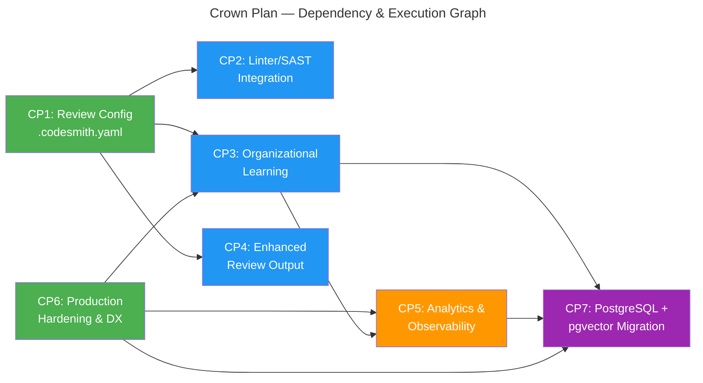

# The Crown Plan — Code Smith Feature Parity & Beyond

## Locked Design Decisions

The crown plan now assumes the following implementation constraints. They are no longer open decisions.

- Repo configuration lives in `.codesmith.yaml` at repo root.
- Repo configuration may select behavior, thresholds, and named linter profiles, but it may never define executable commands.
- Initial linter scope is Biome and other instance-owned standalone binaries only. ESLint is explicitly deferred to a future dependency-hydration and sandbox design.
- Learning and analytics data use `bun:sqlite`, but write ownership belongs to a singleton internal ops/control-plane service rather than multi-writer shared pods.
- Webhook and worker pods send learning and analytics write intents to the ops service through durable internal BullMQ jobs with idempotency keys; only the ops service writes SQLite.
- SQLite is phase-one relational storage, not a permanent architectural boundary. Learning and analytics code must sit behind storage interfaces so PostgreSQL can replace SQLite later without queue-payload or route-contract churn.
- Learning feedback starts with GitLab reactions and suggestion-state tracking. Explicit comment commands are future work.
- Admin and analytics routes use a dedicated bearer-auth or mTLS-protected internal route group, disabled by default, and never reuse webhook auth.
- Feedback polling stores persisted sync cursors and source identifiers so resume and deduplication are deterministic after restarts.
- Operational observability uses Prometheus metrics; leadership analytics use SQLite-backed APIs behind the admin route group.
- SQLite is supported only on a singleton ops deployment with block-backed `ReadWriteOnce` storage. Shared RWX/network-filesystem deployments are explicitly unsupported for the SQLite file.
- Kubernetes packaging uses Helm.
- Summary output is tiered: smart summary always, walkthrough only when the MR is large or explicitly enabled.
- Glob matching defaults to `Bun.Glob`; an external matcher is added only if Bun-native behavior proves insufficient.
- Dependency-introducing phases must include a `bun audit` remediation or explicit risk-acceptance step before merge. `bun audit` is the canonical gate; optional wrappers may assist CI reporting but must not replace it.
- Standalone linter profiles run with an explicit sandbox contract: minimal inherited environment, stripped credentials, bounded output, bounded time, and isolated temp storage.
- Readiness is role-specific across webhook, worker, and ops deployments; external dependency reachability stays on diagnostics only.
- Storage roles are explicit: relational storage is the source of truth for feedback, learned patterns, and analytics facts; Valkey remains queue/cache infrastructure; vector indexing is future optional infrastructure only if semantic retrieval becomes a real requirement.

## Strategic Vision

Code Smith's corrected evaluation score is **7.3/10** — marginally behind GitLab Duo (7.4) and above CodeRabbit (6.9). The score is honest: Code Smith leads on data sovereignty and cost but gets hammered on production readiness (4/10), ease of setup (5/10), and operational maturity. The gap to GitLab Duo is 0.1 points — closing it requires meaningful gains in readiness, operations, and integration depth.

This plan closes every competitive gap through six primary child plans plus one threshold-driven future migration plan. The target is a legitimate **9.0/10** — earned through real capabilities, not marketing.

**Legend:** Green = start immediately (no dependencies); Blue = start after CP1; Orange = start after prerequisites; Purple = threshold-driven future migration path.

---

## Scoring Gap Analysis

Each child plan targets specific scoring improvements. The rightmost column shows the expected score after all plans are implemented.

| Criterion | Weight | Current | Target | Delta | Enabling Plans |
|---|---|---|---|---|---|
| Review quality & depth | 20% | 8 | 9 | +1 | CP2 (linters), CP3 (learning), CP4 (output) |
| Data privacy & sovereignty | 20% | 10 | 10 | 0 | Already strongest; note that code diffs transit to org-controlled LLM providers |
| Production readiness & maturity | 15% | 4 | 9 | +5 | CP6 (Helm, monitoring, perf, testing, runbook) |
| Cost efficiency | 15% | 8 | 9 | +1 | CP2 (linters reduce need for external tools) |
| Ease of setup & operations | 10% | 5 | 9 | +4 | CP1 (config), CP6 (Helm chart, docs) |
| GitLab integration depth | 10% | 7 | 9 | +2 | CP4 (summaries, walkthroughs), CP5 (analytics) |
| Customization & extensibility | 5% | 9 | 10 | +1 | CP1 (YAML config) |
| Vendor risk / sustainability | 5% | 5 | 7 | +2 | CP6 (contributor guide, test coverage, docs) |

**Target weighted score:** 9×0.20 + 10×0.20 + 9×0.15 + 9×0.15 + 9×0.10 + 9×0.10 + 10×0.05 + 7×0.05 = **9.15**

> **Baseline note:** Current scores are from the corrected evaluation: GitLab Duo 7.4, CodeRabbit 6.9, Code Smith 7.3. See `docs/AI-Code-Review-Tool-Evaluation.md` Section 9 for the evidence-backed rubric.

---

## Child Plan Inventory

### CP1 — Repo-Based Review Configuration

**File:** [`docs/plans/implemented/repo-review-config-plan.md`](../implemented/repo-review-config-plan.md)
**Priority:** HIGH (foundational — CP2, CP3, CP4 depend on it)
**Estimated hours:** 24–36

**Status:** Implemented and audited. Follow-on security hardening is tracked separately in `CP1-SG`.

**What it does:** Introduces `.codesmith.yaml` repo-level configuration. Projects can customize review behavior, severity thresholds, file exclusions, language-specific rules, and opt into features like enhanced summaries and linter integration — all without environment variables or Code Smith redeployment.

**Competitive gap closed:** Custom review instructions (GitLab Duo: YAML per-file patterns; CodeRabbit: YAML + AST + Learnings)

**Key capabilities:**
- `.codesmith.yaml` discovery and Zod-validated parsing during pipeline startup
- Per-file-pattern review rules (glob-based, like GitLab Duo's `fileFilters`)
- Severity threshold overrides (e.g., "only report high+ for test files")
- File/directory exclusion patterns
- Language-specific review instructions injected into agent prompts
- Feature flags per repo (linter integration, enhanced summaries, learning opt-in)
- Named instance-owned linter profile selection without allowing repo-defined command execution

---

### CP2 — Linter & SAST Integration

**File:** [`docs/plans/backlog/linter-sast-integration-plan.md`](../backlog/linter-sast-integration-plan.md)
**Priority:** HIGH
**Estimated hours:** 30–45
**Depends on:** CP1 (linter config in `.codesmith.yaml`)

**What it does:** Runs Biome and other instance-owned standalone static-analysis profiles against changed files before the AI review. Feeds normalized findings into the agent pipeline as structured context — agents can reference, deduplicate against, and prioritize their own findings relative to deterministic tooling output.

**Competitive gap closed:** Linter/SAST integration (CodeRabbit: 40+ built-in; Code Smith: 0 → Biome + standalone-binary profile architecture)

**Key capabilities:**
- Auto-detect repo Biome usage and select instance-owned standalone profiles from deployment config
- Run Biome and other instance-owned standalone binaries against changed files only (diff-scoped)
- Parse linter output (JSON format) into normalized finding format
- Feed linter context to investigator agent as structured pre-review data
- Optionally publish linter-only findings as separate inline comments
- Configurable via `.codesmith.yaml` (enable/disable, severity threshold, named profile selection)
- ESLint explicitly deferred until a separate dependency-hydration and sandbox plan exists

---

### CP3 — Organizational Learning System

**File:** [`docs/plans/backlog/organizational-learning-plan.md`](../backlog/organizational-learning-plan.md)
**Priority:** HIGH
**Estimated hours:** 40–60
**Depends on:** CP1 (learning config in `.codesmith.yaml`), CP6 (admin route group and singleton ops foundation)

**What it does:** Captures feedback signals from developers (reactions and applied/dismissed suggestions), stores them in a singleton ops-owned SQLite database, and injects relevant learned patterns into future reviews through a safe internal read path. This is the single biggest competitive differentiator CodeRabbit has — and the most impactful feature Code Smith can build.

**Competitive gap closed:** Learns from feedback across MRs (CodeRabbit: "Learnings" system; GitLab Duo: none; Code Smith: none → full learning loop)

**Key capabilities:**
- Feedback ingestion: poll GitLab for reactions on Code Smith comments, track applied suggestions
- `bun:sqlite` learning database with WAL mode and singleton write ownership
- Durable internal write-job transport from webhook/worker surfaces to the ops service
- Pattern extraction: group feedback by file pattern, language, finding category
- Learning injection: add relevant learned patterns to investigator agent's system prompt per review via an internal cached read API
- Learning management: API endpoints to view, edit, and delete learned patterns behind the dedicated admin route group
- Per-project and cross-project learning scopes
- Configurable via `.codesmith.yaml` (opt-in/out, scope, retention)

---

### CP4 — Enhanced Review Output

**File:** [`docs/plans/backlog/enhanced-review-output-plan.md`](../backlog/enhanced-review-output-plan.md)
**Priority:** MEDIUM-HIGH
**Estimated hours:** 24–36
**Depends on:** CP1 (output config in `.codesmith.yaml`)

**What it does:** Upgrades Code Smith's review output from "findings + verdict" to a comprehensive review experience: smart MR summaries, change walkthroughs, architecture impact notes, and improved suggestion formatting with better one-click-apply support.

**Competitive gap closed:** PR summary/walkthrough (CodeRabbit: summary + walkthrough + diagram; GitLab Duo: MR summary; Code Smith: verdict only → full review output)

**Key capabilities:**
- Smart MR summary: change categories, key decisions, risk assessment, testing status
- File-by-file change walkthrough (configurable, opt-in for large MRs)
- Improved suggestion formatting: clearer before/after context, better GitLab suggestion fence generation
- Severity-sorted finding presentation with color-coded priority bands
- Collapsible detail sections in summary notes (GitLab-flavored markdown)
- Architecture impact notes when cross-module changes are detected
- Configurable output depth via `.codesmith.yaml`

---

### CP5 — Analytics & Observability

**File:** [`docs/plans/backlog/analytics-observability-plan.md`](../backlog/analytics-observability-plan.md)
**Priority:** MEDIUM
**Estimated hours:** 30–45
**Depends on:** CP3 (learning database schema), CP6 (deployment wiring and operationalization for Prometheus metrics)

**What it does:** Adds review-level analytics (finding trends, severity distributions, per-project stats, false positive rates) and operational metrics (Prometheus endpoint for request latency, queue depth, LLM call duration). Provides API endpoints for querying analytics data for dashboards or reports.

**Competitive gap closed:** Analytics/reporting (CodeRabbit: built-in dashboard; GitLab Duo: SDLC trends; Code Smith: structured logs only → metrics + analytics API)

**Key capabilities:**
- `bun:sqlite` analytics tables: review runs, findings, feedback, timing
- REST API endpoints under the dedicated admin route group for `/api/v1/admin/analytics/*`
- Durable ops-owned analytics write path using BullMQ jobs with idempotency keys
- Prometheus metrics endpoint: `/metrics` (review duration, queue depth, LLM latency, error rates, findings per severity)
- Per-project review quality scores derived from finding-to-feedback ratios
- Time-series trend data (weekly/monthly aggregates)
- Configurable retention period for analytics data, enforced by the singleton ops service

**Ownership note:** CP5 owns the concrete metrics implementation (`src/metrics/*`, instrumentation, and the `/metrics` route). CP6 consumes that foundation for Helm scrape configuration, operational runbooks, and autoscaling follow-on work.

---

### CP6 — Production Hardening & Developer Experience

**File:** [`docs/plans/backlog/production-hardening-plan.md`](../backlog/production-hardening-plan.md)
**Priority:** HIGH (parallel with CP1 — no dependencies)
**Estimated hours:** 40–60

**What it does:** Transforms Code Smith from a well-engineered prototype into a production-grade service. Helm chart, HPA, health probes, resource limits, Prometheus metrics, operational runbook, performance benchmarks, contributor documentation, and end-to-end integration tests.

**Competitive gap closed:** Production readiness (4/10 → 9/10), Ease of setup (5/10 → 9/10), Vendor risk (5/10 → 7/10)

**Key capabilities:**
- Helm chart with configurable `values.yaml` (replaces raw K8s manifests)
- Dedicated admin/control-plane route group with separate auth and internal-ingress defaults
- Singleton ops deployment for learning and analytics write ownership
- Internal durable queue transport for ops-owned writes and maintenance jobs
- HorizontalPodAutoscaler for webhook and worker deployments
- Resource limits and requests based on benchmarked memory/CPU profiles
- Readiness and liveness probes (beyond current `/health`) with readiness based on local service health, not external GitLab reachability
- Prometheus scrape integration and deployment hardening for the metrics foundation implemented in CP5
- Operational runbook (incident response, scaling, backup, recovery)
- Performance benchmarks: review latency P50/P95/P99 under load
- End-to-end integration test suite (webhook → agents → publication)
- Contributor guide (setup, architecture overview, PR process, code style)
- Structured error taxonomy for consistent error handling
- Graceful degradation documentation (what happens when LLM/GitLab/Jira is down)
- Dependency audit gate for new packages introduced in later phases

---

### CP7 — PostgreSQL & pgvector Migration Path

**File:** [`docs/plans/backlog/postgresql-pgvector-migration-plan.md`](../backlog/postgresql-pgvector-migration-plan.md)
**Priority:** FUTURE / THRESHOLD-DRIVEN
**Estimated hours:** 40–70
**Depends on:** CP3, CP5, CP6

**What it does:** Defines the additive migration path from the phase-one singleton SQLite design to PostgreSQL as the long-term system of record, with optional `pgvector` only if Code Smith later needs semantic retrieval over free-form review memory.

**Competitive gap closed:** Long-term operational maturity, HA storage, and future semantic memory without locking the product into a premature specialized database.

**Activation criteria:** Start CP7 only when one or more thresholds are met: multi-writer or HA pressure on the ops service, external SQL/reporting consumers, sustained queue lag from analytics writes, multi-GB growth with degraded admin queries, stronger PITR/backup expectations, or a proven need for semantic retrieval beyond heuristic learning rules.

**Key capabilities:**
- Storage abstraction seam across CP3 and CP5 so migration is additive rather than invasive
- PostgreSQL foundation for transactional learning and analytics data
- Dual-write/backfill/cutover plan with verification gates
- Optional `pgvector` extension only when semantic retrieval becomes a justified product requirement

---

## Execution Strategy

### Phase 1 — Foundation (Weeks 1–3)

CP1 is complete. Continue CP6 (Production Hardening) as the remaining foundation track while downstream plans build on the shipped `.codesmith.yaml` contract.

- **CP1** now unlocks CP2, CP3, and CP4 through a shipped repo-config contract
- **CP6** establishes the remaining operational foundation (Helm, metrics, testing)

### Phase 2 — Core Capabilities (Weeks 3–7)

With CP1 complete and CP6's admin/control-plane and durable-write foundation in place, start CP2 (Linter Integration), CP3 (Organizational Learning), and CP4 (Enhanced Output).

- **CP2** adds linter pre-processing to the pipeline
- **CP3** adds the feedback loop and learning injection on top of the singleton ops service
- **CP4** upgrades the review output quality

### Phase 3 — Analytics & Polish (Weeks 7–10)

With CP3 and CP6 complete, start CP5 (Analytics & Observability).

- **CP5** builds on CP6's Prometheus foundation and CP3's learning database

### Phase 4 — Storage Validation & Future Scale Path (Week 10+)

With CP3, CP5, and CP6 implemented, review the storage activation criteria. If the thresholds are not met, keep the phase-one SQLite design. If they are met, activate CP7 and migrate to PostgreSQL, adding `pgvector` only if semantic retrieval is part of the requirement.

### Phase 5 — Crown Validation (after required child plans)

Re-run the competitive evaluation scoring with evidence from implemented capabilities. Update the evaluation document with honest, evidence-backed scores.

---

## Success Criteria

The Crown Plan is complete when:

1. CP1–CP6 are implemented, reviewed (via `review-plan-phase`), and moved to `docs/plans/implemented/`
2. CP7 is either implemented after its activation criteria are met or explicitly left deferred with the criteria documented as not yet met
3. The competitive evaluation scoring can be re-run with evidence showing Code Smith at **9.0+** weighted score
4. Every scoring improvement claim is backed by a working, tested feature — not aspirational capability
5. The evaluation document (`docs/AI-Code-Review-Tool-Evaluation.md`) is updated with new scores and evidence
6. No child plan was marked complete based on partial scaffolding, stub implementations, or skipped tests

---

## Relationship to Existing Plans

| Active Plan | Relationship |
|---|---|
| [Code Smith Master Plan](../backlog/code-smith-master-plan.md) | Predecessor. Crown Plan extends beyond Phase 5. No conflicts. |
| [CodeSmith Awakening Personality Plan](../backlog/CodeSmith-awakening-personality-plan.md) | Independent. Personality work continues alongside Crown Plan. CP1 config may later include personality settings. **Coordination note (review-driven O6):** The Awakening plan modifies `src/api/router.ts`, `src/publisher/gitlab-publisher.ts`, and `src/api/pipeline.ts` — all files that CP1, CP4, and CP6 also modify. Strategy: either (a) complete the Awakening plan before Crown Plan implementation begins on CP4 (publisher changes), or (b) implement Crown Plan changes in a way that preserves Awakening's trigger-context and tone-split hooks. Implementers of CP4 and CP6 must check the Awakening plan's current status before modifying overlapping files. |
| [Review Edge Cases Hardening](./review-edge-cases-hardening.md) | Predecessor (fully implemented). Crown Plan builds on the checkpoint, incremental review, and dedup infrastructure. |
