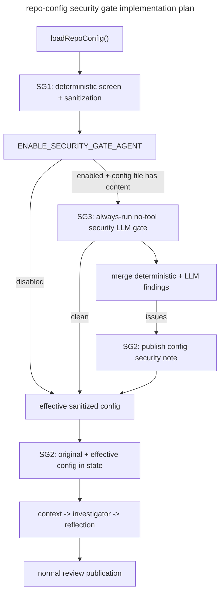

# CP1-SG — Repo Config Security Gate



## Executive Summary

CP1 Phase C3 intentionally made `.codesmith.yaml` prompt-aware, but it did not add a security gate between repo-owned config text and the review agents. This plan hardens that path by introducing deterministic all-field screening for every unsealed config value, quarantining unsafe prompt-carrying and non-prompt fields, and publishing a separate MR note for config-security issues. It then adds an always-run, no-tool security LLM gate for every non-empty repo config when `ENABLE_SECURITY_GATE_AGENT` is enabled. The outcome is that repo configuration remains useful, but it no longer gets a free path into prompts or other downstream policy surfaces.

## Resolved Decisions

| Concern | Decision | Rationale |
|---|---|---|
| Gate placement | Run in `src/api/pipeline.ts` immediately after repo-config load | This is the earliest point where prompt-bearing config exists and the last point before prompt construction begins |
| Gate enablement | Control the whole security gate with `ENABLE_SECURITY_GATE_AGENT` | Operators need an explicit deployment-level off switch for tightly controlled on-prem environments |
| Failure mode | Fail closed for unsafe unsealed fields, fail open for the overall review | Unsafe config values are stripped, but the main review still runs |
| Primary authority | Deterministic policy is authoritative | Reproducibility and security posture cannot depend on model judgment |
| LLM role | Secondary semantic reviewer with no tools that runs on every non-empty config when enabled | Avoids trying to predict when repo config is risky enough to inspect |
| Publication surface | Separate top-level MR note | Config-security findings should remain distinct from code-review findings and easier to suppress idempotently |

## Problem Statement

Today, repo authors can put free-form text into `review_instructions` and `file_rules[].instructions`, and other config fields such as patterns or profile strings may also remain open-ended unless explicitly sealed by validation. While the tool surface is sandboxed and read-only, the current design still lets a malicious MR attempt to:

- suppress or reshape valid findings
- steer the investigator toward unnecessary sensitive-file searches
- pressure the reviewer to approve changes or omit categories of defects
- abuse prompt framing through XML-like or role-like content

The system needs a dedicated pre-review guardrail that inspects every unsealed config field before it reaches any agent prompt or downstream policy logic, while preserving sealed fields and avoiding a full review outage.

## Current Gaps

- `src/config/repo-config.ts` validates only shape and types, not semantic safety for unsealed fields
- `src/api/pipeline.ts` loads repo config and passes it directly into review state with no security screening
- `src/agents/context-agent.ts`, `src/agents/investigator-agent.ts`, and `src/agents/reflection-agent.ts` consume repo config without a notion of sanitized versus original config
- there is no deployment-level flag to disable the whole gate in environments that do not want the extra LLM call
- publisher flows only know about normal review summaries and inline comments, not config-security notes
- no test suite currently models malicious `.codesmith.yaml` prompt content as an adversarial input class

## Directory Impact

```text
src/
  agents/
    config-security-agent.ts         # new no-tool security reviewer
    prompts/
      system-prompts.yaml            # new config_security_agent prompt
  config/
    repo-config-security.ts          # deterministic checks + sanitization
  publisher/
    config-security-note.ts          # note formatting + marker helpers
tests/
  agents.test.ts                     # security agent + prompt behavior tests
  pipeline.test.ts                   # gate integration tests
  publisher.test.ts                  # config-security note tests
  repo-config.test.ts                # deterministic detector tests
```

## Phased Implementation

## Phase SG1 — Deterministic Gate Foundation

**Goal:** Create a pure, reproducible validator and sanitizer for every unsealed repo-config field.

**SG1.1** — Create `src/config/repo-config-security.ts`:
- Define Zod-backed issue and result schemas for deterministic security findings
- Model issue metadata with `fieldPath`, `category`, `severity`, `evidence`, `suggestion`, and `shouldQuarantine`
- Export helpers for classifying fields as sealed or unsealed and screening all unsealed values

**SG1.2** — Implement phrase and shape detectors:
- Detect instruction-override language such as attempts to replace system or previous instructions
- Detect outcome manipulation language such as attempts to force approval or suppress findings
- Detect tool-steering and exfiltration prompts such as requests to inspect `.env`, secrets, or unrelated config dumps
- Detect prompt-structure injection such as XML-like control tags, role impersonation, and repeated fence abuse
- Detect suspicious payload shapes such as large base64-like blobs or repeated delimiters intended to break framing
- Apply those detectors to every unsealed field, not just prompt-carrying instruction fields

**SG1.3** — Implement sanitization rules:
- Remove affected prompt-carrying fields and any other unsealed fields that are not confidently safe
- Preserve sealed values such as booleans and closed enums
- Preserve unaffected `file_rules` entries even when neighboring entries are quarantined
- Return both issues and a sanitized config object in one result

**SG1.4** — Add deterministic unit coverage:
- Clean config passes with no findings and no sanitization
- Global `review_instructions` is removed when it contains a hard-fail pattern
- Only matching `file_rules[].instructions` fields are removed when a single rule is malicious
- Unsealed non-prompt fields are screened as well
- Sealed fields remain byte-for-byte equivalent before and after sanitization

**SG1.5** — Update documentation:
- Add deterministic gate behavior to `docs/context/ARCHITECTURE.md`
- Document quarantined field behavior, sealed-field exemptions, and examples in `docs/guides/REPO_REVIEW_CONFIG.md`

### Acceptance Criteria

- A malicious `review_instructions` value can be flagged and stripped without discarding the rest of the config
- A malicious per-file instruction can be stripped without removing unrelated file rules
- Unsealed non-prompt fields are screened under the same security policy instead of bypassing review
- The deterministic gate runs without any LLM dependency and produces stable results for the same input
- The repo-config guide explicitly tells users that all unsealed fields are screened and may be quarantined

## Phase SG2 — Pipeline And Publisher Integration

**Goal:** Run the deterministic gate before prompt construction, make the whole gate env-controlled, retain observability, and publish separate config-security feedback.

**SG2.1** — Add gate configuration:
- Add `ENABLE_SECURITY_GATE_AGENT` to `src/config.ts`
- Document it in `.env.example` and `docs/context/CONFIGURATION.md`
- Default it to the repo’s chosen secure behavior and make the toggle explicit in deployment docs

**SG2.2** — Extend `src/agents/state.ts` and config-load metadata:
- Keep `repoConfig` as the original parsed config
- Add `effectiveRepoConfig` for sanitized downstream usage
- Track whether `.codesmith.yaml` or `.codesmith.yml` was found and whether it had any content
- Add `repoConfigSecurityIssues` and optional security summary fields for publisher visibility

**SG2.3** — Wire the gate into `src/api/pipeline.ts`:
- Run deterministic screening immediately after repo-config load when `ENABLE_SECURITY_GATE_AGENT=true` and a repo config file with content exists
- Build review state with both original and effective config values
- Ensure the agent prompt builders consume `effectiveRepoConfig`, not the raw config

**SG2.4** — Add config-security publisher support:
- Create `src/publisher/config-security-note.ts` for note body formatting and marker helpers
- Add a unique hidden marker for duplicate suppression on same-head reruns
- Keep config-security publication separate from summary-note generation

**SG2.5** — Integrate publication behavior:
- Post a config-security note whenever security findings exist
- Continue the normal review path using `effectiveRepoConfig`
- Ensure the normal summary note does not duplicate the config-security content

**SG2.6** — Add integration tests:
- `ENABLE_SECURITY_GATE_AGENT=false` bypasses the whole gate
- Unsafe config posts a security note and proceeds with sanitized config
- Safe config produces no security note and preserves existing review behavior apart from the extra gate pass
- Missing config remains unchanged from today
- Same-head reruns do not keep posting duplicate config-security notes

**SG2.7** — Update architecture and docs index:
- Add the pre-review security gate to `docs/context/WORKFLOWS.md`
- Update `docs/README.md` active-plan and current-state summaries

### Acceptance Criteria

- `ENABLE_SECURITY_GATE_AGENT` cleanly disables the whole gate when operators choose to do so
- No unsafe unsealed repo-config field reaches an agent or downstream policy consumer through `effectiveRepoConfig` after the pipeline gate is enabled
- Review runs continue when malicious prompt text is present, using the sanitized config instead
- MR authors receive a separate, deduplicated config-security note describing exactly what was quarantined and why
- Existing reviews without `.codesmith.yaml` or with safe configs behave the same as before apart from added observability fields

## Phase SG3 — Security LLM Gate

**Goal:** Add a narrow semantic reviewer that always inspects non-empty repo config when the gate is enabled.

**SG3.1** — Add prompt and schema support:
- Add `config_security_agent` to `src/agents/prompts/system-prompts.yaml`
- Define strict JSON result parsing with Zod
- Keep the prompt explicitly security-only and no-tool

**SG3.2** — Implement `src/agents/config-security-agent.ts`:
- Invoke the LLM without tool access and without repo file context
- Provide only normalized unsealed fields and deterministic finding context
- Reject non-JSON or schema-invalid responses cleanly

**SG3.3** — Add execution policy:
- Run the LLM gate on every non-empty repo config when `ENABLE_SECURITY_GATE_AGENT=true`
- Do not skip the LLM gate just because deterministic hard-fail findings already exist
- Do not allow the LLM to clear a deterministic hard-fail decision

**SG3.4** — Merge findings safely:
- Merge deterministic and LLM findings into one publication flow
- Allow the LLM to add new quarantines for semantically manipulative text
- Keep the final sanitized config derivation deterministic from the merged result set

**SG3.5** — Add tests:
- Strict JSON parsing rejects malformed model output
- Invocation path remains tool-less
- Env-enabled non-empty repo configs always invoke the security LLM path
- Warning-level manipulative examples can be escalated to quarantine
- LLM failures degrade gracefully to deterministic-only behavior

**SG3.6** — Update documentation:
- Document the secondary role of the LLM gate in `docs/context/ARCHITECTURE.md`
- Document operator expectations, env flag behavior, and fallback behavior in `docs/guides/REPO_REVIEW_CONFIG.md`

### Acceptance Criteria

- The security LLM gate never receives tool access, repository search, or diff context
- Every non-empty repo config triggers the LLM security pass when `ENABLE_SECURITY_GATE_AGENT=true`
- Deterministic hard-fail decisions always remain authoritative
- Suspicious-but-not-obvious prompt text can be escalated to quarantine when the deterministic layer alone is inconclusive
- If the LLM gate fails, the pipeline still completes with deterministic screening only

## Phase SG4 — Validation, Dogfooding, And Audit

**Goal:** Prove the hardening works in practice, update the remaining docs, and close the plan through the repo’s review gate.

**SG4.1** — Add dogfooding config:
- Create or update the repo-root `.codesmith.yaml` with safe examples that exercise prompt-bearing fields
- Keep examples aligned with CodeSmith’s current conventions and avoid text that should trigger the gate

**SG4.2** — Add end-to-end malicious samples:
- Extend test fixtures or inline pipeline tests with representative malicious prompt samples
- Cover both global and per-file instruction attacks
- Verify that findings are published and the review still runs

**SG4.3** — Run validation:
- Run `bun run check`
- Run `bun run ci`
- Fix any plan-related regressions before audit

**SG4.4** — Update plan bookkeeping and user-facing docs:
- Update `docs/README.md` current-state summary to reflect shipped hardening
- Update `docs/plans/active/repo-review-config-plan.md` to reference the delivered security gate follow-on
- Ensure `docs/guides/GETTING_STARTED.md` or `docs/guides/REPO_REVIEW_CONFIG.md` points to the final behavior where relevant

**SG4.5** — Audit completion:
- Run `review-plan-phase`
- Save the report under `docs/plans/review-reports/`
- Do not mark this plan complete until the audit is green and any remediation is applied

### Acceptance Criteria

- The repository contains a safe dogfooding `.codesmith.yaml` example that reflects the hardened model
- CI covers adversarial prompt-bearing config inputs and proves quarantine plus review continuity
- CI covers env-enabled and env-disabled gate behavior plus adversarial non-prompt unsealed fields
- Documentation describes the shipped behavior rather than the pre-hardening model
- A review report exists and the plan is not presented as complete until that report is ready

## Dependencies And Sequencing

- This plan depends on CP1 because it hardens the prompt-injection surface introduced there
- SG1 and SG2 should be implemented before SG3 so the deterministic safety boundary exists before any new model path is added
- SG4 should not begin until SG1 through SG3 are code-complete

## Out Of Scope

- future policy linting beyond the all-field security scan defined in this plan
- inline `.codesmith.yaml` comments anchored to diff lines; top-level security note is sufficient for v1
- repo-defined executable commands or any expansion of tool privileges

## Recommended Execution Order

1. Implement SG1 and SG2 together so no deterministic detector lands without actual enforcement.
2. Add SG3 only after the deterministic gate, env flag, and publisher path are stable.
3. Close with SG4 validation and a formal `review-plan-phase` audit.