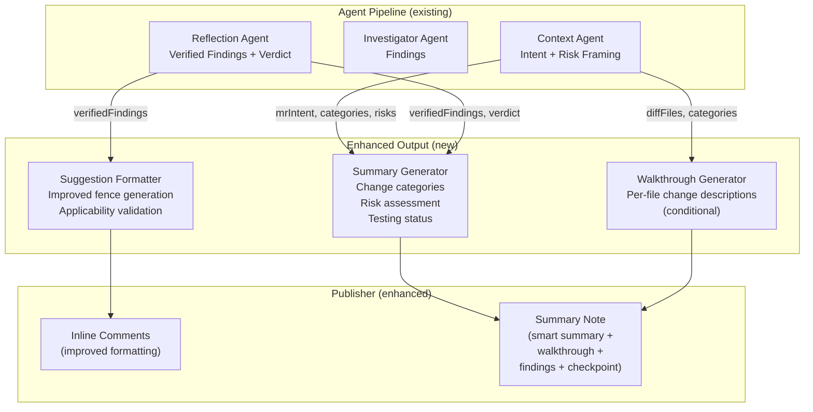

# CP4 — Enhanced Review Output

## Executive Summary

Code Smith currently publishes two types of output: inline finding comments (anchored to specific lines) and a summary note (verdict + finding list + checkpoint). This is functional but bare compared to CodeRabbit (which produces summaries, file-by-file walkthroughs, architecture diagrams, and one-click fixes) and GitLab Duo (which generates MR summaries and merge commit messages).

This plan upgrades Code Smith's review output to be comprehensive and developer-friendly:
- **Smart MR summary** with change categories, risk assessment, and testing status
- **File-by-file walkthrough** for larger MRs (configurable)
- **Improved suggestion formatting** with clearer context and better GitLab integration
- **Priority visualization** in inline comments for faster developer triage

The key design constraint is token cost: generating a file-by-file walkthrough for every MR burns significant LLM tokens. The plan uses a tiered approach — smart summary always, detailed walkthrough only when warranted (large MRs, explicit opt-in).

## Architecture



## Phased Implementation

### Phase RO1 — Smart MR Summary

**Goal:** Replace the current bare-bones summary (verdict + finding list) with a comprehensive MR summary.

**RO1.1** — Extend context agent output:
- Current output: `{ intent, categories, riskHypotheses }`
- Extended output: add `changeSummary: string` (2-3 sentences describing what the MR does)
- Extended output: add `riskAssessment: string` (1-2 sentences on the primary risk)
- Extended output: add `testingStatus: "adequate" | "insufficient" | "none"` (based on test file changes vs production code changes)
- Update `system-prompts.yaml` context_agent section with new output fields
- Update the Zod schema for context agent output in `context-agent.ts`

**RO1.2** — Create `src/publisher/summary-template.ts`:
- `generateSmartSummary(state: ReviewState): string`
- Template structure:
  ```markdown
  ## 🤖 CodeSmith Code Review — {verdictEmoji} {verdict}
  
  ### Summary
  {changeSummary}
  
  **Risk Assessment:** {riskAssessment}
  **Testing:** {testingStatusEmoji} {testingStatus}
  **Change Categories:** {categories as badges}
  
  ### Findings ({count})
  
  | Severity | Finding | File |
  |---|---|---|
  | 🔴 | Title | `src/file.ts:10-15` |
  | 🟠 | Title | `src/api/handler.ts:45-50` |
  
  <details>
  <summary>Finding Details</summary>
  
  #### 🔴 Finding Title
  {description}
  
  **Evidence:** {evidence}
  **Suggested fix:** {suggestedFix}
  
  </details>
  ```

**RO1.3** — Integrate into publisher:
- Replace current summary building logic in `gitlab-publisher.ts` with `generateSmartSummary()`
- Maintain backward compatibility: checkpoint markers still appended at the bottom
- Maintain `<!-- code-smith:summary -->` and `<!-- code-smith:head sha=... -->` markers

**RO1.4** — Collapsible details:
- Use GitLab-flavored markdown `<details><summary>...</summary>...</details>` for:
  - Individual finding details (expanded view)
  - Linter findings summary (when CP2 is active)
  - File walkthrough (when RO2 is active)
- This keeps the summary concise while providing depth on demand

**RO1.5** — Tests:
- Summary generation with various finding combinations
- Summary with zero findings (APPROVE verdict)
- Summary with critical findings (REQUEST_CHANGES verdict)
- Collapsible section rendering
- Backward compatibility: checkpoint markers preserved

**RO1.6** — Update ARCHITECTURE.md publisher section.

### Phase RO2 — File-by-File Walkthrough

**Goal:** Generate per-file change descriptions for larger MRs, similar to CodeRabbit's walkthrough feature.

**RO2.1** — Create `src/agents/walkthrough-generator.ts`:
- `generateWalkthrough(diffFiles: DiffFile[], mrIntent: string): Promise<WalkthroughEntry[]>`
- For each changed file, produce a 1-2 sentence description of what changed and why
- Extend the context agent's output to include per-file change descriptions during its existing analysis pass rather than making a separate LLM call
- `walkthrough-generator.ts` becomes a formatting/extraction layer over context-agent output plus deterministic truncation/ordering logic
- Output schema:
  ```typescript
  const walkthroughEntrySchema = z.object({
    file: z.string(),
    changeType: z.enum(["added", "modified", "deleted", "renamed"]),
    description: z.string(), // 1-2 sentences
  });
  ```
- Token budget: cap input at ~4000 tokens (truncate large diffs; prioritize files with most changes)

**RO2.2** — Integrate into summary note:
- Add walkthrough as a collapsible section in the summary:
  ```markdown
  <details>
  <summary>📂 File Walkthrough ({fileCount} files)</summary>
  
  | File | Change | Description |
  |---|---|---|
  | `src/api/router.ts` | Modified | Added input validation for the new /users endpoint |
  | `src/models/user.ts` | Added | New User model with Zod schema |
  | `tests/api.test.ts` | Modified | Added tests for user creation flow |
  
  </details>
  ```

**RO2.3** — Tiered trigger logic:
- `auto` (default): generate walkthrough when MR has 5+ changed files
- `always`: generate for every MR
- `never`: skip walkthrough entirely
- Configurable via `.codesmith.yaml` `output.include_walkthrough`
- Also triggerable via `/ai-review --walkthrough` command suffix (when CodeSmith Awakening plan is implemented)

**RO2.4** — Token budget management:
- Walkthrough shares the existing context-agent LLM call rather than introducing a second call
- Expand the context-agent output schema with a bounded per-file summary section
- Cap walkthrough-related context-agent input overhead at ~4000 additional tokens and the walkthrough output section at ~2000 tokens
- If diff exceeds budget, prioritize non-test files, then by diff size
- Skip files with trivial changes (only import reordering, only whitespace)

**RO2.5** — Tests:
- Walkthrough generation with mock LLM response
- Trigger logic: file count thresholds
- Token budget truncation behavior
- Config-based enable/disable

**RO2.6** — Update WORKFLOWS.md.

### Phase RO3 — Improved Suggestion UX

**Goal:** Make Code Smith's suggestions easier to understand and apply.

**RO3.1** — Enhance suggestion fence generation in `suggestion-normalizer.ts`:
- Current: basic context-stripping normalization
- Enhanced: include a brief "Before → After" description above the suggestion fence
- Format:
  ```markdown
  **Suggested change:** Replace unchecked type cast with Zod validation
  
  ```suggestion
  const parsed = schema.parse(input);
  ```
  ```
- Add line number reference for multi-line suggestions

**RO3.2** — Multi-line suggestion improvements:
- Current: suggestion fences use `-N+M` syntax for context lines
- Enhanced: validate that the suggestion fence line counts match actual diff context
- Handle edge cases: suggestions at file boundaries, suggestions spanning hunk boundaries

**RO3.3** — Suggestion applicability validation:
- Before publishing a suggestion, verify:
  - The target lines exist in the current diff (not stale)
  - The suggestion doesn't duplicate an already-applied change
  - The suggestion fence line numbers are within valid range
- If validation fails, downgrade to prose suggestion (remove `suggestedFixCode`, keep `suggestedFix`)

**RO3.4** — Priority visualization:
- Current: emoji prefix (🔴🟠🟡🔵)
- Enhanced: add a severity badge with consistent formatting
  ```markdown
  <!-- code-smith:finding ... -->
  ### 🔴 CRITICAL — Unauthenticated Endpoint Exposed
  
  **Impact:** This endpoint accepts requests without auth middleware, exposing user data.
  
  **Evidence:**
  > `router.get('/users', handler)` — no `authMiddleware` in chain
  
  **Fix:**
  ```suggestion
  router.get('/users', authMiddleware, handler)
  ```
  ```

**RO3.5** — Tests:
- Enhanced suggestion formatting
- Multi-line suggestion edge cases
- Applicability validation (valid, stale, boundary)
- Priority visualization rendering

**RO3.6** — Update ARCHITECTURE.md.

### Phase RO4 — Output Config, Docs & Audit

**Goal:** Wire output settings to repo config and complete documentation.

**RO4.1** — Respect `.codesmith.yaml`:
- `output.max_findings` → cap verified findings before publication
- `output.include_walkthrough` → control walkthrough generation
- `output.collapsible_details` → toggle collapsible sections
- `features.enhanced_summary` → toggle smart summary (fall back to current format when false)

**RO4.2** — Add output customization section to `docs/guides/REPO_REVIEW_CONFIG.md`.

**RO4.3** — Update `docs/README.md`.

**RO4.4** — Run `review-plan-phase` audit.

## Token Cost Analysis

| Feature | LLM Calls | Est. Input Tokens | Est. Output Tokens | Cost per Review (~) |
|---|---|---|---|---|
| Smart summary fields | 0 (from existing context agent) | 0 | ~200 extra | ~$0.001 |
| File walkthrough (10 files) | 0 additional (shared with context agent) | ~4,000 additional | ~2,000 additional | marginal increase within existing context-agent call |
| Suggestion validation | 0 (deterministic) | 0 | 0 | $0 |
| **Total additional cost** | **0 additional calls** | **0–4,000 additional** | **200–2,200 additional** | **marginal increase on existing context-agent call** |

The walkthrough is the only significant token increase, and it's conditional (5+ files by default). It does not add a separate LLM round-trip; total review cost increase remains marginal within the existing context-agent call.
