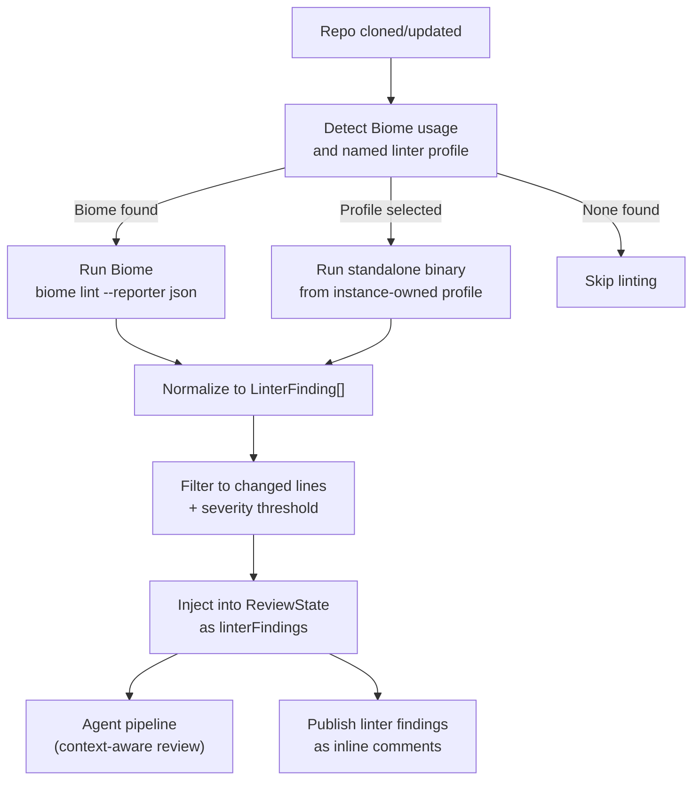

# CP2 — Linter & SAST Integration

## Executive Summary

CodeRabbit integrates 40+ linters and SAST scanners alongside its AI analysis. Git Gandalf currently relies entirely on LLM reasoning — no linter, no SAST, no static analysis of any kind. This is a significant gap: linters catch deterministic, rule-based issues (unused imports, type errors, security patterns) that LLMs sometimes miss or hallucinate about.

This plan adds automatic linter detection and execution to the Git Gandalf pipeline. Changed files are linted before the AI review begins; linter findings are fed into agents as structured context; and linter-specific findings are published as separate inline comments.

The initial scope covers **Biome** and other **instance-owned standalone binaries** only. ESLint is explicitly out of scope for this plan because it requires dependency hydration, plugin resolution, and sandbox boundaries that do not exist in the current clone-only runtime. The architecture remains extensible to additional standalone binaries (Ruff for Python, golangci-lint for Go, Semgrep, etc.) via an instance-owned profile pattern.

## Technology Decisions

| Concern | Choice | Rationale |
|---|---|---|
| Biome execution | `Bun.spawn()` → `biome lint --reporter json` | Biome is already installed in Git Gandalf's image; single-binary, fast |
| Standalone profile execution | `Bun.spawn()` with instance-owned allowlisted commands | Commands and binaries are configured by the Git Gandalf deployment, not by the reviewed repository |
| Linter detection | Config file presence + named profile selection | Fast, reliable: `biome.json` or a repo-selected allowlisted profile |
| Output normalization | Zod-validated schema | Both linters output JSON; normalize to a common `LinterFinding` type |
| Diff scoping | Filter linter output to changed lines | Run linter on full files (needed for accurate analysis) but only report findings on changed lines |
| Subprocess safety | Explicit sandbox contract | Standalone profiles run with minimal inherited env, stripped credentials, bounded output, timeout + kill, and isolated temp storage |
| ESLint support | Deferred | Requires a separate dependency-hydration and sandbox plan before safe implementation |

## Architecture



## Normalized Finding Schema

```typescript
const linterFindingSchema = z.object({
  file: z.string(),                    // Relative path from repo root
  line: z.number().int().positive(),   // 1-based line number
  column: z.number().int().positive().optional(),
  endLine: z.number().int().positive().optional(),
  endColumn: z.number().int().positive().optional(),
  severity: z.enum(["error", "warning", "info"]),
  ruleId: z.string(),                  // Linter rule identifier (e.g., "no-unused-vars")
  message: z.string(),                 // Human-readable message
  source: z.enum(["biome", "standalone"]),
  suggestedFix: z.string().optional(), // Auto-fix code if available
});

type LinterFinding = z.infer<typeof linterFindingSchema>;
```

## Phased Implementation

### Phase L1 — Linter Detection & Execution Engine

**Goal:** Build the core linter subsystem that can detect, execute, and normalize linter output.

**L1.1** — Create `src/linters/detect.ts`:
- `detectLinters(repoPath: string, repoConfig: RepoConfig): Promise<LinterType[]>`
- Check for: `biome.json`, `biome.jsonc` → `"biome"`
- Check for named instance-owned profile from `.gitgandalf.yaml` → `"standalone"`
- Respect repo config overrides and allowlist validation from instance config
- Return array of detected linter types

**L1.2** — Create `src/linters/biome.ts`:
- `runBiome(repoPath: string, files: string[]): Promise<BiomeLintResult>`
- Execute: `Bun.spawn(["biome", "lint", "--reporter", "json", ...files], { cwd: repoPath })`
- Parse Biome JSON output with Zod
- Timeout: 30 seconds (configurable)
- Graceful failure: if Biome crashes or times out, log warning and return empty results
- Use the repo's own `biome.json` config (Biome auto-discovers it)

**L1.3** — Create `src/linters/standalone-profile.ts`:
- `runStandaloneProfile(repoPath: string, files: string[], profile: LinterProfile): Promise<StandaloneLintResult>`
- Execute allowlisted commands from an instance-owned profile file or env-backed config
- Profiles define fixed binaries, fixed argument templates, timeout budgets, and JSON output contracts
- Profiles also define sandbox controls: minimal env allowlist, `maxStdoutBytes`, `maxStderrBytes`, temp-dir strategy, and network policy expectation
- Repo config may reference a profile name but may not define or modify commands
- Build an explicit subprocess env that omits GitLab, Jira, AWS, OpenAI, and Google credentials
- Run in an isolated temp directory with the repo mounted as input only; profile execution may read repo files but must not rely on ambient writable workspace state
- Apply timeout + hard kill and truncate or fail closed on output beyond configured byte caps
- Graceful failure: same pattern as Biome

**L1.4** — Create `src/linters/schema.ts`:
- Define `LinterFinding` Zod schema (shown above)
- Create `normalizeBiomeOutput(raw: BiomeLintResult): LinterFinding[]`
- Create `normalizeStandaloneOutput(raw: StandaloneLintResult): LinterFinding[]`
- Map Biome severity levels (`error`, `warning`, `info`) to normalized schema
- Map each allowlisted profile's output contract to the normalized schema with Zod validation

**L1.5** — Create `src/linters/orchestrator.ts`:
- `runLinters(repoPath: string, changedFiles: string[], repoConfig: RepoConfig): Promise<LinterFinding[]>`
- Detect → execute all detected linters → normalize → concatenate → deduplicate
- Filter to only findings on changed files (compare file paths)
- Filter by severity threshold from repo config
- Sort by file → line for deterministic output

**L1.6** — Tests:
- Detection with various config files present/absent
- Biome executor with mock subprocess output
- Standalone profile executor with mock subprocess output
- Normalization of each supported profile's JSON format
- Orchestrator with multiple linters
- Timeout handling and graceful degradation
- Credential stripping and output-cap enforcement
- Exclusion via repo config
- Rejection of repo-defined executable commands

**L1.7** — Update ARCHITECTURE.md: add linter subsystem section.

### Phase L2 — Pipeline Integration & Agent Context

**Goal:** Wire linter execution into the review pipeline and feed findings to agents.

**L2.1** — In `src/api/pipeline.ts`, after repo clone and config loading, before `executeReview()`:
- Extract changed file paths from `analysisDiffFiles`
- Call `runLinters(repoPath, changedFiles, repoConfig)`
- Only execute if `repoConfig.features.linter_integration` is true (default: false until stable)
- **Parallelization note (review-driven O2):** Linter execution is independent of the pipeline's MR-details fetch (discussions, notes, diff versions) that follows the clone. Consider kicking off `runLinters()` concurrently with the remaining MR data fetches using `Promise.all()` and merging results before agent execution begins. This saves up to 30 seconds (the linter timeout) from the critical path.

**L2.2** — Extend `ReviewState`:
- Add `linterFindings: LinterFinding[]` field
- Populated with normalized, filtered linter results

**L2.3** — Inject into investigator agent:
- Add a `<linter_context>` section to the investigator prompt when linter findings exist
- Format: structured list of findings grouped by file
- Instruction: "The following linter findings were detected by static analysis. Consider them as additional context. Do not re-report linter findings unless you have additional insight. Focus your investigation on issues that static analysis cannot detect."
- This prevents the AI from duplicating linter findings while still being aware of them

**L2.4** — Update reflection agent:
- When deduplicating, check if an AI finding overlaps with a linter finding (same file, overlapping line range)
- If overlap exists and the AI finding adds no meaningful insight beyond the linter finding, prefer the linter finding (deterministic > probabilistic)
- If the AI finding provides deeper analysis (e.g., explains the security impact of the linter error), keep both

**L2.5** — Respect `.gitgandalf.yaml`:
- `features.linter_integration: false` → skip entirely
- `linters.profile` → select an allowlisted instance-owned profile
- `linters.severity_threshold` → filter normalized findings below threshold

**L2.6** — Tests:
- Pipeline with linter enabled → findings in ReviewState
- Pipeline with linter disabled → empty linterFindings
- Agent prompt injection with linter findings
- Reflection agent deduplication logic
- Config-driven enabling/disabling

**L2.7** — Update WORKFLOWS.md: add linter step to pipeline flow.

### Phase L3 — Publication & Output

**Goal:** Publish linter findings as inline comments alongside AI findings.

**L3.1** — Extend `src/publisher/gitlab-publisher.ts`:
- New function `postLinterComments(findings, mrDetails, discussions)`
- Marker format: `<!-- git-gandalf:linter biome:no-unused-vars src/file.ts:10 -->`
- Comment format:
  ```
  <!-- git-gandalf:linter {source}:{ruleId} {file}:{line} -->
  🔧 **Linter: {ruleId}** ({source})
  
  {message}
  
  ```suggestion
  {suggestedFix}
  ```
  ```
- Use 🔧 emoji to visually distinguish linter findings from AI findings (🔴🟠🟡🔵)

**L3.2** — Include linter summary in MR summary note:
- Add a "Static Analysis" section before the AI findings section
- Show count by source and severity
- Example:
  ```
  ### Static Analysis
  | Source | Errors | Warnings |
  |---|---|---|
  | Biome | 2 | 5 |
  | Standalone | 0 | 3 |
  ```

**L3.3** — Severity threshold filtering:
- Apply `linters.severity_threshold` from repo config (default: `warning`)
- `info`-level findings suppressed by default

**L3.4** — Cross-type deduplication:
- If an AI finding and a linter finding target the same line range, and the AI finding has a `suggestedFixCode` that matches the linter's auto-fix, skip the linter comment (AI version is richer)
- If both exist but are different, publish both (different markers prevent collision)

**L3.5** — Tests:
- Linter comment formatting
- Summary section generation
- Severity filtering
- Cross-type deduplication
- Deduplication against existing comments (header-based, same as AI findings)

**L3.6** — Update ARCHITECTURE.md publisher section.

### Phase L4 — Instance Profiles, Deferred ESLint, Docs & Audit

**Goal:** Lock in the safe extension model and document what is explicitly out of scope.

**L4.1** — Instance-owned linter profiles:
- Define a deployment-owned profile format loaded from env or an instance config file
- Each profile declares fixed binaries, fixed args, timeout budget, expected JSON schema, severity mapping, output byte caps, and sandbox expectations
- Repo config may only reference a profile name; unknown profile names are ignored with warning

**Phase-1 sandbox contract:**
- Explicit env allowlist only; no GitLab, Jira, AWS, Bedrock, OpenAI, or Google credentials inherited
- Read repo content from the cloned workspace but write temporary artifacts only under an isolated temp directory
- Bound stdout/stderr capture; exceedance fails the profile run with a warning instead of streaming unbounded output into memory
- No implicit package installation, shell expansion, or operator-provided freeform command templates
- Network-disabled execution is preferred where the deployment runtime can enforce it; when that is not available, compensating controls are the stripped environment, fixed binary allowlist, and bounded runtime/output

**L4.2** — Deferred ESLint support:
- Document ESLint as a separate future plan that must solve dependency hydration, plugin resolution, sandboxing, and Bun-compatible execution
- State explicitly that CP2 will not invoke `npm`, `npx`, `yarn`, or install repo dependencies

**L4.3** — Add linter integration section to `docs/guides/REPO_REVIEW_CONFIG.md`:
- How to enable linter integration
- Supported linters and detection logic
- Instance-owned profile selection
- Severity configuration

**L4.4** — Update `docs/guides/GETTING_STARTED.md`:
- Add linter prerequisites (Biome binary in Docker image)
- Note that standalone binaries are installed into the Git Gandalf image by operators

**L4.5** — Update `docs/README.md`.

**L4.6** — Run `review-plan-phase` audit.

## Extensibility Notes

The architecture supports future linter additions by creating a new executor file (e.g., `src/linters/ruff.ts` for Python, `src/linters/golangci-lint.ts` for Go) that implements the same interface: `run(repoPath, files) → NormalizedFindings[]`. The orchestrator discovers available executors based on repo config and detection logic. No framework needed — just follow the pattern.

## Docker Image Changes

The Git Gandalf Dockerfile already includes `git` and `ripgrep`. For linter support:
- Biome: install the Biome binary in the Git Gandalf image
- Additional standalone tools: install explicitly in the Git Gandalf image and expose only through instance-owned profiles
- Standalone tools must follow the sandbox contract above before they are exposed in a profile
- ESLint: explicitly out of scope for this plan
