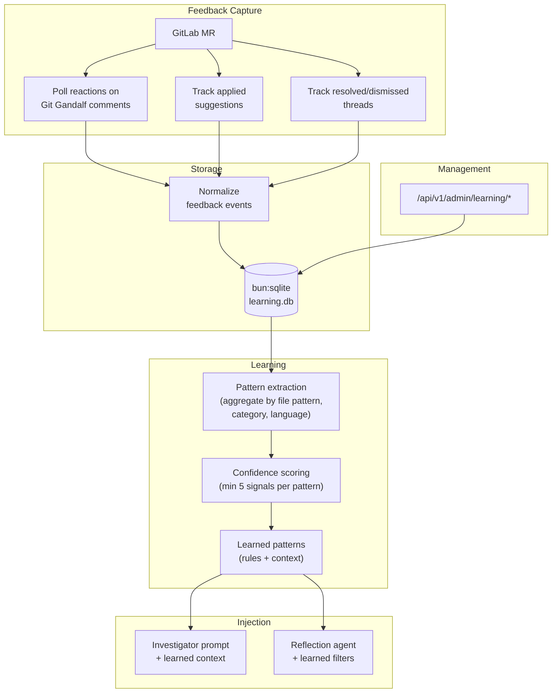

# CP3 — Organizational Learning System

## Executive Summary

CodeRabbit's "Learnings" system is their most impactful competitive differentiator. Teams can correct review comments in natural language, and those corrections are retained and applied to all future reviews across the organization. Over time, reviews become more accurate and less noisy because the system learns what matters to each team.

Git Gandalf currently has no feedback mechanism. Every review runs fresh — the system learns nothing from prior interactions. A finding that was dismissed 50 times will be raised a 51st time.

This plan introduces a complete learning feedback loop:
1. **Capture** — track developer reactions (👍/👎) and suggestion application/dismissal
2. **Store** — persist feedback in a singleton ops-owned relational database, starting with SQLite behind a storage abstraction
3. **Learn** — extract patterns from aggregated feedback signals
4. **Inject** — feed relevant learned patterns into future reviews through a cached internal read path
5. **Manage** — provide API endpoints for viewing and curating learned patterns behind a dedicated admin route group

This is the most technically complex child plan and the highest-impact competitive differentiator.

Phase-one storage uses `bun:sqlite` because it is Bun-native and operationally cheap, but this plan treats SQLite as an implementation choice rather than the permanent architecture. The learning subsystem must expose storage interfaces so CP7 can migrate the source of truth to PostgreSQL later without rewriting queue contracts, route contracts, or prompt-injection logic.

## Architecture



## Technology Decisions

| Concern | Choice | Rationale |
|---|---|---|
| Database | `bun:sqlite` with WAL mode | Built-in, zero deps, 3-6x faster than better-sqlite3, concurrent reads |
| Phase-one deployment constraint | Singleton ops pod with block-backed `ReadWriteOnce` storage only | SQLite is acceptable only when the DB file shares safe local/block-attached semantics with the app server |
| DB ownership | Singleton ops service | Prevents multi-writer contention across replicated webhook and worker pods |
| Write transport | BullMQ jobs on existing Valkey | Reuses the repo's durable queue pattern; webhook and worker pods enqueue write intents instead of touching SQLite |
| Storage abstraction | Domain store interfaces over DB-specific calls | Keeps PostgreSQL migration additive instead of forcing CP3/CP5 rewrites |
| Schema migrations | Versioned SQL files, forward-only | Simple, no ORM dependency, matches Bun-native philosophy |
| Feedback polling | Periodic timer (setInterval + GitLab API) | Simpler than webhooks for reactions; GitLab doesn't webhook emoji reactions |
| Feedback sync strategy | Cursor-based bounded polling | Avoids rescanning broad time windows and reduces GitLab API fan-out |
| Pattern extraction | SQL aggregation + heuristic rules | No ML needed; simple frequency/ratio analysis suffices |
| Confidence threshold | Minimum 5 signals before trusting a pattern | Prevents overfitting on a single developer's preference |
| Learning scope | Per-project (default) with opt-in cross-project | Respects different team conventions across projects |
| Admin auth | Dedicated bearer token or mTLS | Keeps operator surfaces separate from webhook auth |
| Future scale-up target | PostgreSQL; add `pgvector` only if semantic retrieval becomes a requirement | Preserves a clean path to HA and richer retrieval without forcing vector infrastructure early |

**Storage boundary note:** The relational store is the system of record for feedback events, learned patterns, and review-run facts. Valkey remains queue/cache infrastructure. Dedicated vector indexing is explicitly future scope only if Git Gandalf later needs semantic retrieval across free-form review memory.

## Database Schema

```sql
-- Tracks individual feedback events
CREATE TABLE feedback_events (
  id INTEGER PRIMARY KEY AUTOINCREMENT,
  project_id INTEGER NOT NULL,
  mr_iid INTEGER NOT NULL,
  discussion_id TEXT,
  note_id TEXT,
  source_kind TEXT NOT NULL,          -- 'reaction' | 'suggestion' | 'thread_resolution'
  source_cursor TEXT,                 -- provider-specific cursor/watermark captured at ingest time
  finding_file TEXT NOT NULL,
  finding_line_start INTEGER NOT NULL,
  finding_line_end INTEGER NOT NULL,
  finding_title TEXT NOT NULL,
  finding_risk_level TEXT NOT NULL,
  finding_category TEXT,              -- Derived from title/description keywords
  signal_type TEXT NOT NULL,          -- 'thumbs_up' | 'thumbs_down' | 'applied' | 'dismissed' | 'resolved'
  signal_value INTEGER NOT NULL,      -- +1 for positive, -1 for negative
  gitlab_user_id INTEGER,
  file_pattern TEXT,                  -- Derived glob pattern (e.g., "**/*.test.ts")
  language TEXT,                      -- Detected from file extension
  created_at TEXT NOT NULL DEFAULT (datetime('now'))
);

CREATE UNIQUE INDEX idx_feedback_dedup
  ON feedback_events(project_id, mr_iid, source_kind, COALESCE(discussion_id, ''), COALESCE(note_id, ''), signal_type, COALESCE(gitlab_user_id, -1));

-- Aggregated learned patterns (derived from feedback_events)
CREATE TABLE learned_patterns (
  id INTEGER PRIMARY KEY AUTOINCREMENT,
  project_id INTEGER,                 -- NULL for cross-project patterns
  scope TEXT NOT NULL DEFAULT 'project', -- 'project' | 'global'
  file_pattern TEXT,                  -- Glob pattern this applies to (NULL = all files)
  language TEXT,                      -- Language this applies to (NULL = all)
  category TEXT,                      -- Finding category this applies to
  pattern_type TEXT NOT NULL,         -- 'suppress' | 'emphasize' | 'instruction'
  description TEXT NOT NULL,          -- Human-readable rule description
  confidence REAL NOT NULL,           -- 0.0–1.0 confidence score
  positive_signals INTEGER NOT NULL DEFAULT 0,
  negative_signals INTEGER NOT NULL DEFAULT 0,
  total_signals INTEGER NOT NULL DEFAULT 0,
  is_active INTEGER NOT NULL DEFAULT 1,
  created_at TEXT NOT NULL DEFAULT (datetime('now')),
  updated_at TEXT NOT NULL DEFAULT (datetime('now'))
);

-- Review run metadata for analytics (feeds into CP5)
CREATE TABLE review_runs (
  id INTEGER PRIMARY KEY AUTOINCREMENT,
  project_id INTEGER NOT NULL,
  mr_iid INTEGER NOT NULL,
  head_sha TEXT NOT NULL,
  trigger_mode TEXT NOT NULL,         -- 'automatic' | 'manual'
  review_range_mode TEXT NOT NULL,    -- 'full' | 'incremental' | 'skip'
  findings_count INTEGER NOT NULL,
  verdict TEXT NOT NULL,
  linter_findings_count INTEGER DEFAULT 0,
  duration_ms INTEGER,
  llm_provider TEXT,
  llm_tokens_used INTEGER,
  created_at TEXT NOT NULL DEFAULT (datetime('now'))
);

-- Persisted polling state so feedback sync resumes deterministically after restarts.
CREATE TABLE feedback_sync_state (
  id INTEGER PRIMARY KEY AUTOINCREMENT,
  project_id INTEGER NOT NULL,
  mr_iid INTEGER NOT NULL,
  source_kind TEXT NOT NULL,          -- 'reaction' | 'suggestion' | 'thread_resolution'
  last_cursor TEXT,
  last_note_id TEXT,
  last_discussion_id TEXT,
  last_synced_at TEXT NOT NULL DEFAULT (datetime('now')),
  sync_status TEXT NOT NULL DEFAULT 'idle', -- 'idle' | 'running' | 'error'
  last_error TEXT,
  UNIQUE(project_id, mr_iid, source_kind)
);

CREATE INDEX idx_feedback_project ON feedback_events(project_id);
CREATE INDEX idx_feedback_file_pattern ON feedback_events(file_pattern);
CREATE INDEX idx_patterns_project ON learned_patterns(project_id, is_active);
CREATE INDEX idx_patterns_scope ON learned_patterns(scope, is_active);
CREATE INDEX idx_runs_project ON review_runs(project_id);
CREATE INDEX idx_sync_state_project ON feedback_sync_state(project_id, mr_iid, source_kind);
```

## Phased Implementation

### Phase OL0 — Admin Surface & Control Plane Foundation

**Goal:** Wire learning-specific surfaces and job types onto the admin/ops foundation created by CP6 Phase PH0. OL0 does not create the admin route group, ops service entrypoint, or BullMQ write transport — those are delivered by PH0 and must be verified complete before OL0 begins.

> **Hard dependency**: CP6 PH0 (PH0.1 admin surface, PH0.2/PH0.2a/PH0.2b ops entrypoint and write transport) must be **fully implemented** before OL0 begins. Verify: `src/ops.ts` exists, `DEPLOYMENT_ROLE=ops` starts a functional Hono server with the admin route group, and BullMQ consumers are draining at least one test job type.

**OL0.1** — Verify PH0 admin surface and register learning routes:
- Confirm `/api/v1/admin/` route group exists with dedicated bearer token auth (delivered by PH0.1)
- Register learning-specific admin routes under `/api/v1/admin/learning/*` on the ops Hono instance
- Disabled by default in non-ops deployments (enforced by `DEPLOYMENT_ROLE` check)
- Reserve `/api/v1/admin/learning/*` for operator-only management and statistics actions; worker pods must never authenticate against or read through this surface

**OL0.2** — Register learning job types on the ops BullMQ consumer:
- Verify PH0.2b's BullMQ consumer infrastructure is operational (delivered by PH0.2a/PH0.2b)
- Register learning-specific job schemas: `learning-feedback-event`, `learning-review-run`, `learning-retention`, `learning-pattern-extraction`
- Ops service validates payloads with Zod, applies writes transactionally, and records dead-letter failures for operator review

**OL0.3** — Cached internal read path:
- Define an internal `LearningClient` used by review workers to fetch active learned patterns with a short TTL cache
- Avoid direct cross-pod SQLite reads as the default production design
- Read path uses a separate internal read-only service contract (for example `/api/v1/internal/learning/patterns` or an ops-only ClusterIP endpoint), not the operator admin bearer-token surface and not direct DB mounts on webhook or worker pods
- Internal read-path auth must be distinct from operator admin auth; worker pods receive only read-only service credentials or platform identity, never mutation-capable admin credentials

**OL0.4** — Update CONFIGURATION.md and ARCHITECTURE.md.

### Phase OL1 — Database Schema & Storage Layer

**Goal:** Set up the SQLite database, schema, and basic CRUD operations.

**Phase-one storage constraint:** SQLite in this phase is supported only on the singleton ops deployment with block-backed `ReadWriteOnce` storage. Shared RWX/network-filesystem mounts are unsupported for the SQLite file.

**Migration seam requirement:** OL1 must define store interfaces now so CP7 can introduce PostgreSQL later without changing BullMQ job schemas or API route contracts.

**OL1.0** — Create storage contracts:
- Create `src/learning/store.ts`
- Define interfaces such as `FeedbackEventStore`, `LearnedPatternStore`, and `ReviewRunStore`
- Keep public method signatures DB-neutral so SQLite and PostgreSQL implementations can satisfy the same contract
- Route handlers, queue consumers, and prompt-injection code must depend on these contracts rather than importing SQLite-specific helpers directly

**OL1.1** — Create `src/learning/database.ts`:
- `initLearningDB(dbPath: string): Database`
- Open with `bun:sqlite`, enable WAL mode, set busy timeout
- Run migrations on first open
- Export singleton `getLearningDB()` accessor used only by the ops service in production

**OL1.1a** — Create `src/learning/sqlite-store.ts`:
- Implement the OL1.0 interfaces using `bun:sqlite`
- Treat this as the phase-one adapter, not the architectural boundary

**OL1.2** — Create `src/learning/schema.ts`:
- Zod schemas for `FeedbackEvent`, `LearnedPattern`, `ReviewRun`, and `FeedbackSyncState`
- Type exports: `type FeedbackEvent = z.infer<typeof feedbackEventSchema>`
- CRUD functions:
  - `insertFeedbackEvent(db, event)`
  - `insertLearnedPattern(db, pattern)`
  - `insertReviewRun(db, run)`
  - `upsertFeedbackSyncState(db, state)`
  - `getFeedbackSyncState(db, projectId, mrIid, sourceKind)`
  - `getLearnedPatterns(db, projectId, options?)` — returns active patterns for a project
  - `updatePatternConfidence(db, patternId, confidence)`
  - `deactivatePattern(db, patternId)`

**OL1.3** — Create `src/learning/migrations/`:
- `001_initial.sql` — creates feedback, pattern, review-run, and sync-state tables and indexes
- Migration runner: reads SQL files in order, tracks applied migrations in a `_migrations` table
- Forward-only (no rollback mechanism — keep simple)
- **Transaction wrapping (review-driven O4):** Each migration file execution must be wrapped in `BEGIN/COMMIT` with `ROLLBACK` on failure. Record the migration as applied in the `_migrations` table only after the transaction commits. This prevents partial schema states if a migration crashes mid-execution.

**OL1.4** — Add to config:
- `LEARNING_DB_PATH`: string, default `./data/learning.db`
- `LEARNING_ENABLED`: boolean string, default `"false"` (opt-in until stable)
- Add `data/` to `.gitignore` and `.dockerignore`

**OL1.5** — Tests:
- Database creation and WAL mode verification
- Migration execution (fresh DB, already-migrated DB)
- CRUD operations for all four tables
- Prepared statement caching behavior
- Concurrent read verification

**OL1.6** — Update CONFIGURATION.md (new env vars) and ARCHITECTURE.md (learning subsystem overview).

**OL1.7** — Create a storage ADR:
- Record SQLite as the phase-one store
- Record PostgreSQL as the default scale-up target for CP7
- Record that `pgvector` is future optional scope only when semantic retrieval becomes a demonstrated requirement

### Phase OL2 — Feedback Ingestion

**Goal:** Capture developer feedback signals from GitLab and store them.

**OL2.1** — Create `src/learning/feedback-poller.ts`:
- `pollReactions(projectId, mrIid, gitlabClient): Promise<FeedbackEvent[]>`
- Fetch discussions on the MR
- For each Git Gandalf inline comment (identified by `<!-- git-gandalf:finding ... -->` marker):
  - Check for 👍 and 👎 emoji reactions via `GET /projects/:id/merge_requests/:iid/discussions/:disc_id/notes/:note_id/award_emoji`
  - Map to feedback events with `signal_type: 'thumbs_up'` or `'thumbs_down'`, plus `discussion_id`, `note_id`, and source cursor metadata
- Idempotency: enforce dedup through the `feedback_events` unique index and sync-state watermarks rather than best-effort in-memory checks

**OL2.2** — Create `src/learning/suggestion-tracker.ts`:
- `trackSuggestions(projectId, mrIid, gitlabClient): Promise<FeedbackEvent[]>`
- Fetch MR discussions with Git Gandalf suggestion comments
- Check if suggestions were applied (GitLab marks applied suggestions differently in the API)
- Check if threads were resolved (resolved without applying = dismissed)
- Map to feedback events: `signal_type: 'applied'` (+1) or `'dismissed'` (-1), with stable source identifiers for replay-safe deduplication

**OL2.3** — Create `src/learning/feedback-normalizer.ts`:
- `normalizeFeedbackEvent(rawEvent): FeedbackEvent`
- Derive `file_pattern` from file path (e.g., `src/api/router.ts` → `src/api/**`)
- Derive `language` from file extension
- Derive `category` from finding title keywords (security → "security", test → "testing", etc.)

**OL2.4** — Create `src/learning/feedback-scheduler.ts`:
- Schedule periodic polling (configurable interval, default: 5 minutes)
- On each tick: load `feedback_sync_state`, advance per-MR cursors for Git Gandalf-authored notes, and poll only unseen feedback surfaces
- Enforce bounded batch sizes, backoff on GitLab 429s, and idempotent resume from persisted cursors after restarts
- Update sync-state rows transactionally with write ingestion so cursor advance and event persistence stay consistent
- Graceful shutdown integration (cancel timer on SIGTERM)
- Skip when `LEARNING_ENABLED=false`
- Run only in the singleton ops service
- **Polling bounds (review-driven):**
  - Only poll MRs that were reviewed by Git Gandalf in the last `FEEDBACK_POLL_MR_AGE_DAYS` days (default: 14); remove merged/closed MRs from the active set after that window
  - Cap active polling set at `FEEDBACK_POLL_MAX_MRS` per cycle (default: 50); prioritize most recently reviewed MRs
  - Cap per-cycle GitLab API calls at `FEEDBACK_POLL_API_BUDGET` (default: 100); terminate the cycle early if the budget exhausts
  - For deployments with >50 active MRs, document that the polling interval should be lengthened (e.g., 10-15 minutes) to avoid rate-limit pressure

**OL2.5** — Tests:
- Reaction polling with mocked GitLab API responses
- Suggestion tracking with applied/dismissed scenarios
- Feedback normalization (file pattern derivation, language detection)
- Idempotency (duplicate events not inserted)
- Restart-resume behavior from persisted sync state
- Scheduler lifecycle (start, poll, stop)

**OL2.6** — Update WORKFLOWS.md: add feedback ingestion workflow.

### Phase OL3 — Pattern Extraction & Learning

**Goal:** Derive actionable learned patterns from accumulated feedback signals.

**OL3.1** — Create `src/learning/pattern-extractor.ts`:
- `extractPatterns(db, projectId): Promise<LearnedPattern[]>`
- Query feedback events grouped by: `(file_pattern, category, language)`
- For each group with sufficient signals (≥ 5 total):
  - Calculate positive ratio: `positive / total`
  - If ratio < 0.3 → `pattern_type: 'suppress'` ("team consistently dismisses this type of finding")
  - If ratio > 0.8 → `pattern_type: 'emphasize'` ("team consistently values this type of finding")
  - Between 0.3–0.8 → no pattern (insufficient consensus)

**OL3.2** — Pattern rule generation:
- `suppress` patterns translate to: "Do not report {category} findings on files matching {file_pattern}. Historical feedback shows the team considers these noise."
- `emphasize` patterns translate to: "Pay special attention to {category} findings on files matching {file_pattern}. Historical feedback shows the team values these highly."
- `instruction` patterns (manually created via API) translate to: "{description}" — injected as explicit review instruction

**OL3.3** — Confidence scoring:
- `confidence = (total_signals / 20) * consistency_ratio`
  - `consistency_ratio = max(positive/total, negative/total)` — how one-sided the signal is
  - Cap at 1.0
  - Minimum threshold to activate: `confidence >= 0.5`
- Patterns below threshold exist in DB but are marked `is_active = 0`

**OL3.4** — Scope management:
- Per-project patterns: derived from that project's feedback events only
- Cross-project patterns: derived from all projects (when scope = 'global')
- `.gitgandalf.yaml` `features.learning` controls opt-in
- Cross-project patterns require explicit opt-in at instance level (`LEARNING_CROSS_PROJECT=true`)

**OL3.5** — Tests:
- Pattern extraction from various feedback distributions
- Confidence scoring edge cases (few signals, perfectly split, unanimously positive/negative)
- Scope isolation (project patterns don't leak to other projects)
- Pattern deactivation when signal distribution changes

**OL3.6** — Update ARCHITECTURE.md: add pattern extraction algorithm documentation.

### Phase OL4 — Learning Injection Into Reviews

**Goal:** Use learned patterns to improve review quality by injecting relevant context into agent prompts.

**OL4.1** — In `src/api/pipeline.ts`, after loading repo config and before `executeReview()`:
- Query the internal `LearningClient` for active patterns through the read-only internal learning endpoint owned by the singleton ops service
- Filter to patterns relevant to the current review's changed file set (match `file_pattern`)
- Attach to ReviewState as `learnedPatterns: LearnedPattern[]`
- Keep the `LearningClient` contract retrieval-oriented and backend-neutral so CP7 can change the underlying store without changing review-worker call sites

**OL4.2** — Investigator agent injection:
- Add a `<learned_review_rules>` section to the investigator prompt
- Include relevant `suppress` and `emphasize` patterns as explicit instructions
- Format:
  ```
  <learned_review_rules>
  Based on historical team feedback on this project:
  - DO NOT report unused-import findings on test files (pattern: **/*.test.ts). This team marks these as noise. [confidence: 0.85]
  - PAY ATTENTION to error handling in API routes (pattern: src/api/**). This team values these findings highly. [confidence: 0.92]
  </learned_review_rules>
  ```
- Cap at 10 most confident patterns to avoid prompt bloat

**OL4.3** — Reflection agent injection:
- `suppress` patterns inform the reflection agent's filtering:
  - "The following finding types should be discarded based on organizational feedback: {list}"
  - The reflection agent already filters weak findings; this adds a data-driven filter

**OL4.4** — Tag findings with learning metadata:
- When a finding is influenced by a learned pattern (either suppressed or emphasized), add metadata
- Extend `Finding` schema with optional `learningInfluenced?: boolean`
- Useful for feedback loop validation (did learning actually improve outcomes?)

**OL4.5** — Tests:
- Pattern injection with various pattern types and scopes
- Prompt composition with learned rules
- Reflection agent filtering with suppress patterns
- Finding tagging with learning metadata
- Empty patterns → no injection (no change to behavior)

**OL4.6** — Update WORKFLOWS.md: add learning injection step to pipeline flow.

### Phase OL5 — Management API & Docs

**Goal:** Provide API endpoints for managing learned patterns and complete documentation.

**OL5.1** — Create API endpoints in `src/api/router.ts` (or new `src/api/learning-router.ts`):
- `GET /api/v1/admin/learning/patterns?project_id=N` — list active patterns for a project
- `GET /api/v1/admin/learning/patterns/:id` — get pattern details
- `GET /api/v1/admin/learning/patterns/global` — list cross-project patterns

**OL5.2** — Management endpoints:
- `PUT /api/v1/admin/learning/patterns/:id` — update pattern description or toggle `is_active`
- `DELETE /api/v1/admin/learning/patterns/:id` — soft-delete (set `is_active = 0`)
- `POST /api/v1/admin/learning/patterns` — manually create an `instruction`-type pattern
  - Body: `{ project_id?, file_pattern?, language?, description }`
  - This allows teams to add explicit review rules via API (like CodeRabbit's manual learning input)

**OL5.3** — Statistics endpoint:
- `GET /api/v1/admin/learning/stats?project_id=N` — feedback statistics
  - Total feedback events, positive/negative ratio, pattern count, most active rules

**OL5.4** — Respect `.gitgandalf.yaml`:
- `features.learning: false` → skip feedback polling and pattern injection for this project
- `features.learning: true` (or default when `LEARNING_ENABLED=true`) → full learning loop

**OL5.5** — Add `docs/guides/LEARNING.md`:
- How the learning system works (capture → store → learn → inject)
- How to view and manage learned patterns
- How to manually add team-specific review rules
- Configuration options (env vars + repo config)
- Privacy considerations (what data is stored, retention)

**OL5.6** — Update `docs/README.md`.

**OL5.7** — Run `review-plan-phase` audit.

## Privacy & Security Considerations

- Feedback events store GitLab user IDs for attribution but no personal information beyond that
- All data stays local to the Git Gandalf instance (SQLite file on disk)
- Learning patterns are derived from aggregated signals, not individual feedback events
- The management API must use dedicated admin auth and never reuse webhook secrets; worker/service-to-service reads must use a separate read-only internal auth mechanism
- Data retention: configurable (`LEARNING_RETENTION_DAYS`, default 365)
- Database file should be excluded from Docker image builds; mounted only into the singleton ops service by default
- Feedback and analytics writes flow through queue-backed ops jobs with idempotency keys; webhook and worker pods do not inherit DB write authority
