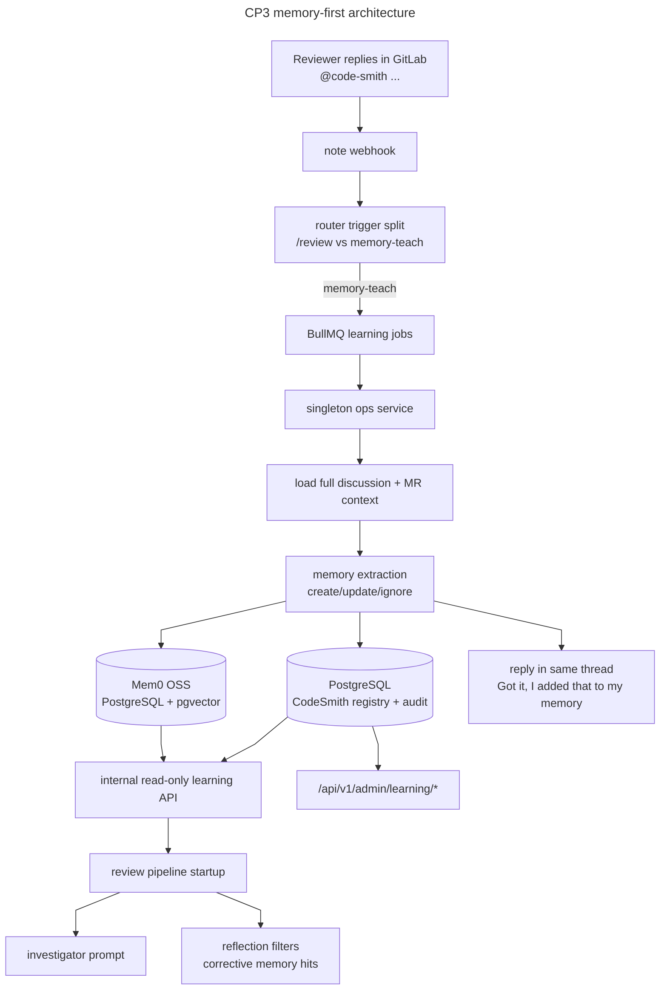

# CP3 — Organizational Learning & Review Memory



## Executive Summary

CodeRabbit's strongest product behavior is not generic feedback analytics. It is the ability for a human to correct the bot in natural language during a review thread and have that correction become durable future behavior. That is the capability CodeSmith should replicate.

This plan replaces the earlier SQLite-first, aggregation-first learning design with a memory-first architecture built on Mem0 OSS backed by PostgreSQL plus pgvector. Human replies to CodeSmith review comments become first-class memory candidates with scope, provenance, lifecycle state, and semantic retrieval. Reactions and applied suggestions still matter, but only as reinforcement signals for existing memories rather than the primary learning mechanism.

The result is a review system that can be taught in-thread, acknowledge that it learned, and then use those memories safely in future reviews without replatforming CodeSmith around a separate agent runtime.

## Locked Decisions

| Concern | Choice | Rationale |
|---|---|---|
| Memory engine | Mem0 OSS | Best product fit for CodeSmith: focused memory layer, OSS, active development, and practical TypeScript integration |
| Durable storage | PostgreSQL plus pgvector from the start | Avoids a disposable SQLite phase for the memory system and matches the semantic retrieval requirement |
| Primary learning source | Human replies to CodeSmith-authored review threads and explicit `@code-smith` mentions on MR notes | Highest-signal input, closest to competitor behavior, and the only path that naturally supports in-thread teaching |
| Secondary learning source | Reactions, suggestion application, and thread-resolution state | Useful reinforcement and memory-health signals, but too weak and ambiguous to be the main memory-creation surface |
| Write ownership | Singleton ops service behind BullMQ jobs | Keeps write authority aligned with CP6 PH0 and avoids multi-writer drift |
| Read path | Internal read-only learning API plus short TTL cache in review workers | Keeps webhook and worker pods away from admin credentials and direct storage mutation |
| Bot identity | Dedicated GitLab service account for CodeSmith | Required for mention detection, same-thread acknowledgments, and clear user expectations |
| Lifecycle model | Create, merge, supersede, archive, and reinforce explicit memories | Better match for evolving team conventions than one-shot heuristic aggregates |
| Prompt usage | Semantic retrieval plus metadata filtering, capped and provenance-labeled | Preserves relevance while limiting prompt bloat and stale global instructions |

## Problem Statement

CodeSmith currently has no durable review memory. Every review is stateless beyond repo configuration and checkpoint state. If a human replies to a CodeSmith finding with a correction such as "@code-smith we do not want stub implementations here," that preference is lost after the thread ends.

The previous CP3 draft improved observability around feedback, but it still treated learning as a relational analytics problem:

- reactions and applied suggestions were the main signals
- SQLite was the phase-one store
- learned output was primarily aggregated pattern extraction
- explicit comment-based teaching was future work

That design is too indirect for the product behavior we actually want. A modern review-memory system needs to treat human corrections as first-class memories, not as weak signals waiting to accumulate into a heuristic rule.

## Why The Earlier SQLite-First Design Is Replaced

The earlier plan was defensible for low-cost feedback analytics, but it is the wrong primary architecture for durable agent memory.

Why it is replaced:

- it optimized for storing events, not for retrieving semantic corrections later
- it made explicit comment-based learning secondary even though that is the highest-value workflow
- it assumed SQLite phase-one storage despite the repo already anticipating PostgreSQL plus pgvector for semantic retrieval
- it pushed the real memory problem into a later migration plan instead of solving the correct product surface now

This plan therefore supersedes the earlier storage direction for CP3. If CP7 remains in the roadmap, it should be narrowed later to analytics-store evolution and any future dedicated-memory scaling work rather than serving as the activation gate for CP3's core memory substrate.

## Architecture Boundary

CodeSmith owns the review-specific behavior. Mem0 owns the memory substrate.

CodeSmith remains responsible for:

- deciding whether a note should become memory
- deriving memory scope from GitLab context
- storing provenance, idempotency, and usage audit records
- choosing which memories enter prompts and how
- replying in-thread when a memory is added or updated
- exposing operator APIs for inspection and curation

Mem0 is responsible for:

- durable semantic memory storage
- embedding-backed retrieval
- metadata-filtered search
- long-term memory update primitives

## Directory Impact

```text
src/
  api/
    router.ts                     # note-event routing for memory-teach triggers
    schemas.ts                    # webhook schema expansion for MR note memory events
    trigger.ts                    # new memory-teach trigger context
  learning/
    store.ts                      # domain interfaces for learning registry and retrieval
    mem0-client.ts                # Mem0 OSS integration boundary
    postgres-store.ts             # PostgreSQL registry, audit, usage, and sync-state adapter
    mention-processor.ts          # note-event eligibility, thread loading, and ack orchestration
    memory-extractor.ts           # structured memory extraction and lifecycle decisions
    retrieval.ts                  # memory query and ranking for review startup
  publisher/
    gitlab-publisher.ts           # same-thread memory acknowledgments and markers
  config.ts                       # Postgres, pgvector, bot identity, learning toggles
  ops.ts                          # ops-owned job consumers and learning bootstrap

tests/
  learning-mentions.test.ts
  learning-extractor.test.ts
  learning-retrieval.test.ts
  learning-admin.test.ts

docs/
  context/
    ARCHITECTURE.md
    CONFIGURATION.md
    WORKFLOWS.md
  guides/
    LEARNING.md
```

## Memory Record Model

Memories should be durable records with semantic retrieval plus explicit provenance.

Each memory should carry:

- canonical memory text
- project id and repository scope
- optional file glob or path prefix
- optional language and finding category
- source MR iid, discussion id, and note id
- creating GitLab user id and username
- lifecycle state: active, archived, superseded
- usage count and last-used timestamp
- reinforcement counters from reactions, applied suggestions, and later thread corrections
- Mem0 memory id plus CodeSmith registry id

Mem0 should store the semantic memory content and metadata. CodeSmith should keep its own PostgreSQL registry and audit tables so admin queries, idempotency, and provenance do not depend on Mem0 internals.

## Exact GitLab Interaction Flow

The interaction model should be explicit and deterministic.

### Example target behavior

1. CodeSmith posts an inline finding.
2. A reviewer replies on the same thread: `@code-smith we don't want stub implementations, that is not ok.`
3. CodeSmith processes the reply as a memory candidate.
4. If the reply expresses a durable preference, CodeSmith replies on the same thread:
   `Got it, I added that to my memory for future reviews in this project.`
5. Future reviews on relevant files retrieve that memory and avoid recommending stub implementations unless the context explicitly calls for scaffolding.

### Event eligibility rules

A merge-request note event becomes a memory candidate only when all of the following are true:

- `object_kind` is `note`
- `noteable_type` is `MergeRequest`
- the author is not the CodeSmith bot user
- the note either mentions the configured CodeSmith bot username or is a reply in a discussion that already contains a CodeSmith-authored note
- the body is not just `/ai-review`
- the note id has not already produced a completed memory action
- project learning is enabled and the repo has not opted out in `.codesmith.yaml`

### Trigger precedence

- `/ai-review` remains a manual review trigger.
- `@code-smith` teaching replies become learning triggers.
- If both appear in the same note, manual review wins and the memory path is skipped unless a future explicit dual-action command is defined.

### Processing steps

1. Router validates the note event and emits a `memory-teach` trigger context.
2. Webhook process enqueues a `learning-thread-memory` BullMQ job instead of invoking the review pipeline directly.
3. Ops consumer loads the full MR discussion and identifies:
   - the source human note
   - the CodeSmith note being corrected, if any
   - path and line metadata from the discussion position
   - MR title and relevant repo context
4. Mention processor runs deterministic filters to reject:
   - bot-authored notes
   - duplicate note ids
   - non-review chatter with no corrective intent
   - unsafe oversized payloads or marker abuse
5. Memory extractor converts the thread into one of these outcomes:
   - `create_memory`
   - `update_memory`
   - `supersede_memory`
   - `ignore_one_off`
   - `clarify_needed`
6. On create, update, or supersede, CodeSmith writes:
   - semantic memory into Mem0
   - registry and audit metadata into PostgreSQL
   - usage and dedupe markers into PostgreSQL
7. CodeSmith replies in the same discussion with a memory-ack note carrying a hidden marker so retries cannot double-post.
8. On ignore or clarify outcomes, CodeSmith may optionally post a short explanation, but it must not claim a memory was stored when none was written.

### Acknowledgment reply contract

When a durable memory is written, CodeSmith posts a same-thread reply with:

- a concise acknowledgment sentence
- optional scope context such as "for future reviews in this project" or "for files under src/api/**"
- a hidden marker containing source note id, memory registry id, and head SHA for duplicate suppression

Example:

```text
Got it, I added that to my memory for future reviews in this project.
<!-- code-smith:memory-ack source_note_id=12345 memory_id=987 head_sha=abc123 -->
```

### Retrieval flow in future reviews

1. Pipeline startup computes the review's changed file set and repo metadata.
2. Review worker queries the internal learning API with:
   - project id
   - repo path and changed files
   - optional language and finding-category hints
   - a semantic query built from MR context plus file content summary
3. Internal learning service retrieves candidate memories from Mem0 with metadata filters.
4. CodeSmith applies additional ranking and caps before prompt injection.
5. Investigator and reflection stages receive only the highest-value memories, with provenance labels and hard caps.
6. Memory-hit usage is written back asynchronously through ops jobs.

## Technology Decisions And Tradeoffs

| Concern | Option A | Option B | Recommendation | Rationale |
|---|---|---|---|---|
| Memory engine | Mem0 OSS | Graphiti | Mem0 OSS | Graphiti is more advanced but heavier to operate and less natural for a Bun-native TS service |
| Base store | PostgreSQL plus pgvector | SQLite first, migrate later | PostgreSQL plus pgvector | Semantic retrieval is a core requirement, not future scope |
| Primary learning input | Explicit thread corrections and mentions | Reactions and applied suggestions only | Explicit thread corrections | Higher signal and directly matches the desired product behavior |
| Runtime shape | Keep CodeSmith architecture and add a memory subsystem | Replatform around a full stateful-agent platform | Keep CodeSmith architecture | Lower blast radius and better fit with existing Hono and BullMQ surfaces |
| Memory lifecycle | First-class memory records with provenance | Aggregated heuristic patterns only | First-class memory records | Better operator control, editability, and future semantic retrieval |
| Retrieval | Semantic plus metadata filters | Exact-match rules only | Semantic plus metadata | Required for applying learnings outside near-identical phrasing |

## Phased Implementation

## Phase OL0 — Decision Lock, Bot Identity & Control Plane Boundary

**Goal:** Lock the architecture, establish the GitLab bot contract, and align CP3 with CP6's control-plane design before storage or extraction work begins.

**OL0.1** — Lock the memory architecture:
- Replace the SQLite-first assumption in CP3 with Mem0 OSS on PostgreSQL plus pgvector
- Record that reactions and applied suggestions are reinforcement, not the primary memory-creation path
- Record that explicit note-based teaching is in scope from the start, not future work

**OL0.2** — Verify PH0 prerequisites and define learning boundaries:
- Confirm CP6 PH0.1, PH0.2, and PH0.2b are the required control-plane prerequisites
- Define the learning-specific BullMQ jobs consumed by the ops role:
  - `learning-thread-memory`
  - `learning-reinforcement-event`
  - `learning-memory-usage`
  - `learning-retention`
- Keep worker and webhook surfaces as producers only

**OL0.3** — Expand trigger design:
- Add a `memory-teach` trigger context alongside the current merge-request and `/ai-review` trigger paths
- Document precedence between manual review commands and memory-teach note events
- Ensure note events can route to learning without accidentally invoking the full review pipeline

**OL0.4** — Define bot identity and publication contract:
- Add a dedicated GitLab bot username or user id to config
- Define memory-ack markers and duplicate-suppression semantics
- Specify exact acknowledgment language and when it may be emitted

**OL0.5** — Documentation update:
- Update `docs/context/CONFIGURATION.md` and `docs/context/ARCHITECTURE.md` with the new locked design decisions and control-plane boundary

### Acceptance Criteria

- CP3 no longer depends on SQLite as the default learning store
- GitLab note-based teaching is explicitly first-class scope
- The bot-user requirement and acknowledgment behavior are documented clearly enough to implement without ambiguity

## Phase OL1 — Memory Substrate & PostgreSQL Foundation

**Goal:** Stand up the durable memory substrate and the CodeSmith-owned registry around it.

**OL1.1** — Configuration and validation:
- Add env vars for PostgreSQL, pgvector, Mem0 enablement, learning capture toggles, bot identity, and internal read credentials
- Validate all learning-related config with Zod in `src/config.ts`

**OL1.2** — Service boundary:
- Create `src/learning/store.ts` with DB-neutral interfaces for:
  - memory registry writes
  - memory audit writes
  - sync cursor and dedupe reads
  - memory usage updates
  - memory retrieval calls used by the internal learning API
- Create `src/learning/mem0-client.ts` as the only Mem0-specific integration boundary
- Create `src/learning/postgres-store.ts` as the CodeSmith-owned registry adapter

**OL1.3** — PostgreSQL schema and migrations:
- Add forward-only migrations for:
  - `memory_registry`
  - `memory_source_events`
  - `memory_usage_events`
  - `feedback_sync_state`
  - `review_memory_hits`
- Enable pgvector as part of the ops bootstrap path
- Keep Mem0 and CodeSmith registry migrations ordered and deterministic

**OL1.4** — Ops bootstrap:
- Initialize PostgreSQL, pgvector checks, Mem0 client wiring, and migration order in `src/ops.ts`
- Expose health diagnostics for the learning service without leaking secrets
- Preserve transactional guarantees for CodeSmith-owned audit writes around Mem0 operations where possible

**OL1.5** — Tests:
- Config validation and startup failure cases
- Migration order and idempotency
- CRUD for registry and audit tables
- Mem0-backed retrieval with metadata filters and deterministic limits
- Retry-safe write behavior

**OL1.6** — Documentation update:
- Update `docs/context/CONFIGURATION.md` and `docs/context/ARCHITECTURE.md`

### Acceptance Criteria

- Learning storage is PostgreSQL-backed from the start
- Mem0 integration is isolated behind a CodeSmith-owned boundary
- Registry, provenance, and dedupe behavior do not depend on opaque third-party internals

## Phase OL2 — GitLab Mention Capture, Thread Context & Acknowledgment Replies

**Goal:** Turn merge-request discussion replies into safe, idempotent memory-teaching events.

**OL2.1** — Note-event schema and routing:
- Expand `src/api/schemas.ts` to capture note-event fields required for memory routing
- Expand `src/api/router.ts` to accept eligible merge-request note events for memory-teach processing
- Preserve existing `/ai-review` behavior unchanged

**OL2.2** — Thread-context loading and filters:
- Add discussion loaders in `src/gitlab-client/client.ts` or equivalent helpers for fetching source discussions and notes by id
- Build deterministic eligibility filters in `src/learning/mention-processor.ts`
- Reject duplicate, bot-authored, or irrelevant notes before any LLM extraction path

**OL2.3** — Queue jobs and ops consumers:
- Define Zod-validated job payloads for note-triggered memory writes and acknowledgment publication
- Route all learning writes through ops-owned consumers
- Add dead-letter handling and retry-safe idempotency keys keyed by source note id and action type

**OL2.4** — Acknowledgment publication:
- Extend publisher support so CodeSmith can post same-thread memory acknowledgments with hidden markers
- Ensure retries do not double-post
- Keep acknowledgment phrasing concise and factual

**OL2.5** — Tests:
- Mention detection and routing
- Discussion-context loading
- Duplicate suppression for source notes and ack replies
- Queue handoff and retry behavior
- Same-thread acknowledgment publication

**OL2.6** — Documentation update:
- Update `docs/context/WORKFLOWS.md`

### Acceptance Criteria

- A valid `@code-smith` teaching reply reaches ops as a learning job without starting a review run
- A durable memory action emits exactly one acknowledgment note in the same discussion
- Duplicate webhook deliveries do not create duplicate memories or duplicate acknowledgments

## Phase OL3 — Memory Extraction, Scope Resolution & Reinforcement Signals

**Goal:** Convert thread corrections into durable memories with explicit lifecycle behavior.

**OL3.1** — Memory extraction workflow:
- Create `src/learning/memory-extractor.ts`
- Input includes:
  - source human note
  - corrected CodeSmith note
  - MR title and relevant file path
  - discussion position metadata
  - any matching existing memories for that scope
- Output is a strict structured decision:
  - create
  - update
  - supersede
  - ignore one-off
  - clarify needed

**OL3.2** — Scope derivation:
- Infer project scope by default
- Add repo, file-pattern, language, and finding-category filters when context supports them
- Keep scope conservative when context is weak rather than over-generalizing

**OL3.3** — Lifecycle behavior:
- Normalize memory text into reusable review guidance rather than storing raw user prose only
- Merge near-duplicate memories where appropriate
- Supersede stale memories when a new correction clearly replaces an older one
- Archive memories rather than hard-deleting them when operator history matters

**OL3.4** — Reinforcement events:
- Keep reaction polling and suggestion-state tracking, but use them to:
  - reinforce existing memories
  - update usage or confidence
  - flag stale or contradicted memories for operator review
- Do not let weak reinforcement alone create broad new memories without a human correction path

**OL3.5** — Tests:
- One-off versus durable correction classification
- Scope derivation from file path, language, and category
- Create, merge, supersede, and archive behavior
- Reinforcement updates for reactions and applied suggestions

**OL3.6** — Documentation update:
- Update `docs/context/ARCHITECTURE.md`

### Acceptance Criteria

- Human thread corrections can become durable review memories with clear provenance
- One-off thread-specific exceptions are not over-promoted into broad project rules
- Reinforcement signals improve memory health without replacing explicit teaching

## Phase OL4 — Memory Retrieval & Injection Into Reviews

**Goal:** Retrieve the right memories at review time and inject them safely into CodeSmith's existing agents.

**OL4.1** — Retrieval path:
- Query the internal learning API during pipeline startup
- Filter by project, changed files, repo path, language hints, and category hints before semantic ranking
- Apply short TTL caching inside review workers

**OL4.2** — Investigator prompt injection:
- Add a `<learned_review_rules>` section containing the highest-confidence, most relevant memories
- Label each memory with enough provenance to be explainable without bloating the prompt
- Hard-cap count and total characters

**OL4.3** — Reflection-stage correction:
- Feed corrective memories into reflection so previously corrected behavior can suppress noisy findings or adjust confidence
- Keep deterministic policy authoritative when memories conflict with hard security or config rules

**OL4.4** — Usage tagging:
- Add memory-hit metadata to `ReviewState` and final findings where relevant
- Emit asynchronous usage updates so memories track last-used time and hit counts

**OL4.5** — Tests:
- Retrieval with semantic plus metadata filtering
- Prompt injection caps and formatting
- Reflection suppression or correction behavior
- Memory-hit tagging and usage updates

**OL4.6** — Documentation update:
- Update `docs/context/WORKFLOWS.md`

### Acceptance Criteria

- Relevant memories are retrieved without requiring exact wording matches
- Prompt injection remains bounded and explainable
- Memory usage can be observed and audited later

## Phase OL5 — Memory Management API, Docs & Final Audit

**Goal:** Make memories inspectable, editable, and operationally safe.

**OL5.1** — Admin APIs:
- Add endpoints under `/api/v1/admin/learning/*` for:
  - list memories
  - semantic search memories
  - get memory details
  - edit memory text and scope
  - archive or restore memory
  - supersede one memory with another

**OL5.2** — Stats and export:
- Add endpoints for:
  - memory counts by project and status
  - most-used memories
  - stale or never-used memories
  - reinforcement event summaries
  - export of memory registry with provenance and usage metadata

**OL5.3** — Repo-config controls:
- Respect `.codesmith.yaml` learning settings for capture, retrieval scope, and opt-out
- Keep project opt-out authoritative over instance defaults

**OL5.4** — Guide documentation:
- Add `docs/guides/LEARNING.md` covering:
  - how to teach CodeSmith in a thread
  - what gets remembered and what does not
  - how acknowledgment replies work
  - admin management and privacy controls
  - retention and memory hygiene

**OL5.5** — Docs index and plan references:
- Update `docs/README.md` and any affected cross-plan summaries to reflect the memory-first design and `@code-smith` teaching workflow

**OL5.6** — Final audit:
- Run `review-plan-phase`
- Save the audit report under `docs/plans/review-reports/`
- Do not mark the plan complete until implementation, tests, docs, and acknowledgment behavior all pass review

### Acceptance Criteria

- Operators can inspect and correct memories without touching storage internals
- Users have a documented and predictable way to teach CodeSmith in review threads
- The plan is not presented as complete until the full audit verifies behavior, docs, and controls

## Privacy & Security Considerations

- Memory capture must ignore bot-authored notes and never learn from CodeSmith's own text alone
- Raw source notes should be retained only as needed for provenance and audit; prompt injection should use normalized memories rather than replaying full thread history
- Learning writes must stay behind ops-owned credentials and queue boundaries
- Internal read credentials for workers must be separate from operator admin credentials
- Memory extraction must apply bounded input sizes and marker sanitization before any LLM step
- Retention and archival behavior must be explicit and operator-controlled
- Project opt-out via `.codesmith.yaml` must disable both capture and retrieval for that project

## Open Questions Resolved By This Revision

These are no longer open decisions in CP3:

- SQLite is not the default memory store for CP3
- explicit comment-based teaching is not future work
- semantic retrieval is not deferred behind a later migration gate
- reactions and applied suggestions are not the main learning mechanism
