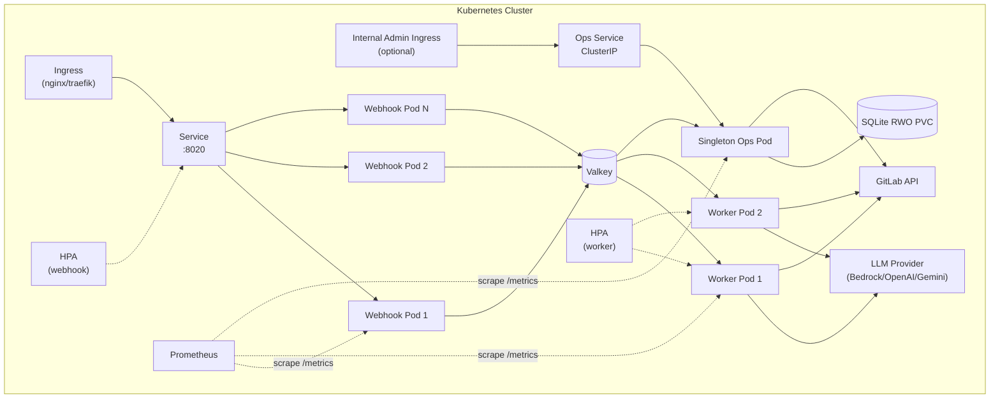

# CP6 — Production Hardening & Developer Experience

## Executive Summary

Git Gandalf scored **4/10 on production readiness** and **5/10 on ease of setup** in the competitive evaluation. These are the two biggest numerical gaps in the scoring matrix. The evaluation was honest: no HPA, no Helm chart, no resource limits, no ingress, no monitoring integration, no load testing, no operational runbook, no contributor guide, no end-to-end tests.

This plan transforms Git Gandalf from a well-engineered prototype into a production-grade service that an operations team can deploy, monitor, scale, and trust. It also addresses the "bus factor" risk by creating contributor documentation and improving developer experience.

The plan has no dependencies on other Crown Plan children and can start immediately, in parallel with CP1.

## Operating Assumptions

- The webhook and review-worker surfaces may scale horizontally.
- Learning, retention, and analytics writes are owned by a singleton internal ops deployment.
- Webhook and worker surfaces enqueue durable internal BullMQ jobs for ops-owned writes; they do not write SQLite directly.
- Admin and analytics APIs are disabled by default and exposed only through a dedicated admin route group with separate auth.
- Readiness is based on local process health and critical local dependencies, not on transient GitLab reachability.
- Every dependency-introducing phase must run `bun audit` and either remediate or explicitly record accepted risk. Optional reporting helpers may be used in CI, but they do not replace the Bun-native audit gate.

## Architecture — Target Deployment



## Phased Implementation

### Phase PH0 — Admin Surface, Ops Ownership & Dependency Gate

**Goal:** Establish the foundational operational boundaries that later plans rely on.

**PH0.1** — Dedicated admin surface:
- Define `/api/v1/admin/*` as a separate route group from `/api/v1/webhooks/gitlab`
- Protect with a dedicated bearer token and optional mTLS or internal-ingress policy
- Keep admin routes disabled by default in standard deployments
- Define a separate internal read-only surface for worker/service-to-service consumption (for example `/api/v1/internal/*` or an ops-only ClusterIP route group) so worker pods never receive the operator admin bearer token

**PH0.2** — Singleton ops deployment:
- Define a singleton internal ops deployment that owns SQLite writes for learning, analytics retention, and feedback polling
- Webhook and worker pods do not mount the learning database by default

**PH0.2b** — Ops service entrypoint and role detection:
- Create `src/ops.ts` as the ops process entrypoint (analogous to `src/worker.ts` for review workers)
- Add `DEPLOYMENT_ROLE` env var to `src/config.ts` with values `webhook | worker | ops` (default: `webhook` for backward compatibility)
- `src/ops.ts` initializes: SQLite database, BullMQ consumer for learning and analytics write-intent queues, feedback polling scheduler, admin Hono router, and graceful shutdown handlers
- `src/ops.ts` does **not** initialize: the webhook router, the review worker, or the LLM client
- `src/index.ts` and `src/worker.ts` detect their role via `DEPLOYMENT_ROLE` and skip ops-only subsystems
- Define the BullMQ queue names consumed by the ops service: `learning-feedback-event`, `learning-review-run`, `learning-retention`, `analytics-write`
- Each queue consumer validates job payloads with Zod before writing to SQLite
- Graceful shutdown: drain BullMQ consumers, cancel feedback polling timer, close SQLite, log shutdown timeline

**PH0.2a** — Durable internal write transport:
- Reuse BullMQ/Valkey for internal ops-owned write jobs instead of inventing a new synchronous RPC surface
- Define job schemas and idempotency keys for learning feedback writes, analytics writes, retention runs, and pattern extraction triggers
- Webhook and worker services act as producers; ops service is the only consumer that mutates SQLite state
- Document backpressure behavior, retry policy, and dead-letter handling for these job types

**PH0.3** — Dependency gate:
- Add a dependency audit gate to all dependency-introducing phases
- **Canonical audit command:** Use `bun audit` as the required dependency gate before merge. This keeps the workflow aligned with AGENTS.md's Bun-only rule and with the current repo's working audit support.
- Optional CI helper: if teams want policy thresholds or nicer CI formatting, they may add a Bun-invoked wrapper such as `bunx audit-ci`, but it is supplementary and must not replace `bun audit`.
- Track current audit findings and require implementers to document status before merge
- Record the baseline audit state when the phase begins. As of this review, `bun audit` reports two advisories in `fast-xml-parser` via `@aws-sdk/client-bedrock-runtime` (1 high, 1 moderate); dependency-introducing phases must either leave the baseline unchanged or document accepted delta.
- Provide an explicit risk-acceptance checklist template for advisories that cannot be immediately resolved

**PH0.4** — Update CONFIGURATION.md and ARCHITECTURE.md.

### Phase PH1 — Helm Chart

**Goal:** Replace raw K8s manifests with a proper Helm chart that supports configurable deployment for any environment.

**PH1.1** — Create Helm chart structure:
```
charts/git-gandalf/
├── Chart.yaml
├── values.yaml
├── templates/
│   ├── _helpers.tpl
│   ├── namespace.yaml
│   ├── configmap.yaml
│   ├── secret.yaml
│   ├── webhook-deployment.yaml
│   ├── webhook-service.yaml
│   ├── webhook-hpa.yaml
│   ├── worker-deployment.yaml
│   ├── worker-hpa.yaml
│   ├── ingress.yaml
│   ├── valkey-statefulset.yaml (optional)
│   ├── serviceaccount.yaml
│   ├── pdb.yaml
│   └── NOTES.txt
└── tests/
    └── test-connection.yaml
```

**PH1.2** — Webhook deployment template:
- Configurable replicas (default: 2)
- Resource requests/limits (default: 256Mi/512Mi memory, 250m/500m CPU)
- Readiness probe: `GET /readyz` (PH2)
- Liveness probe: `GET /livez` (PH2)
- Environment variables from ConfigMap + Secret
- Pod anti-affinity for HA (prefer spread across nodes)
- Security context: `runAsNonRoot: true`, `readOnlyRootFilesystem: true` (with tmpfs for repo cache)

**PH1.3** — Worker deployment template:
- Configurable replicas (default: 1)
- Higher resource limits (workers do LLM calls + git operations)
- Default: 1Gi memory, 1 CPU
- `terminationGracePeriodSeconds: 660` (matches current docker-compose)
- Shared volume for repo cache (emptyDir or PVC, configurable)
- No direct learning DB mount by default; workers consume learned state through the internal read path

**PH1.4** — Singleton ops deployment template:
- Single replica, explicit PodDisruptionBudget, and RWO storage for learning/analytics state
- Hosts feedback polling, retention jobs, admin APIs, and analytics aggregation
- Exposed only on an internal ClusterIP service
- Consumes internal BullMQ job types for learning and analytics writes

**PH1.5** — Valkey StatefulSet (optional):
- Enabled via `valkey.enabled: true` (default: false for production — use external Redis/Valkey)
- Single replica, 256Mi memory, persistence via PVC
- For dev/test environments only; production should use managed Redis/Valkey

**PH1.6** — Supporting templates:
- ConfigMap: all non-secret env vars from `values.yaml`
- Secret: GitLab token, webhook secret, admin bearer token, LLM API keys, Jira credentials
- Service: ClusterIP for webhook, ops service, and headless for Valkey
- Ingress: configurable class, TLS, host, paths; admin ingress disabled by default and internal-only when enabled

**PH1.7** — HPA templates:
- Webhook HPA: scale on CPU utilization (target: 70%, min: 2, max: 10)
- Worker HPA: scale on CPU initially; queue-depth-based scaling is added only after a metrics-adapter path is implemented and validated
- Both configurable via `values.yaml`
- **Known limitation (review-driven R7):** CPU-based HPA is a poor proxy for worker throughput because workers are I/O-bound (waiting on LLM API responses). A worker at 10% CPU may be fully saturated with concurrent reviews. Until queue-depth-based scaling exists (planned for CP5 after Prometheus metrics), recommend operators set a fixed `replicaCount` based on expected MR throughput rather than relying on CPU HPA alone. Add a follow-up task in CP5 to implement KEDA ScaledObject or Prometheus-adapter HPA for worker pods based on `gitgandalf_queue_depth` metric.

**PH1.8** — Tests:
- `helm lint charts/git-gandalf/`
- `helm template` rendering with default values
- `helm template` rendering with custom values (all features enabled)
- Validate generated YAML passes `kubectl --dry-run`

**PH1.9** — Update GETTING_STARTED.md:
- Helm installation instructions (add repo, configure values, install)
- Quick-start with KinD + Helm
- Production deployment checklist

**PH1.10** — Update ARCHITECTURE.md deployment section.

### Phase PH2 — Health Probes & Graceful Lifecycle

**Goal:** Implement proper Kubernetes health checks and graceful process lifecycle.

**PH2.1** — `GET /readyz` endpoint:
- Implement role-specific readiness contracts instead of one generic probe:
  - Webhook pod: config parsed, HTTP router initialized, and queue enqueue dependency healthy when `QUEUE_ENABLED=true`
  - Worker pod: config parsed, worker initialized, Valkey connectivity healthy, and local job processor ready
  - Ops pod: config parsed, SQLite accessible, scheduler initialized, admin routes mounted, and Valkey connectivity healthy
- Return 200 with role-specific JSON status or 503 with failures
  ```json
  { "status": "ready", "role": "ops", "checks": { "config": "ok", "database": "ok", "scheduler": "ok", "queue": "ok" } }
  ```

Add a separate diagnostics endpoint for external dependency reachability (`GitLab`, `Jira`, `LLM`) that does not control readiness.

**PH2.2** — `GET /livez` endpoint:
- Check process health (event loop responsive)
- Check memory pressure (warn if RSS > 80% of configured limit)
- Lightweight — no external calls
  ```json
  { "status": "alive", "uptime_seconds": 3600, "memory_mb": 245 }
  ```

**PH2.3** — Graceful shutdown improvements:
- Current: worker handles SIGTERM/SIGINT
- Enhanced:
  - Webhook server: stop accepting new connections, drain in-flight requests (10s grace)
  - Worker: finish current job, don't pick new ones (already handled by BullMQ)
  - Close SQLite database connections
  - Close GitLab API client
  - Log shutdown timeline

**PH2.4** — Startup probe:
- `GET /healthz` returns 200 once configuration is parsed and server is ready
- Separate from readiness (startup probe runs once; readiness runs continuously)

**PH2.5** — Tests:
- Readiness probe matrix for webhook, worker, and ops roles
- Role-specific failure cases (queue down for worker, DB down for ops, router init failure for webhook)
- Liveness probe response shape
- Graceful shutdown sequence

**PH2.6** — Update WORKFLOWS.md.

### Phase PH3 — Performance Benchmarking

**Goal:** Measure and document Git Gandalf's performance characteristics under realistic load.

**PH3.1** — Create `benchmarks/` directory:
- `benchmarks/synthetic-mr.ts` — generates synthetic MR payloads with configurable diff sizes
- `benchmarks/pipeline-bench.ts` — timed pipeline runs with mock LLM (measures everything except LLM latency)
- `benchmarks/full-bench.ts` — full pipeline with real LLM (measures true end-to-end latency)

**PH3.2** — Measure and document:
- P50, P95, P99 review latency (small MR: 1-3 files; medium: 5-10 files; large: 15+ files)
- LLM call count per review (min, avg, max)
- Token usage per review (min, avg, max)
- Expected targets: P50 < 30s, P95 < 90s for medium MRs

**PH3.3** — Profile resource usage:
- Memory: baseline RSS, peak during review, stable state
- CPU: baseline, peak during git operations and LLM calls
- Disk I/O: repo clone/fetch patterns
- Network: GitLab API call count per review

**PH3.4** — Optimization opportunities:
- Parallel diff fetching + repo update (already somewhat parallel)
- LLM streaming responses (reduce time-to-first-finding)
- Repo cache warming strategies
- Agent prompt size optimization (reduce token usage)

**PH3.5** — Create `docs/guides/PERFORMANCE.md`:
- Benchmark results table
- Capacity planning guide (reviews/hour per worker)
- Resource sizing recommendations per deployment size
- Tuning knobs (MAX_TOOL_ITERATIONS, WORKER_CONCURRENCY)

**PH3.6** — Update ARCHITECTURE.md with performance characteristics section.

### Phase PH4 — Error Taxonomy & Resilience

**Goal:** Structured error handling and resilience patterns for production reliability.

**PH4.1** — Create `src/errors.ts`:
- Define error categories:
  - `GitLabApiError` — GitLab API failures (auth, rate limit, server error)
  - `LlmProviderError` — LLM API failures (timeout, rate limit, content filter)
  - `RepoOperationError` — git clone/fetch failures
  - `ConfigurationError` — invalid config or missing required values
  - `PipelineError` — review pipeline failures
- Each error type carries: `code`, `category`, `isRetryable`, `message`
- Consistent structured logging for all error types

**PH4.2** — LLM circuit breaker:
- Create `src/agents/circuit-breaker.ts`
- States: closed → open (after N consecutive failures) → half-open (probe after cooldown)
- Per-provider circuit breakers (Bedrock, OpenAI, Google are independent)
- Configuration: `failure_threshold: 3`, `cooldown_ms: 30000`, `probe_count: 1`
- When circuit is open, skip the provider immediately (faster fallback)
- Log circuit state transitions

**PH4.3** — GitLab API rate-limit backoff:
- Detect `429 Too Many Requests` and `Retry-After` header
- Implement exponential backoff with jitter for retries
- Cap at 3 retries per API call
- Log rate-limit events as warnings

**PH4.4** — Document graceful degradation:
- LLM provider down → fallback chain (already exists), circuit breaker accelerates failover
- All LLM providers down → pipeline fails with clear error, dead-letter queue captures job
- GitLab API down → review completes but publication fails → retry via queue (when enabled)
- Jira down → already handled (returns empty tickets, logged as warning)
- SQLite DB locked → WAL mode handles concurrent reads; write contention logged as warning

**PH4.5** — Tests:
- Circuit breaker state transitions
- Rate-limit detection and backoff
- Error taxonomy: correct codes and categories for each scenario
- Graceful degradation for each failure mode

**PH4.6** — Update ARCHITECTURE.md.

### Phase PH5 — End-to-End Integration Tests

**Goal:** Create integration tests that verify the full pipeline from webhook to publication.

**PH5.1** — Create `tests/integration/mock-gitlab-server.ts`:
- Lightweight Hono server that mocks GitLab API endpoints:
  - `GET /api/v4/projects/:id/merge_requests/:iid` → returns mock MR details
  - `GET /api/v4/projects/:id/merge_requests/:iid/diffs` → returns mock diffs
  - `GET /api/v4/projects/:id/merge_requests/:iid/discussions` → returns mock discussions
  - `POST /api/v4/projects/:id/merge_requests/:iid/discussions` → captures posted comments
  - `POST /api/v4/projects/:id/merge_requests/:iid/notes` → captures posted notes
- Records all received requests for assertion in tests

**PH5.2** — Integration test: full review flow:
- Start mock GitLab server + Git Gandalf (test mode with mocked LLM)
- Send webhook payload to Git Gandalf
- Assert: MR details fetched, diff fetched, review executed, findings published to mock server
- Assert: summary note posted with correct format

**PH5.3** — Integration test: incremental review:
- First webhook → full review → summary with checkpoint
- Second webhook (new commits) → incremental review → new summary
- Assert: second review only analyzed new commit range

**PH5.4** — Integration test: queue mode:
- Start mock GitLab + Git Gandalf + in-memory Valkey (or mock)
- Send webhook → job queued → worker picks up → review completes → findings published
- Assert: correct async flow

**PH5.5** — Configure integration tests in CI:
- Separate from unit tests (`bun test --filter integration`)
- Run as part of `bun run ci` pipeline
- Timeouts: 60s per integration test

**PH5.6** — Update `docs/guides/DEVELOPMENT.md`: add integration test section.

### Phase PH6 — Contributor DX & Operational Docs

**Goal:** Lower the barrier for new contributors and provide operational documentation.

**PH6.1** — Create `CONTRIBUTING.md` at repo root:
- Development setup (one-command: `bun install && cp .env.example .env && bun run dev`)
- Architecture overview (link to docs/agents/context/ARCHITECTURE.md)
- Code organization guide (modules, where to add new features)
- PR process (branch naming, commit conventions via conventional-commits skill, review expectations)
- Code style (Biome, strict TypeScript, Zod boundaries)
- Testing expectations (unit tests per feature, integration tests for pipeline changes)

**PH6.2** — Create `docs/guides/OPERATIONS.md`:
- Deployment checklist (pre-flight checks, config validation, rollback plan)
- Incident response playbook:
  - Reviews not posting → check GitLab connectivity, token permissions, webhook secret, and queue health
  - Reviews taking too long → check LLM provider health, reduce MAX_TOOL_ITERATIONS
  - Queue backlog growing → scale workers, check Valkey connectivity
  - Memory exceeded → check for repo cache growth, adjust TTL
- Scaling guide (horizontal: add webhook/worker replicas; vertical: increase resources)
- **SQLite backup and recovery** _(review-driven R6)_:
  - Ops service runs a periodic `sqlite3 .backup()` call (configurable interval, default: daily) writing to a configurable object storage path or secondary PVC
  - Maximum acceptable data loss window: 24 hours of feedback data; learned patterns are reconstructible from persisted feedback events
  - Recovery procedure: restore from most recent backup, replay BullMQ dead-letter queue if needed
  - Add `LEARNING_DB_BACKUP_INTERVAL_HOURS` (default: `24`) and `LEARNING_DB_BACKUP_PATH` (default: `./data/backups/`) to config
- Valkey persistence guidance
- Admin route-group access model and ops-service ownership
- Log analysis guide (structured JSON queries, common patterns)

**PH6.3** — Improve development setup:
- `bun run setup` script: checks prerequisites (git, ripgrep), copies .env, runs install
- `bun run dev:seed` script: sends a sample webhook for local testing
- Validate `.env` on startup with helpful error messages (already exists, enhance)

**PH6.4** — Code coverage:
- Add `bun test --coverage` to CI
- Set minimum coverage gate: 70% line coverage (pragmatic, not 100%)
- Coverage report in CI output

**PH6.5** — Update `docs/README.md`.

**PH6.6** — Run `review-plan-phase` audit.

## Existing K8s Manifests Migration

The current `k8s/` directory contains raw manifests that will be superseded by the Helm chart. Migration plan:

1. Create Helm chart alongside existing manifests
2. Verify Helm-generated YAML is functionally equivalent
3. Update docs to reference Helm chart
4. Move raw manifests to `k8s/legacy/` (keep as reference, don't delete immediately)
5. Remove legacy manifests in a follow-up cleanup
