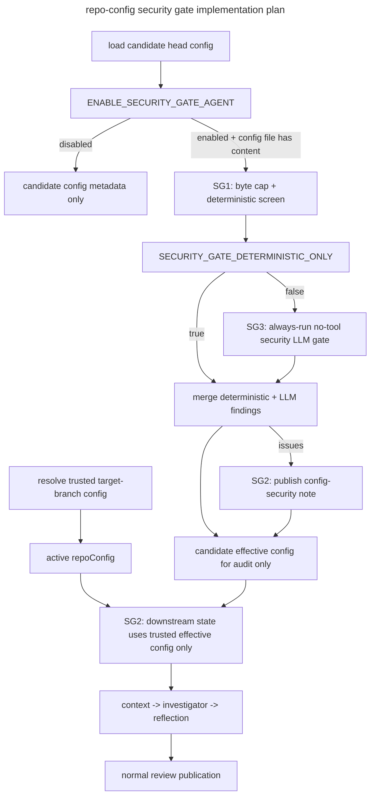

# CP1-SG — Repo Config Security Gate



## Executive Summary

CP1 Phase C3 intentionally made `.codesmith.yaml` prompt-aware, but it did not add a security gate between repo-owned config text and the review agents. This revision hardens that path in two layers. First, the current MR is always reviewed under a trusted target-branch baseline config, not under the candidate head-branch config being proposed in the same MR. Second, the candidate head-branch config is screened with deterministic all-field checks, optional no-tool LLM review, configurable byte caps, and redacted publication. The outcome is that repo configuration remains useful, but config changes can no longer govern their own introducing MR, and unsafe candidate values no longer get a free path into prompts, scope policy, or future execution selectors.

## Trusted Config Model

This plan now treats repo config as two separate artifacts with different trust levels.

| Artifact | Source | Trust level | Allowed to govern the current MR review? | Notes |
|---|---|---|---|---|
| Trusted baseline config | `.codesmith.yaml` or `.codesmith.yml` resolved from the target branch through a server-trusted ref path | trusted after normal schema validation | yes | This is the only repo-owned config that may influence diff filtering, severity policy, prompt injection, or other downstream behavior for the current MR |
| Candidate head config | `.codesmith.yaml` or `.codesmith.yml` loaded from the MR head branch clone | untrusted | no | This config is screened, summarized, and prepared for future post-merge behavior, but it must not govern the MR that introduces or changes it |

Operational rule:

- if the target branch has no repo config, the trusted baseline is `DEFAULT_REPO_CONFIG`
- if the target branch config is malformed or invalid, the trusted baseline falls back to defaults and logs an operator-visible warning
- if the head branch adds or changes repo config, the candidate file is audited and may publish security findings, but the current review still runs under the trusted baseline
- only after that config lands on the trusted branch does it become eligible to govern future reviews

## Resolved Decisions

| Concern | Decision | Rationale |
|---|---|---|
| Current-MR trust source | Govern the current MR review with a trusted target-branch baseline config, never with the candidate head-branch config from the same MR | Prevents self-exemption through `exclude`, `skip`, severity inflation, or invalid-config fallback games |
| Gate placement | Run in `src/api/pipeline.ts` immediately after trusted baseline resolution and candidate head-config load | This is the earliest point where candidate config exists and the last point before prompt construction begins |
| Gate enablement | Use `ENABLE_SECURITY_GATE_AGENT` to control candidate-config screening, LLM review, and config-security publication, but never to disable trusted-baseline governance for the current MR | Operators need an explicit deployment-level off switch for the extra screening path without reopening the self-governing-config hole |
| Deterministic-only mode | Add `SECURITY_GATE_DETERMINISTIC_ONLY` so operators can keep deterministic screening and publication while disabling the LLM gate | Provides an operational escape hatch without removing the core safety boundary |
| Size budget | Enforce `SECURITY_GATE_MAX_CONFIG_BYTES` before YAML parse for both trusted-baseline and candidate config acquisition, plus schema-level string and array caps | Prevents the config file from becoming a parse-time, memory, or token-budget amplifier |
| Failure mode | Fail closed for unsafe unsealed candidate fields, fail open for the overall review | Unsafe candidate values are quarantined or ignored, but the main review still runs under trusted config |
| Primary authority | Deterministic policy is authoritative | Reproducibility and security posture cannot depend on model judgment |
| State contract | Downstream `repoConfig` means trusted effective config only; candidate config lives in audit-only fields and raw text does not persist in `ReviewState` | Prevents accidental leakage of untrusted content into prompts or later policy consumers |
| LLM role | Secondary semantic reviewer with no tools that runs on every non-empty candidate config when enabled and not in deterministic-only mode | Avoids trying to predict when candidate config is risky enough to inspect while preserving an operator off switch |
| Publication surface | Separate top-level MR note with escaped/redacted evidence and capped excerpts | Config-security findings should remain distinct from code-review findings without echoing attacker payloads verbatim |

## Problem Statement

Today, repo authors can put free-form text into `review_instructions` and `file_rules[].instructions`, and other config fields such as patterns or profile strings may also remain open-ended unless explicitly sealed by validation. A malicious MR can therefore attack two surfaces at once:

- the prompt surface, by trying to override instructions, steer tools, or coerce approval
- the policy surface, by changing scope and thresholds in ways that are syntactically valid but security-significant

Without a trusted-baseline model, the same MR can attempt to:

- suppress or reshape valid findings
- self-exempt the review by broadening `exclude` or enabling `file_rules.skip`
- raise severity thresholds so valid findings disappear
- steer the investigator toward unnecessary sensitive-file searches
- pressure the reviewer to approve changes or omit categories of defects
- abuse prompt framing through XML-like or role-like content
- create oversized or malformed config payloads that amplify parse, memory, or LLM cost before the review starts

The system therefore needs a dedicated pre-review guardrail that:

- separates trusted baseline config from untrusted candidate config
- inspects every unsealed candidate field before it reaches any future policy surface
- enforces bounded input size before parsing or LLM use
- redacts published evidence so the gate does not become a new exfiltration channel
- preserves review continuity without letting config changes govern their own introducing MR

## Current Gaps

- `src/config/repo-config.ts` validates only shape and types, not semantic safety for unsealed fields
- `src/config/repo-config.ts` does not currently cap free-form string length, array length, or total config size
- `src/api/pipeline.ts` loads head-branch repo config and passes it directly into review state with no trusted-baseline separation or security screening
- `src/agents/context-agent.ts`, `src/agents/investigator-agent.ts`, and `src/agents/reflection-agent.ts` consume repo config without a hard distinction between trusted effective config and audit-only candidate config
- there is no deployment-level flag to disable the LLM pass while preserving deterministic screening
- publisher flows only know about normal review summaries and inline comments, not config-security notes
- there is no redacted publication policy for attacker-controlled config evidence
- there is no candidate-config field inventory contract for rejecting hallucinated LLM findings
- no test suite currently models malicious `.codesmith.yaml` prompt content as an adversarial input class

## Directory Impact

```text
src/
  agents/
    config-security-agent.ts         # new no-tool security reviewer
    prompts/
      system-prompts.yaml            # new config_security_agent prompt
  config/
    repo-config-security.ts          # deterministic checks + sanitization
    repo-config-loader.ts           # shared parse/load helpers for trusted baseline and candidate config
  publisher/
    config-security-note.ts          # note formatting + marker helpers
  gitlab-client/
    client.ts                       # target-branch config retrieval for trusted baseline
tests/
  agents.test.ts                     # security agent + prompt behavior tests
  pipeline.test.ts                   # gate integration tests
  publisher.test.ts                  # config-security note tests
  repo-config.test.ts                # deterministic detector tests
```

## Phased Implementation

## Phase SG1 — Deterministic Gate Foundation

**Goal:** Create a pure, reproducible validator and sanitizer for every unsealed repo-config field, with explicit field trust policy and bounded input size.

**SG1.1** — Create `src/config/repo-config-security.ts`:
- Define Zod-backed issue and result schemas for deterministic security findings
- Model issue metadata with `fieldPath`, `category`, `severity`, `evidence`, `suggestion`, `action`, and `shouldQuarantine`
- Export helpers for classifying fields as sealed, scope-shaping, selector, or prompt-bearing
- Build a stable field inventory for every screenable candidate-config value so later LLM findings can only reference real field paths
- Define deterministic array-stable sanitization helpers that do not mutate array indices mid-pass

**SG1.2** — Add size and schema guardrails:
- Add `SECURITY_GATE_MAX_CONFIG_BYTES` as the hard byte cap applied before YAML parse for both trusted-baseline and candidate-config acquisition
- Add repo-config schema caps for free-form strings and array sizes so a valid-but-large config cannot exhaust memory or prompt budget
- Define capped normalized unsealed-field extraction for deterministic screening and for the optional LLM path
- If the candidate config exceeds the byte cap, emit deterministic findings, skip the LLM path for that candidate, and do not persist raw content beyond gate-local scope

**SG1.3** — Implement phrase, shape, and policy detectors:
- Detect instruction-override language such as attempts to replace system or previous instructions
- Detect outcome manipulation language such as attempts to force approval or suppress findings
- Detect tool-steering and exfiltration prompts such as requests to inspect `.env`, secrets, or unrelated config dumps
- Detect prompt-structure injection such as XML-like control tags, role impersonation, and repeated fence abuse
- Detect suspicious payload shapes such as large base64-like blobs or repeated delimiters intended to break framing
- Detect config-scope abuse such as candidate patterns that would broadly suppress review coverage if trusted later
- Detect selector abuse such as unsafe `linters.profile` values until a future deployment-owned allowlist seals that field
- Detect marker and markdown abuse that would break publication or collide with hidden comment markers
- Apply those detectors to every unsealed field, not just prompt-carrying instruction fields

**SG1.4** — Implement sanitization rules:
- Remove affected prompt-carrying fields and any other unsealed fields that are not confidently safe
- Preserve sealed values such as booleans and closed enums
- Preserve unaffected `file_rules` entries even when neighboring entries are quarantined
- Apply sanitization by stable field path over the original parsed tree so multi-entry array quarantines remain deterministic
- Return issues, sanitized candidate config, and redacted publication-ready metadata in one result

**SG1.5** — Add deterministic unit coverage:
- Clean config passes with no findings and no sanitization
- Oversize config is rejected before YAML parse and LLM use
- Global `review_instructions` is removed when it contains a hard-fail pattern
- Only matching `file_rules[].instructions` fields are removed when a single rule is malicious
- Unsealed non-prompt fields are screened as well
- Multiple quarantines in the same array remain stable and target the intended entries
- `linters.profile` is treated as unsafe/untrusted until a future allowlist seals it
- Sealed fields remain byte-for-byte equivalent before and after sanitization

**SG1.6** — Update documentation:
- Add deterministic gate behavior to `docs/context/ARCHITECTURE.md`
- Document quarantined field behavior, trusted-field classes, size limits, sealed-field exemptions, and examples in `docs/guides/REPO_REVIEW_CONFIG.md`

### Field Trust Matrix

| Field class | Examples | Current-MR trust | Deterministic policy | Sanitization / handling |
|---|---|---|---|---|
| Sealed policy fields | `severity.minimum`, `severity.block_on`, booleans, closed enums | trusted only from target-branch baseline | schema validation only | preserved in trusted baseline; candidate values audited but do not govern current MR |
| Prompt-bearing free text | `review_instructions`, `file_rules[].instructions` | never trusted from candidate head config | prompt-abuse detectors + optional LLM semantic review | remove affected field, publish redacted finding |
| Scope-shaping open strings | `exclude[]`, `file_rules[].pattern` | never trusted from candidate head config | breadth, suppression, marker, and suspicious-shape detectors | quarantine affected entry; unaffected entries preserved |
| Selector open strings | `linters.profile` | never trusted from candidate head config | quarantine unless sealed by a future deployment-owned allowlist | treat as audit-only until CP2 defines a registry |
| Bounded numeric output hints | `output.max_findings` | trusted only from target-branch baseline | schema cap only | preserved when baseline-trusted; candidate value cannot govern same MR |

### Acceptance Criteria

- A malicious `review_instructions` value can be flagged and stripped without discarding the rest of the candidate config
- A malicious per-file instruction can be stripped without removing unrelated file rules
- Unsealed non-prompt fields are screened under the same security policy instead of bypassing review
- Candidate oversize config is bounded before YAML parse or LLM use
- Multi-entry array sanitization produces the same result for the same input every time
- The deterministic gate runs without any LLM dependency and produces stable results for the same input
- The repo-config guide explicitly tells users that all unsealed fields are screened and may be quarantined

## Phase SG2 — Pipeline And Publisher Integration

**Goal:** Run the deterministic gate before prompt construction, make the gate env-controlled, separate trusted baseline from candidate config, retain observability without persisting raw attacker text, and publish separate config-security feedback.

**SG2.1** — Add gate configuration:
- Add `ENABLE_SECURITY_GATE_AGENT` to `src/config.ts`
- Add `SECURITY_GATE_DETERMINISTIC_ONLY` to `src/config.ts`
- Add `SECURITY_GATE_MAX_CONFIG_BYTES` to `src/config.ts`
- Document all three in `.env.example` and `docs/context/CONFIGURATION.md`
- Default them to the repo’s chosen secure behavior and make the toggles explicit in deployment docs
- Document that `ENABLE_SECURITY_GATE_AGENT=false` disables candidate screening and config-security publication only; it does not allow head-branch config to govern the same MR

**SG2.2** — Resolve trusted baseline and candidate config:
- Add a `GitLabClient` or equivalent helper to fetch `.codesmith.yaml` / `.codesmith.yml` from the target branch through a server-trusted ref path
- Reuse shared loader parsing helpers so trusted-baseline and candidate config use the same byte-cap and schema-validation logic
- Define baseline fallback behavior: missing or invalid target-branch config resolves to `DEFAULT_REPO_CONFIG`
- Define candidate behavior: the head-branch config is audit-only for the current MR and never governs diff filtering, severity policy, or prompt injection in that same MR

**SG2.3** — Extend `src/agents/state.ts` and config-load metadata:
- Keep downstream `repoConfig` as the trusted effective config actually used by diff filtering, severity policy, and prompts
- Add audit-only candidate metadata such as `candidateRepoConfigHash`, `candidateRepoConfigBytes`, `candidateRepoConfigPresent`, `candidateRepoConfigIssues`, and optional security summary fields
- Do not persist raw candidate config text in `ReviewState`
- Add metadata needed to explain whether the current MR introduced or changed repo config relative to the trusted baseline

**SG2.4** — Wire the gate into `src/api/pipeline.ts`:
- Resolve the trusted baseline config before building the review state
- Load the candidate head-branch config with the same byte cap and shared parsing logic
- Always use the trusted baseline config for downstream review state, regardless of gate-flag settings
- When `ENABLE_SECURITY_GATE_AGENT=true` and candidate config has content, run deterministic screening on the candidate config
- If `SECURITY_GATE_DETERMINISTIC_ONLY=true`, skip SG3 entirely and continue with deterministic findings only
- Build review state so all downstream consumers use trusted `repoConfig`, not candidate config

**SG2.5** — Add config-security publisher support:
- Create `src/publisher/config-security-note.ts` for note body formatting and marker helpers
- Add a unique hidden marker for duplicate suppression on same-head reruns
- Escape HTML comments, hidden markers, and markdown fences in all published excerpts
- Cap per-issue excerpts and total note size so the note cannot become a new exfiltration or rendering vector
- Keep config-security publication separate from summary-note generation

**SG2.6** — Integrate publication behavior:
- Post a config-security note whenever candidate-config security findings exist
- Continue the normal review path using trusted `repoConfig`
- Ensure the normal summary note does not duplicate the config-security content
- Never echo raw candidate config text verbatim in notes or logs; use redacted or escaped evidence only

**SG2.7** — Add integration tests:
- `ENABLE_SECURITY_GATE_AGENT=false` bypasses candidate screening and config-security publication, but the current MR still uses trusted baseline config
- `SECURITY_GATE_DETERMINISTIC_ONLY=true` preserves SG1 and SG2 while skipping SG3
- Unsafe candidate config posts a security note and proceeds with trusted baseline config
- Safe candidate config produces no security note and preserves existing review behavior
- Missing target-branch config falls back to defaults without trusting candidate config
- Same-head reruns do not keep posting duplicate config-security notes

**SG2.8** — Update architecture and docs index:
- Add the pre-review security gate to `docs/context/WORKFLOWS.md`
- Update `docs/README.md` active-plan and current-state summaries
- Document that config changes do not govern the MR that introduces them

### Acceptance Criteria

- `ENABLE_SECURITY_GATE_AGENT` cleanly disables candidate screening and config-security publication when operators choose to do so, without allowing candidate config to govern the same MR
- `SECURITY_GATE_DETERMINISTIC_ONLY=true` cleanly disables only the LLM gate while preserving deterministic screening and publication
- Candidate head-branch config never governs the MR that introduces or changes it
- No unsafe candidate repo-config field reaches an agent or downstream policy consumer through downstream `repoConfig` after the pipeline gate is enabled
- Review runs continue when malicious prompt text is present, using trusted baseline config instead of candidate config
- MR authors receive a separate, deduplicated config-security note describing what was quarantined and why without echoing raw payloads
- Existing reviews without `.codesmith.yaml` or with safe configs behave the same as before apart from added observability fields

## Phase SG3 — Security LLM Gate

**Goal:** Add a narrow semantic reviewer that always inspects non-empty candidate repo config when the gate is enabled and deterministic-only mode is not active.

**SG3.1** — Add prompt and schema support:
- Add `config_security_agent` to `src/agents/prompts/system-prompts.yaml`
- Define strict JSON result parsing with Zod
- Restrict fields like `fieldPath`, `category`, `severity`, and `action` to closed enums or to a provided field inventory
- Keep the prompt explicitly security-only and no-tool

**SG3.2** — Implement `src/agents/config-security-agent.ts`:
- Invoke the LLM without tool access and without repo file context
- Provide only normalized unsealed fields and deterministic finding context
- Apply a bounded timeout and token budget to the security LLM call
- Reject non-JSON, schema-invalid, or unknown-field responses cleanly
- Fall back to deterministic-only behavior when `SECURITY_GATE_DETERMINISTIC_ONLY=true`

**SG3.3** — Add execution policy:
- Run the LLM gate on every non-empty candidate repo config when `ENABLE_SECURITY_GATE_AGENT=true` and `SECURITY_GATE_DETERMINISTIC_ONLY=false`
- Do not skip the LLM gate just because deterministic hard-fail findings already exist
- Do not allow the LLM to clear a deterministic hard-fail decision
- If the candidate config exceeded byte limits or normalization budgets, keep the decision deterministic-only and skip SG3 for that candidate

**SG3.4** — Merge findings safely:
- Merge deterministic and LLM findings into one publication flow
- Allow the LLM to add new quarantines for semantically manipulative text
- Reject any LLM finding that references a field path outside the deterministic field inventory
- Keep the final candidate-config sanitization derivation deterministic from the merged result set
- Never allow LLM output to alter trusted baseline review policy for the current MR

**SG3.5** — Add tests:
- Strict JSON parsing rejects malformed model output
- Invocation path remains tool-less
- Env-enabled non-empty candidate configs always invoke the security LLM path when deterministic-only mode is off
- Warning-level manipulative examples can be escalated to quarantine
- Unknown field references are rejected
- Timeout and token-budget paths degrade gracefully
- LLM failures degrade gracefully to deterministic-only behavior

**SG3.6** — Update documentation:
- Document the secondary role of the LLM gate in `docs/context/ARCHITECTURE.md`
- Document operator expectations, env flag behavior, deterministic-only mode, timeout/budget policy, and fallback behavior in `docs/guides/REPO_REVIEW_CONFIG.md`

### Acceptance Criteria

- The security LLM gate never receives tool access, repository search, or diff context
- Every non-empty candidate repo config triggers the LLM security pass when `ENABLE_SECURITY_GATE_AGENT=true` and `SECURITY_GATE_DETERMINISTIC_ONLY=false`
- Deterministic hard-fail decisions always remain authoritative
- Suspicious-but-not-obvious prompt text can be escalated to quarantine when the deterministic layer alone is inconclusive
- Unknown or hallucinated field references are dropped instead of influencing sanitization
- If the LLM gate fails, the pipeline still completes with deterministic screening only

## Phase SG4 — Validation, Dogfooding, And Audit

**Goal:** Prove the hardening works in practice, update the remaining docs, and close the plan through the repo’s review gate.

**SG4.1** — Add dogfooding config:
- Create or update the repo-root `.codesmith.yaml` with safe examples that exercise prompt-bearing fields
- Keep examples aligned with CodeSmith’s current conventions and avoid text that should trigger the gate

**SG4.2** — Add end-to-end malicious samples:
- Extend test fixtures or inline pipeline tests with representative malicious prompt samples
- Cover both global and per-file instruction attacks
- Cover candidate configs that attempt to broaden `exclude`, raise severity thresholds, or set unsafe `linters.profile` values
- Verify that findings are published and the review still runs under trusted baseline config

**SG4.3** — Run validation:
- Run `bun run check`
- Run `bun run ci`
- Fix any plan-related regressions before audit

**SG4.4** — Update plan bookkeeping and user-facing docs:
- Update `docs/README.md` current-state summary to reflect shipped hardening
- Update `docs/plans/implemented/repo-review-config-plan.md` to reference the delivered security gate follow-on
- Ensure `docs/guides/GETTING_STARTED.md` or `docs/guides/REPO_REVIEW_CONFIG.md` points to the final behavior where relevant
- Document `SECURITY_GATE_MAX_CONFIG_BYTES` and `SECURITY_GATE_DETERMINISTIC_ONLY`

**SG4.5** — Audit completion:
- Run `review-plan-phase`
- Save the report under `docs/plans/review-reports/`
- Do not mark this plan complete until the audit is green and any remediation is applied

### Acceptance Criteria

- The repository contains a safe dogfooding `.codesmith.yaml` example that reflects the hardened model
- CI covers adversarial prompt-bearing config inputs and proves quarantine plus review continuity
- CI covers env-enabled, env-disabled, and deterministic-only gate behavior plus adversarial non-prompt unsealed fields
- CI proves that a config-introducing MR is reviewed under trusted target-branch baseline policy rather than its own candidate config
- Documentation describes the shipped behavior rather than the pre-hardening model
- A review report exists and the plan is not presented as complete until that report is ready

## Dependencies And Sequencing

- This plan depends on CP1 because it hardens the prompt-injection surface introduced there
- SG1 and SG2 should be implemented before SG3 so the trusted-baseline and deterministic safety boundaries exist before any new model path is added
- SG4 should not begin until SG1 through SG3 are code-complete

## Out Of Scope

- future policy linting beyond the all-field security scan defined in this plan
- inline `.codesmith.yaml` comments anchored to diff lines; top-level security note is sufficient for v1
- repo-defined executable commands or any expansion of tool privileges

## Recommended Execution Order

1. Implement SG1 and SG2 together so no deterministic detector lands without trusted-baseline enforcement and bounded-input handling.
2. Add SG3 only after the deterministic gate, env flags, target-branch baseline path, and publisher path are stable.
3. Close with SG4 validation and a formal `review-plan-phase` audit.